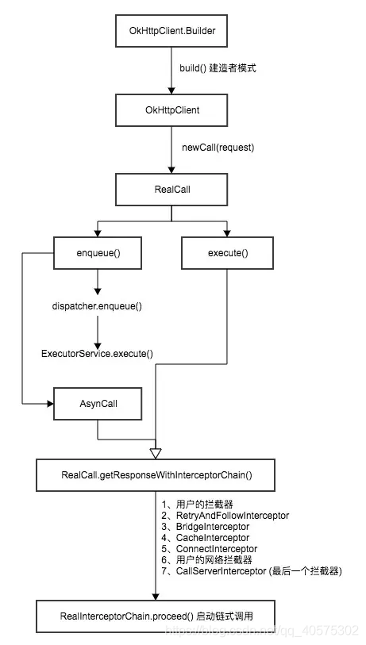
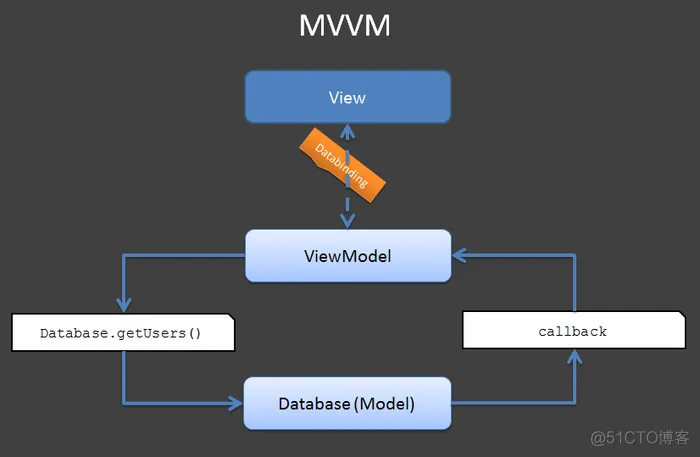
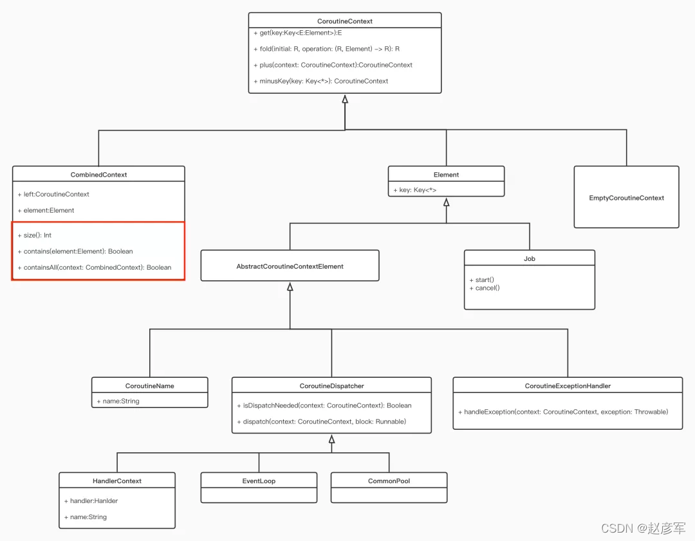

## android面试记录

### 面试题网址

1. [分享一份非常强势的Android面试](https://segmentfault.com/a/1190000016117569)
2. [史上最全的Android面试题集锦](https://juejin.im/post/5d2eea56f265da1b7004df0d#heading-168)
3. [2020最新中高阶Android面试题总结 上（附解题思路）](https://blog.csdn.net/chuhe1989/article/details/104384802)
4. [2020最新中高阶Android面试题总结 下（附解题思路）](https://blog.csdn.net/chuhe1989/article/details/104385096)
5. [Android中高级面试题合集，含答案](https://blog.csdn.net/Coo123_/article/details/113696121)
6. [2023最全Android面试总结-这些面试一定需要](https://juejin.cn/post/7209983180911575100)


### 面试复习-java篇

------

#### 1.java中==和equals和hashCode的区别

1. 基本数据类型的 == 比较的值相等

2. 类的 == 比较的内存的地址，即是否是同一个对象，在不覆盖equals的情况下，同比较内存地址，原实现也为 ==

3. hashCode也是Object类的一个方法。返回一个离散的int型整数

   - 如果两个对象equals，Java运行时环境会认为他们的hashcode一定相等（<font color= #FF0000>否则在Set中就会出现重复元素</font>）
   - 如果两个对象不equals，他们的hashcode有可能相等（<font color= #FF0000>我的理解是由于哈希码在生成的时候产生冲突造成的</font>）
   - 如果两个对象hashcode相等，他们不一定equals
   - 如果两个对象hashcode不相等，他们一定不equals

   

#### 2.什么时候需要重写重写equals方法和hashCode的方法？

- 自定义类对象做为HashMap的key和HashSet的元素的时候

- 重写HashCode() 用于获得元素的存储位置

- 重写equals() 用于在两个元素的位置相同的时候 比较两个元素是否相等


#### 3.equals

- 自反性：对于任何非空引用值 x，x.equals(x) 都应返回 true
- 对称性：对于任何非空引用值 x 和 y，当且仅当 y.equals(x) 返回 true 时，x.equals(y) 才应返回 true
- 传递性：对于任何非空引用值 x、y 和 z，如果 x.equals(y) 返回 true，并且 y.equals(z) 返回 true，那么 x.equals(z) 应返回 true
- 一致性：对于任何非空引用值 x 和 y，多次调用 x.equals(y) 始终返回 true 或始终返回 false，前提是对象上 equals 比较中所用的信息没有被修改


#### 4.int与integer的区别

- int 基本类型
- integer 对象 int的封装类


#### 5.String、StringBuffer、StringBuilder区别

- String:字符串常量 不适用于经常要改变值得情况，每次改变相当于生成一个新的对象

- StringBuffer:字符串变量

  - 支持并发操作，适合多线程中使用

- StringBuilder:字符串变量（线程不安全）

  - 不支持并发操作，适合单线程中使用

  -  确保单线程下可用，效率略高于StringBuffer


#### 6.String为什么要设计成不可变的

- `字符串池:`字符串池是一种存储字符串的缓存机制，它可以避免重复创建相同内容的字符串对象，节省内存空间
- `安全性:`如果字符串是可变的，那么在多线程并发访问时，可能会出现同步问题，从而导致数据不一致或安全问题
- `缓存hash值:`字符串是不可变的，可以缓存字符串的hash值，提高字符串的hash表性能，因为hash值是经常被使用的，如果每次计算都需要重新计算hash值，会降低性能
- `简化代码:`如果字符串是不可变的，可以确保字符串对象的唯一性，这样可以大大简化代码的编写和阅读


#### 7.什么是内部类？内部类的作用

- 内部类可以直接访问外部类的属性

- 内部类是一个编译时的概念，一旦编译成功，就会成为完全不同的两类

- Java中内部类主要分为

  1. 成员内部类

     - 位于外部类成员位置的类。与外部类的属性、方法并列
     - 可以访问外部类的私有成员或属性
     - 外部类不可以访问成员内部类的属性

     ```java
     class Outer {
           private int age = 20;
           //成员位置
           class Inner {
               public void show() {
                   System.out.println(age);
               }
           }
       }
       
       class Test {
           public static void main(String[] ages) {
               //成员内部类是非静态的演示
               Outer.Inner oi = new Outer().new Inner();
               oi.show();
           }
       }
     
     ```

     

  2. 局部内部类（嵌套在方法和作用域内）

     - 局部内部类中不可定义静态变量
     - 可以访问外部类的局部变量(即方法内的变量)，但是变量必须是final的
       - **局部变量是随着方法的调用而调用**，**使用完毕就消失**，而堆内存的数据并不会立即消失
       - 为了让该值还存在，就加final修饰

     ```java
     //在局部位置，可以创建内部类对象，通过对象调用和内部类方法
       class Outer {
           private int age = 20;
           public void method() {
               final int age2 = 30;
               class Inner {
                   public void show() {
                       System.out.println(age);
                       //从内部类中访问方法内变量age2，需要将变量声明为最终类型。
                       System.out.println(age2);
                   }
               }
               
               Inner i = new Inner();
               i.show();
           }
       }
     ```

     

  3. 匿名内部类（没有构造方法）

     - 必须继承或实现一个接口，指定给new的类型为匿名类的超类型，匿名类不能有显示的extends或implements子句，也不能有任何修饰符

     ```java
     interface Inner {
           public abstract void show();
       }
       
       class Outer {
           public void method(){
               new Inner() {
                   public void show() {
                       System.out.println("HelloWorld");
                   }
               }.show();
           }
       }
       
       class Test {
           public static void main(String[] args)  {
               Outer o = new Outer();
               o.method();
           }
       }
     
     ```

     

  4. 静态内部类（static修饰的类，不能使用任何外围类的非static成员变量和方法， 不依赖外围类）

     - 非静态内部类编译后会默认的保存一个指向外部类的引用，而静态类却没有

       ```java
       class Outter {
             int age = 10;
             static age2 = 20;
             public Outter() {        
             }
              
             static class Inner {
                 public method() {
                     System.out.println(age);//错误
                     System.out.println(age2);//正确
                 }
             }
         }
         
         public class Test {
             public static void main(String[] args)  {
                 Outter.Inner inner = new Outter.Inner();
                 inner.method();
             }
         }
       
       
       ```

- 内部类在项目中的应用

  - 每个内部类都可以独立的继承和实现接口，外部类的继承和实现接口对于内部类没有影响
  - 可以利用内部类实现多接口方案达到解决问题的目的


#### 8.进程和线程的区别

- 进程是cpu资源分配的最小单位，线程是cpu调度的最小单位；一个进程可以包含多个线程
- 每个进程都有独立的内存空间，而同一个进程中的多个线程共享内存空间
- 进程之间相互独立，一个进程的崩溃不会影响其他进程的运行，而线程之间共享进程的资源，一个线程的崩溃会影响整个进程的运行
- 进程间通信需要使用IPC（Inter-Process Communication）机制，而线程间通信可以直接读写进程中的共享数据
- 进程的创建和销毁比较耗时，而线程的创建和销毁比较快
- 操作系统可以同时执行多个进程，但每个CPU在同一时刻只能执行一个线程，多线程的并发性是通过操作系统进行线程切换实现的


#### 9.final，finally，finalize的区别

- 定义：都是Java语言中的关键字
- 区别：
  - `final`关键字用于修饰类、方法和变量，表示它们的值不可改变、不可继承或不可重写。在类中，被`final`修饰的变量必须在声明时或构造函数中初始化
  - `finally` 用于定义在`try-catch`语句块中的代码块，它表示不管是否发生异常，都会执行其中的代码。一般用于释放资源或清理操作，比如关闭文件、关闭数据库连接等
  - `finalize`方法是在Java对象被垃圾回收之前调用的方法。


#### 10.Serializable 和Parcelable 的区别

- Serializable Java 序列化接口 在硬盘上读写 读写过程中有大量临时变量的生成，内部执行大量的i/o操作，效率很低。
- Parcelable Android 序列化接口 效率高 使用麻烦 在内存中读写（AS有相关插件 一键生成所需方法） ，对象不能保存到磁盘中


#### 11.静态属性和静态方法是否可以被继承？是否可以被重写？以及原因？

- 可以被继承，不可以被重写而是被隐藏
- 如果子类里面定义了静态方法和属性，那么这时候父类的静态方法或属性称之为"隐藏"。如果你想要调用父类的静态方法和属性，直接通过父类名.方法或变量名完成


#### 12.string 转换成 integer的方式及原理

- ```java
  Integer.parseInt(string) //  String 转 Int
  Integer.toString()// Int 转 String 
  ```


#### 13.哪些情况下的对象会被垃圾回收机制处理

- `对象没有被引用：`如果一个对象没有任何引用指向它，那么它就可以被垃圾回收机制处理掉

- `对象的引用被赋值为null：`如果一个对象的引用被赋值为null，那么它就可以被垃圾回收机制处理掉

- `对象的作用域结束`：如果一个对象在方法或代码块的作用域结束后，它就可以被垃圾回收机制处理掉。

- `对象被标记为可回收：`如果一个对象被标记为可回收，那么它就可以被垃圾回收机制处理掉。这个过程由垃圾回收器负责，当内存不足时，垃圾回收器会扫描堆内存中不再被引用的对象，并将它们标记为可回收，然后释放这些对象占用的内存空间

- 垃圾回收机制的处理时间是不确定的，它会根据具体情况来自动回收内存，而且Java虚拟机提供了`System.gc()`方法(容易造成内存泄漏)，可以显式地调用垃圾回收机制。

- 判断对象是否存活的方法

  - 引用计数法：对象添加一个引用计数器，每当一个地方引用它object时技术加1，引用失去以后就减1，计数为0说明不再引用

    - 优点：实现简单，判定效率高
    - 缺点：无法解决对象相互循环引用的问题，对象A中引用了对象B，对象B中引用对象A

  - 可达性分析法：当一个对象到`GC Roots`没有引用链相连，即就是`GC Roots`到这个对象不可达时，证明对象不可用


#### 13-1.JVM垃圾回收器

- 堆内存详解

  - 
  - 新生代和老年代
  - 新生代分为 `Eden`和`survivor`。他俩空间大小比例默认为8:2
  - 幸存区分为 `s0` 和 `s1` ，空间大小比例1:1

- 垃圾回收过程

  - 新生成的对象首先放到Eden区，当Eden区满了，就会触发Minor GC
  - 第一步GC活下来的对象，会被移动到`survivor`区中的S0区，S0区满了之后会触发Minor GC，S0区存活下来的对象会被移动到S1区，S0区空闲
  - S1满了之后在GC，存活下来的再次移动到S0区，S1区空闲，这样反反复复GC，每GC一次，对象的年龄就`涨一岁`，达到某个值后（15），就会进入`老年代`
  - 在发生一次`Minor GC`后（前提条件），老年代可能会出现`Major GC`，这个视垃圾回收器而定
  
- 回收哪些区域的对象

  - 只回收`堆内存`和`方法区内`的对象。而`栈内存`的数据，在超出作用域后会被JVM自动释放掉

- 新生代可配置的回收器：Serial、ParNew、Parallel Scavenge

- 老年代配置的回收器：CMS、Serial Old、Parallel Old，G1

  


#### 14.静态代理和动态代理的区别，什么场景使用？

- 静态代理

  ```java
  public interface Buy {
      void buyHouse(long money);
  }
  
  public class Xiaoming implements Buy {
      @Override
      public void buyHouse(long money) {
          System.out.println("我买房了，用了"+money+" 钱 ");
      }
  }
  
  public class UserProxy implements Buy {
      /**
       *这个是真实对象，买房一定是真实对象来买的，中介只是跑腿的
       */
      private Buy mBuy;
      public UserProxy(Buy mBuy) {
          this.mBuy = mBuy;
      }
  
      @Override
      public void buyHouse(long money) {
          /**
           * 这里是我们出钱去买房,中介只是帮忙
           */
          mBuy.buyHouse(newMoney);
      }
  }
  ```

  - 代理类是在编译期间就已经存在的，而且UserProxy代理类也只能代理实现了Buy接口的类
  - 静态代理的性能比较高
  - 静态代理的代码比较繁琐，容易产生重复代码

- 动态代理

  ```java
  public class DynamiclProxy implements InvocationHandler {
      //被代理的类引用
      private Object mObject;
  
      public DynamiclProxy(Object mObject) {
          this.mObject = mObject;
      }
  
      @Override
      public Object invoke(Object proxy, Method method, Object[] args) throws Throwable {
      //调用被代理类对象的方法
      Object result = method.invoke(mObject, args);
      return result;
      }
  }
  
  public class ProxyClient {
      public static void main(String[] args){
          System.out.println("静态代理测试");
          Buy buy=new Xiaoming();
          UserProxy proxy=new UserProxy(buy);
          proxy.buyHouse(1000000);
  
          System.out.println("动态代理测试");
          Buy dynamicProxy= (Buy) Proxy.newProxyInstance(buy.getClass().getClassLoader(),
                  buy.getClass().getInterfaces(),new DynamiclProxy(buy));
          dynamicProxy.buyHouse(1000000);
      }
  }
  
  ```

  - 动态代理则在运行时才确定被代理类和代理类
  - 动态代理的代码比较简洁，可读性较高
  - 动态代理的性能比较低，因为它需要在运行时动态生成代理类
  - 可以使用Java中的`java.lang.reflect.Proxy`类和`java.lang.reflect.InvocationHandler`接口来实现


#### 15.说说你对Java反射的理解

- 反射机制是在运行状态中，对于任意一个类，都可以知道这个类的所有属性和方法，对于任意一个对象都可以调用它的属性和方法

- 类加载方式

  - Class.forName()
    - 将类的.class文件加载到jvm中之外，还会对类进行解释，执行类中的static块
    - `Class.forName(name, initialize, loader)`带参函数也可控制是否加载static块。并且只有调用了newInstance()方法采用调用构造函数，创建类的对象
  - ClassLoader.loadClass()
    - 只干一件事情，就是将.class文件加载到jvm中，不会执行static中的内容,只有在newInstance才会去执行static块
  
  - ```java
    Class<?> aClass=Class.forName("com.github.hcsp.MyTestClass");
    Constructor[] constructors = aClass.getDeclaredConstructors();
    Object testClassInstance=constructors.newInstance()
    String message = (String) aClass.getMethod("sayHello").invoke(testClassInstance);
    ```


#### 16.说说你对Java注解的理解

- 什么是注解？

  - 注解annotation是JavaSE5.0中新增功能。可以理解为注解是一种标记，这种标记可以在编译、类加载、运行时被读取，并执行相应的处理
  - 添加到程序的任何元素上：包声明、类型声明、构造方法、普通方法、成员变量、参数

- 五个元注解

  - `Retenation` 定义该注解是作用于什么阶段，编译、类加载、运行（使用最多）

    ```java
    @Documented
        @Retention(RetentionPolicy.RUNTIME)
        @Target(ElementType.ANNOTATION_TYPE)
        public @interface Retention {
            /**
             * Returns the retention policy.
             * @return the retention policy
             */
            RetentionPolicy value();
        }
    
    package java.lang.annotation;
        public enum RetentionPolicy { 
            SOURCE, 
            CLASS, 
            RUNTIME
        }
    
    //SOURCE：只在Java源代码中，编译器编译的时候会把它直接丢弃
    //CLASS：编译器将注解记录在.class文件中。当运行Java程序时，JVM不能获取注解信息。这是默认值。
    //RUNTIME：编译器将注解记录在.class文件中。当运行Java程序时，JVM也能获取注解信息。程序可以通过反射获取注解信息。
    
    ```

  - `Target` 声明创建一个注解的时候，指示该注解可以作用于程序中的哪些元素

    ```java
    @Documented
        @Retention(RetentionPolicy.RUNTIME)
        @Target(ElementType.ANNOTATION_TYPE)
        public @interface Target {
            //元素类型
            ElementType[] value();
        }
        public enum ElementType { 
            TYPE, 
            FIELD, 
            METHOD, 
            PARAMETER, 
            CONSTRUCTOR, 
            LOCAL_VARIABLE, 
            ANNOTATION_TYPE, 
            PACKAGE, 
            /** @since 1.8*/
            TYPE_PARAMETER,
            /** @since 1.8*/
            TYPE_USE
        }
    
    //ANNOTATION_TYPE：指定当前注解只能修饰其它注解
    //CONSTRUCTOR：指定当前注解只能修饰构造方法
    //FIELD：指定当前注解只能修饰成员变量
    //LOCAL_VARIABLE：指定当前注解只能修饰局部变量
    //METHOD：指定当前注解只能修饰方法
    //PACKAGE：指定当前注解只能修饰包
    //PARAMETER：指定当前注解只能修饰参数
    //TYPE：指定当前注解可以修饰类，接口，其它注解，枚举等类型
    ```

  - `Documented `  用于描述其它类型的annotation应该被作为被标注的程序成员的公共API，因此可以被例如javadoc此类的工具文 档化

    ```java
    @Documented
    @Retention(RetentionPolicy.RUNTIME)
    @Target(ElementType.ANNOTATION_TYPE)
    public @interface Documented {
    }
    
    //用来生成文档的，工作中基本上很少使用，作为了解就可以了
    ```

  - `Inherited ` 声明创建一个注解的时候，指定该注解将具有继承性

    ```java
    @Retention(RetentionPolicy.RUNTIME)
        @Target(ElementType.TYPE)
        @Inherited
        public @interface A {
            
        }
        @A
        public class Base {
            
        }
        //Sub也带有@A
        public class Sub extends Base {
        }
    ```

  - `Repeatable`  重复注解，JDK8新增的注解

- 基本注解

  - `Override` 重写父类方法
  - `SafeVarargs` 确保方法不会对其varargs参数执行不安全的操作
  - `SuppressWarnings` 有选择的关闭编译器对类、方法、成员变量、变量初始化的警告
  - `FunctionalInterface ` 仅仅只包含一个抽象方法的接口
  - `Deprecated`  标识方法或类，标识该类或方法已过时


#### 17.Object类的equal和hashCode方法重写，为什么？

- 先进行hashcode比较，如果不同，就不用再进行equals的比较了，比较数量大的情况下效率提高


#### 18.List,Set,Map的区别

- `List` 有序集合，可包含重复的元素
  - 实现类`ArrayList`、`LinkedList`、`Vector`
    - ArrayList是一种基于数组实现的动态数组，查询性能较好,线程不安全。
      - CopyOnWriteArrayList、CopyOnWriteArraySet  是线程安全的
      - List list = Collections.synchronizedList(new ArrayList()) 线程安全的
    - LinkedList是一种基于链表实现的双向链表，插入和删除性能较好
    - Vector与ArrayList类似，但是线程安全，性能较差
- `Set` 无序集合，不允许包含重复的角色
  - 实现类 `HashSet`、`TreeSet`、`LinkedHashSet`
    - HashSet是一种基于hash表实现的集合，查询性能较好
    - TreeSet是一种基于红黑树实现的有序集合，插入和删除性能比较好
    - LinkedHashSet 是一种基于hash表和链表实现的有序集合，插入和删除性格较好
- `Map` 一种键值对映射的集合，每个键只能应对一个值
  - 实现类 `HashMap`、`TreeMap`、`LinkedHashMap`
    - HashMap是一种基于哈希表实现的映射，查询性能较好
    - TreeMap是一种基于红黑树实现的有序映射，插入和删除性能较好
    - LinkedHashMap是一种基于哈希表和链表实现的有序映射，插入和删除性能较好


#### 19.HashMap、ArrayMap和SparseArray的对比

- HashMap 

  - 基于hash表实现的映射，使用键值对存储，支持快速查询，删除和插入
  - 默认的存储大小就是一个容量为16的数组。当HashMap存储元素达到75%时，HashMap存储空间就会扩大原来的2倍
  - 线程不安全

- ArrayMap

  - 使用两个数组进行数据存储，一个记录key的hash值，一个记录value值
  - 二分法查询，当删除或添加数据时，会对空间重新调整，在大量数据的情况下，效率低于50%
  - 用的是copy数据，提供了数组收缩功能，在clear和remove后，会重新收缩数组，释放空间

- SparseArray

  - 一种特殊的ArrayMap，使用稀疏数组，可以在存储数据时节省内存空间
  - 只能存储int类型的key

- <font color= #FF0000>数据大于1000的时候推荐使用hashmap,数据500以下推荐使用arraymap,可以是整型的时候推荐使用SparseArray</font>

  

#### 20.HashMap和HashTable的区别

- `hashmap` 不是线程安全的，键不能重复，值可重复，允许key null，允许value null
- `HashTable`  是线程安全的，不允许key null，不允许value null， 效率低
- `hashmap` 有  containsValue 和 containsKey,`hashtable` 包含 contains
- `hashmap`是Map interface 的一个实现，`hashtable` 是继承Dictionary 类
- `Hashtable`和`HashMap`采用的hash/rehash算法都大概一样，所以性能不会有很大的差异
- `ConcurrentHashMap` 在java1.5 以后可以替代`hashtable`
- `Collections.synchronizedMap` 也是线程安全的，性能和`hashtable` 差不多


#### 21.HashMap与HashSet的区别

- `hashmap`实现了map接口，`hashset`实现了set接口
- `hashmap`存储键值对，`hashset`存储对象
- `hashmap`使用put添加元素，`hashset`使用add添加对象
- `hashmap`中使用键对象来计算hashcode，`hashset`使用成员对象来计算hashcode，如果hashcode相同，就用equals来判断，对象不相同返回false
- `HashSet`较`HashMap`来说比较慢
- 都是通过hash码和equals方法共同判断是否有重复元素，`hashset`是不允许添加，`hashmap`是替换旧值


#### 22.ArrayList和LinkedList的区别，以及应用场景

- `ArrayList`基于数组实现的，ArrayList线程不安全
- `LinkedList`是基于双链表实现的,线程不安全
- 使用场景
  - 如果应用程序对各个索引位置的元素进行大量的存取或删除操作，`ArrayList`对象要远优于`LinkedList`对象
  - 如果应用程序主要是对列表进行循环，并且循环时候进行插入或者删除操作，`LinkedList`对象要远优于`ArrayList`对象


#### 23.数组和链表的区别

- 数组
  - 在内存中，是一块连续的区域
  - 需要预留空间，在使用前先要申请占用内存的大小，可能会浪费内存空间
  - 插入数据和删除数据需要移动其他元素，因此效率低下
  - 随机读取效率很好，因为是连续的，知道每一个数据的内存地址，可以直接找到给定地址的数据
  - 不利于扩展，空间不够的时候需要重新定义数组
- 链表
  - 动态申请空间，可以在内存的任何地方，不要求连续
  - 每个数据都保存了下一条数据的内存地址
  - 增加数据和删除数据效率高
  - 查找效率低下，不具备随机访问，要从头开始查找
  - 不指定大小，扩展方便。不用定义大小，数据可以随意删除


#### 24.开启线程的三种方式？

- 继承Thread
- 实现Runnable
- 使用线程池


#### 25.run()和start()方法区别

- `start()`方法被用来启动新创建的线程，而且`start()`内部调用了`run()`方法
- 调用`run()`方法的时候，只会是在原来的线程中调用，没有新的线程启动


#### 26.如何控制某个方法允许并发访问线程的个数

- semaphore.acquire() 请求一个信号量，这时候的信号量个数-1，一旦为负数，就会阻塞

- semaphore.release() 释放一个信号量，此时信号量个数+1

- ```java
  import java.util.concurrent.Semaphore;
  
  public class Example {
      private Semaphore semaphore = new Semaphore(2); // 允许最多两个线程同时访问
  
      public void doSomething() {
          try {
              semaphore.acquire(); // 获取信号量，开始访问资源
              // 执行需要控制并发的代码块
          } catch (InterruptedException e) {
              e.printStackTrace();
          } finally {
              semaphore.release(); // 释放信号量，结束访问资源
          }
      }
  }
  ```


#### 27.在Java中wait和seelp方法的不同

- 相同点：
  - `sleep()`和`wait()`都可以暂停线程的执行
  - `wait()`和`sleep()`方法都会抛出InterruptedException异常，表示线程在等待或休眠过程中被中断。
- 不同点：
  - 所在类不同
    - `sleep()`是Thread类的静态方法
    - `wait()`是Object类的方法
  - 释放锁不同
    - `sleep()` 让出CPU给其他线程，监控状态依然保持着，时间到了会自动恢复，不会释放对象锁
    - `wait()` 进入此对象的等待锁定池，只有针对此对象调用notify()后该线程才会进入唤醒，会释放对象锁
  - 用途不同
    - `sleep()`  常用于一定时间内暂停线程执行
    - `wait()` 常用户线程间的交互和通信
  - 用法不同
    - `sleep()` 指定时间后，线程会自动苏醒
    - `wait()`  方法被调用后，可以通过 notify()或者notifyAll()（唤醒全部等待线程）唤醒wait的线程，需要重新获取锁才能继续执行


#### 28.什么导致线程阻塞？线程如何关闭

- 阻塞原因
  - 当线程等待输入/输出，会被阻塞，知道操作完成
  - 等待获取锁，当线程在同步代码块或方法中等待获取锁的时候，如果有其他线程占用了锁，就会被阻塞
  - 等待线程结束。当一个线程调用另一个线程的join()方法，它会被阻塞，直到另一个线程执行完毕
  - 等待计时器。调用`sleep()`方法
  - 线程调用wait()方法
- 2种方法关闭线程
  - 调用它里面的stop()方法，设置一个停止标记
  - 调用interrupt()方法中断线程，会抛出一个InterruptedException异常。捕获异常，然后break


#### 29.如何保证线程安全

- 什么是线程安全：多线程访问时，采用了加锁机制，当一个线程访问该类的某个数据时，进行保护，其他线程不能进行访问直到该线程读取完，其他线程才可使用。不会出现数据不一致或者数据污染

- 保证线程安全

  - 使用线程安全的类

  - `synchronized`同步代码块，一个时间内只有一个线程可以执行

  - 使用`Lock`(ReentrantLock)锁需要手动释放和开启。在并发量比较高的情况下，synchronized会让性能下降，此时使用Lock是个不错的方案

    ```java
    class Window implements Runnable{
    
        private int ticket = 100;
        //1.实例化ReentrantLock
        private ReentrantLock lock = new ReentrantLock();
    
        @Override
        public void run() {
            while(true){
                try{
                    //2.调用锁定方法lock()
                    lock.lock();
    
                    if(ticket > 0){
    
                        try {
                            Thread.sleep(100);
                        } catch (InterruptedException e) {
                            e.printStackTrace();
                        }
    
                        System.out.println(Thread.currentThread().getName() + "：售票，票号为：" + ticket);
                        ticket--;
                    }else{
                        break;
                    }
                }finally {
                    //3.调用解锁方法：unlock()
                    lock.unlock();
                }
    
            }
        }
    }
    
    public class LockTest {
        public static void main(String[] args) {
            Window w = new Window();
    
            Thread t1 = new Thread(w);
            Thread t2 = new Thread(w);
            Thread t3 = new Thread(w);
    
            t1.setName("窗口1");
            t2.setName("窗口2");
            t3.setName("窗口3");
    
            t1.start();
            t2.start();
            t3.start();
        }
    }
    ```

    

  - ThreadLocal机制 来实现的

  - 多线程并发情况下，线程共享的变量改为方法局部级变量


#### 30.synchronized 和 volatile 关键字的区别

- `synchronized ` 作用于一段代码、方法、变量；`volatile ` 是变量的修饰符
- `volatile ` 用于在多个线程中保持一个变量的可见性，当一个线程修改了变量的值，其他线程能够立即看到最新的值，从而避免出现数据不一致的问题
- `synchronized ` 确保同一时间内只有一个线程可以访问，从而避免多线程之间的竞争和冲突，每个对象都有一个内部锁，先要获取内部锁才能访问。


#### 31.死锁的四个必要条件

- 互斥条件：一个资源一次只能被一个线程占用，直到该线程释放该资源
- 请求与保持条件：一个线程因请求资源而阻塞时，对已获得的资源保持不放
- 不可剥夺条件：线程已获得的资源，在未使用完之前，不能被其他线程强行剥夺，只能由自己释放。
- 循环等待条件：若干线程之间形成一种头尾相接的循环等待资源关系
- <font color= #FF0000>这四个条件同时满足时，才可能出现死锁</font>


#### 32.谈谈对Synchronized关键字，类锁，方法锁，重入锁的理解

- `Synchronized`是Java中的一个关键字，可以用来实现线程的同步。其作用是对一个对象或方法加锁，使得同一时刻只能有一个线程访问该对象或方法，从而保证线程安全

- 类锁：对类的所有实例对象进行同步，实现方式是在静态方法或代码块前加上synchronized关键字

- 方法锁：方法锁是指对某个方法进行同步，实现方式是在方法前加上synchronized关键字。由于每个实例对象都有一个锁，因此不同实例对象的方法之间是不互斥的

- 重入锁：ReentrantLock 的使用

  - 默认采用非公平锁，除非在构造方法中传入参数true

  - ```java
    //默认
    public ReentrantLock() {
        sync = new NonfairSync();
    }
    //传入true or false
    public ReentrantLock(boolean fair) {
        sync = fair ? new FairSync() : new NonfairSync();
    }
    ```

  - 公平锁：每个线程获取锁的顺序是按照线程访问锁的先后顺序获取的，最前面的线程总是最先获取到锁

  - 非公平锁：每个线程获取锁的顺序是随机的，并不会遵循先来先得的规则，所有线程会竞争获取锁。


#### 33.java中堆和栈有什么不同

- 堆和栈都是用于存储数据的内存区域
- 堆 (Heap):堆是 Java 中最大的内存区域，它用于存储动态分配的数据对象。堆是动态的，也就是说，当程序需要更多内存时，堆可以自动扩展。堆中的对象通常是动态生成的，例如，在运行时创建的对象或从数据库中检索的数据。堆也是垃圾回收器负责回收的主要区域之一
- 栈 (Stack):栈是 Java 中的局部变量区和方法返回地址区，它用于存储临时数据和函数调用时的局部变量和返回地址等信息。栈是静态分配的内存区域，也就是说，栈中的内存对象是在程序编译时就已经分配好了的。栈中的对象通常是静态的，例如，全局变量和静态变量


#### 34.java中引用分类

- 强引用

  - java中的引用默认就是强引用，任何一个对象的赋值操作就产生了对这个对象的强引用

  - 

    ```java
    public class StrongReferenceUsage {
    
        @Test
        public void stringReference(){
            Object obj = new Object();
        }}
    
    //这个obj就是new Object()的强引用
    ```

  - 特性是只要有强引用存在，被引用的对象就不会被垃圾回收

- 软引用

  - 软引用在java中有个专门的SoftReference类型，软引用的意思是只有在内存不足的情况下，被引用的对象才会被回收

  - ```java
       public void softReference(){
            Object obj = new Object();
            SoftReference<Object> soft = new SoftReference<>(obj);
            obj = null;
            log.info("{}",soft.get());
            System.gc();
            log.info("{}",soft.get());
        }
    //内存不足的时候，引用对象会被回收
    ```

  - 使用场景

    - 创建缓存的时候，创建的对象放进缓存中，当内存不足时，JVM就会回收早先创建的对象
    - 图片编辑器，视频编辑器之类的软件

- 弱引用

  - weakReference和softReference很类似，不同的是weekReference引用的对象只要垃圾回收执行，就会被回收，而不管是否内存不足

  - ```java
       public void weakReference() throws InterruptedException {
            Object obj = new Object();
            WeakReference<Object> weak = new WeakReference<>(obj);
            obj = null;
            log.info("{}",weak.get());
            System.gc();
            log.info("{}",weak.get());
        }
    ```

  - 使用场景

    - 防止handler内存泄漏
    - WeakHashMap的使用

- 虚引用

  - PhantomReference的作用是跟踪垃圾回收器收集对象的活动，在GC的过程中，如果发现有PhantomReference，GC则会将引用放到ReferenceQueue中，由程序员自己处理，当程序员调用ReferenceQueue.pull()方法，将引用出ReferenceQueue移除之后，Reference对象会变成Inactive状态，意味着被引用的对象可以被回收了

  - ```java
    public class PhantomReferenceUsage {
    
        @Test
        public void usePhantomReference(){
            ReferenceQueue<Object> rq = new ReferenceQueue<>();
            Object obj = new Object();
            PhantomReference<Object> phantomReference = new PhantomReference<>(obj,rq);
            obj = null;
            log.info("{}",phantomReference.get());
            System.gc();
            Reference<Object> r = (Reference<Object>)rq.poll();
            log.info("{}",r);
        }}
    ```

  - 使用场景

    - 大多被用于引用销毁前的处理工作，比如释放资源


#### 35.Java的类加载过程

- 编译

  - 即把我们写好的java文件，通过javac命令编译成字节码，也就是我们常说的.class文件

- 运行

  - 则是把编译生成的.class文件交给Java虚拟机(JVM)执行

- 过程

  - JVM虚拟机把.class文件中类信息加载进内存，并进行解析生成对应的class对象的过程
  - JVM不是一开始就把所有的类都加载进内存中，而是只有第一次遇到某个需要运行的类时才会加载，且只加载一次

- 类加载

  

  - 加载：指的是把class字节码文件从各个来源通过类加载器装载入内存中
    - **字节码来源**。
    
      - 本地路径下编译生成的.class文件，
    
      - 从jar包中的.class文件，
      - 从远程网络，
      - 以及动态代理实时编译
    
    - **类加载器**:
      
      - `启动类加载器(bootstrap ClassLoader)`
      
        - 嵌套在JVM内部，java程序无法直接操作这个类
        - 它加载`扩展类加载器`和`应用程序类加载器`，并成为他们的父类加载器
      
      - `扩展类加载器(Extension ClassLoader)`
      
        - Java语言编写,我们可以用Java程序操作这个加载器
        - 派生继承自java.lang.ClassLoader，父类加载器为`启动类加载器`
        - `java.ext.dirs`目录中加载类库 或 从JDK安装目录：`jre/lib/ext`目录下加载类库。我们就可以将我们自己的包放在以上目录下，就会自动加载进来了
      
      - `应用类加载器(Application ClassLoader)`
      
        - Java语言编写，
        - 派生继承自java.lang.ClassLoader，父类加载器为`启动类加载器`
        - 它是程序中默认的类加载器，我们Java程序中的类，都是由它加载完成的
        - 我们可以通过`ClassLoader#getSystemClassLoader()`获取并操作这个加载器
      
      - `自定义类加载器`：核心 `对字节码文件的获取`，如果是加密的字节码则需要在该类中对文件进行解密
      
        - ```java
          package com.github.hcsp.classloader;
          
          import java.io.ByteArrayOutputStream;
          import java.io.File;
          import java.io.FileInputStream;
          import java.io.FileNotFoundException;
          import java.io.IOException;
          
          public class MyClassLoader extends ClassLoader {
              // 存放字节码文件的目录
              private final File bytecodeFileDirectory;
          
              public MyClassLoader(File bytecodeFileDirectory) {
                  this.bytecodeFileDirectory = bytecodeFileDirectory;
              }
          
              // 还记得类加载器是做什么的么？
              // "从外部系统中，加载一个类的定义（即Class对象）"
              // 请实现一个自定义的类加载器，将当前目录中的字节码文件加载成为Class对象
              // 提示，一般来说，要实现自定义的类加载器，你需要覆盖以下方法，完成：
              //
              // 1.如果类名对应的字节码文件存在，则将它读取成为字节数组
              //   1.1 调用ClassLoader.defineClass()方法将字节数组转化为Class对象
              // 2.如果类名对应的字节码文件不存在，则抛出ClassNotFoundException
              //
              @Override
              protected Class<?> findClass(String name) throws ClassNotFoundException {
                  byte[] classData = getByteArrayFromFile(name);
                  if (classData == null) {
                      throw new ClassNotFoundException();
                  }
                  return defineClass(name, classData, 0, classData.length);
              }
          
              byte[] getByteArrayFromFile(String className) throws ClassNotFoundException {
                  ByteArrayOutputStream bos = new ByteArrayOutputStream();
                  File file = new File(bytecodeFileDirectory, className + ".class");
                  int len = 0;
                  try {
                      byte[] bufferSize = new byte[1024];
                      FileInputStream fis = new FileInputStream(file);
                      while ((len = fis.read(bufferSize)) != -1) {
                          bos.write(bufferSize, 0, len);
                      }
                  } catch (FileNotFoundException e) {
                      throw new ClassNotFoundException();
                  } catch (IOException e) {
                      e.printStackTrace();
                  }
                  return bos.toByteArray();
              }
          
              public static void main(String[] args) throws Exception {
                  File projectRoot = new File(System.getProperty("basedir", System.getProperty("user.dir")));
                  MyClassLoader myClassLoader = new MyClassLoader(projectRoot);
          
                  Class testClass = myClassLoader.loadClass("com.github.hcsp.MyTestClass");
                  Object testClassInstance = testClass.getConstructor().newInstance();
                  String message = (String) testClass.getMethod("sayHello").invoke(testClassInstance);
                  System.out.println(message);
              }
          }
          ```
      
          
    
  - 验证：主要是为了保证加载进来的字节流符合虚拟机规范，不会造成安全错误
    - **文件格式的验证**：比如常量中是否有不被支持的常量？文件中是否有不规范的或者附加的其他信息？
    - **元数据的验证**：比如该类是否继承了被final修饰的类？类中的字段，方法是否与父类冲突？是否出现了不合理的重载？
    - **字节码的验证**：保证程序语义的合理性，比如要保证类型转换的合理性
    - **符号引用的验证**：比如校验符号引用中通过全限定名是否能够找到对应的类？校验符号引用中的访问性（private，public等）是否可被当前类访问
    
  - 准备：
    - 为类变量（static修饰的字段变量）分配内存并且设置该类变量的初始值，（如static int i = 5 这里只是将 i 赋值为0，在初始化的阶段再把 i 赋值为5)，这里不包含final修饰的static ，因为final在编译的时候就已经分配了。这里不会为实例变量分配初始化，类变量会分配在方法区中，实例变量会随着对象分配到Java堆中
    
  - 解析：将常量池内的符号引用替换为直接引用的过程，虚拟机会把所有的类名，方法名，字段名这些符号引用替换为具体的内存地址或偏移量
  
  - 初始化：这个阶段主要是对**类变量**初始化，是执行类构造器的过程
    - 只对static修饰的变量或语句进行初始化
    - 初始化一个类的时候，其父类尚未初始化，则优先初始化其父类
    - 同时包含多个静态变量和静态代码块，则按照自上而下的顺序依次执行
  
- 类加载机制

  - `全盘负责` ：当一个类加载器负责加载某个Class时，该Class所依赖的和引用的其他Class也将由该类加载器负责载入，除非显示使用另外一个类加载器来载入
  - `父类委托`：先让父类加载器试图加载该类，只有在父类加载器无法加载该类时才尝试从自己的类路径中加载该类
  - `缓存机制`：缓存机制将会保证所有加载过的Class都会被缓存，当程序中需要使用某个Class时，类加载器先从缓存区寻找该Class，只有缓存区不存在，系统才会读取该类对应的二进制数据，并将其转换成Class对象，存入缓存区。这就是为什么修改了Class后，必须重启JVM，程序的修改才会生效

- 双亲委派模型

  - 一个类加载器收到了类加载的请求，它首先不会自己去尝试加载这个类，而是把请求委托给父加载器去完成，依次向上
  - 所有的类加载请求最终都应该被传递到顶层的启动类加载器中
  - 只有当父加载器在它的搜索范围中没有找到所需的类时，即无法完成该加载，子加载器才会尝试自己去加载该类
  - 存在意义 
  
    - 系统类防止内存中出现多份同样的字节码
    - 保证Java程序安全稳定运行


#### 36.抽象类和接口的异同

- 抽象类

  - 使用abstract修饰符修饰的类，就是抽象类
  - 不能实例化，可以定义成员变量，成员方法，构造方法
  - 抽象方法：只声明，不实现
- 接口

  - 一个抽象类型，是抽象方法的集合
- 共同点

  - 都不能被实例化
  - 都包含抽象方法，这些抽象方法用户描述类具备的功能
  - 都是上层的抽象层
- 区别

  - 语法层面上

    - 抽象类可以提供成员方法的实现细节，而接口中只能存在public abstract 方法

    - 抽象类中的成员变量可以是各种类型的，而接口中的成员变量只能是public static final类型的

    - 接口中不能含有静态代码块以及静态方法，而抽象类可以有静态代码块和静态方法

    - 一个类只能继承一个抽象类，而一个类却可以实现多个接口
- 设计层面上面
  
  - 抽象类是对一种事物的抽象，即对类抽象，而接口是对行为的抽象
  
  - 设计层面不同，抽象类作为很多子类的父类，它是一种模板式设计；而接口是一种行为规范，它是一种辐射式设计
  - 什么时候用抽象类，什么时候用接口

    - 当需要为一些类提供公共的实现代码时，应优先考虑抽象类。因为抽象类中的非抽象方法可以被子类继承下来，使实现功能的代码更简单
- 当注重代码的扩展性跟可维护性时，应当优先采用接口

#### 37.算法

- 冒泡排序

  - 两个数比较大小，较大的数下沉，较小的数冒起来

  - 时间复杂度为O(n^2)

  - ```java
        private void getBubbleSort() {
            int arr[] = {5, 6, 55, 66, 77, 8, 9, 1};
            int length = arr.length;
            int temp;//临时变量
            boolean flag;//是否交换的标志
            LogUtils.i("原始顺序 =-= " + Arrays.toString(arr));
            //i表示第几趟排序
            for (int i = 0; i < length - 1; i++) {//表示趟数，一共arr.length-1次。
                flag = false;
                //每次都从最后一个开始
                for (int j = length - 1; j > i; j--) {
                    //如果后面的比前面的小，就像泡泡一样冒上去
                    if (arr[j] < arr[j - 1]) {
                        temp = arr[j];
                        arr[j] = arr[j - 1];
                        arr[j - 1] = temp;
                        flag = true;
                    }
                }
                LogUtils.i("第" + i + "趟排序:  =-= " + Arrays.toString(arr));
                if (!flag) {
                    break;
                }
            }
        }
    ```

- 选择排序

  - 在长度为N的无序数组中，第一次遍历n-1个数，找到最小的数值与第一个元素交换

  - 第二次遍历n-2个数，找到最小的数值与第二个元素交换

  - 第n-1次遍历，找到最小的数值与第n-1个元素交换，排序完成

  - 不稳定的排序方法

  - O(n^2）

  - ```java
        private void getSelctionSort() {
            int arr[] = {5, 6, 55, 66, 77, 8, 9, 0};
            int length = arr.length;
            LogUtils.i("原始顺序 =-= " + Arrays.toString(arr));
            for (int i = 0; i < length - 1; i++) {
                int minIndex = i;
                for (int j = i + 1; j < length; j++) {
                    // 找到最小值的那个元素的下标
                    if (arr[j] < arr[minIndex]) {
                        minIndex = j;
                    }
                }
                // 把最小值调换到最前面
                if (minIndex != i) {
                    int temp = arr[i];
                    arr[i] = arr[minIndex];
                    arr[minIndex] = temp;
                }
                LogUtils.i("第" + i + "趟排序:  =-= " + Arrays.toString(arr));
            }
        }
    
    ```

- 插入排序

  - 在要排序的一组数中，假定前n-1个数已经排好序，现在将第n个数插到前面的有序数列中，使得这n个数也是排好顺序的。如此反复循环，直到全部排好顺序

  - 插入排序不适合对于数据量比较大的排序应用。但是，如果需要排序的数据量很小（eg：量级小于千），那么插入排序是一个不错的选择

  - 插入排序是稳定的

  - ```java
        private void getInsertionSort() {
            int arr[] = {5, 6, 55, 66, 77, 8, 9, 0};
            int length = arr.length;
    
            int tmp;//要插入的数据
            int istIndex;//插入位置索引
            LogUtils.i("原始顺序 =-= " + Arrays.toString(arr));
            for (int i = 1; i < length; i++) {
                if (arr[i] < arr[i - 1]) {
                    tmp = arr[i];
                    istIndex = i;
                    while (istIndex > 0 && arr[istIndex - 1] > tmp) {
                        //插入位置往前移，寻找合适位置
                        arr[istIndex] = arr[istIndex - 1];
                        istIndex--;
                    }
                    arr[istIndex] = tmp;
                }
                LogUtils.i("第" + i + "趟排序:  =-= " + Arrays.toString(arr));
            }
        }
    ```

- 希尔排序

  - 在要排序的一组数中，根据某一增量分为若干子序列，并对子序列分别进行插入排序

  - 然后逐渐将增量减小,并重复上述过程。直至增量为1,此时数据序列基本有序,最后进行插入排序

  - 希尔排序又称缩小增量排序，是简单插入排序的增强版本

  - ```java
        private void getShellSort() {
            int arr[] = {5, 6, 55, 66, 77, 8, 9, 0};
            int length = arr.length;
            int gap;//步长
            int istIndex;//插入位置索引
            int tmp;
            LogUtils.i("原始顺序 =-= " + Arrays.toString(arr));
            //按照步长来分组
            for (gap = length / 2; gap >= 1; gap /= 2) {
                //类似插入排序的方法
                for (int i = gap; i < length; i++) {
                    tmp = arr[i];//取出暂存
                    istIndex = i;//插入的位置
                    while ((istIndex > (gap - 1) && tmp < arr[istIndex - gap])) {
                        //插入位置往前移，寻找合适位置
                        arr[istIndex] = arr[istIndex - gap];
                        istIndex -= gap;
                    }
                    arr[istIndex] = tmp;
                }
                LogUtils.i("步长为" + gap + "的排序:  =-= " + Arrays.toString(arr));
            }
        }
    ```

- 快速排序

  - 快速排序和冒泡排序类似，都是基于交换的思想，快速排序对冒泡排序进行了优化，从而更加快速高效

  - ```java
        private void getQuickSort(int[] arr, int left, int right) {
            if (arr == null || left >= right || arr.length <= 1)
                return;
            int mid = partition(arr, left, right);
            getQuickSort(arr, left, mid);
            getQuickSort(arr, mid + 1, right);
        }
    
        //获取基准值
        private int partition(int[] arr, int left, int right) {
            int temp = arr[left];
            while (right > left) {
                // 先判断基准数和后面的数依次比较
                while (temp <= arr[right] && left < right) {
                    right--;
                }
                // 当基准数大于了 arr[right]，则填坑
                if (left < right) {
                    arr[left] = arr[right];
                    left++;
                }
                // 现在是 arr[right] 需要填坑了
                while (temp >= arr[left] && left < right) {
                    left++;
                }
                if (left < right) {
                    arr[right] = arr[left];
                    right--;
                }
            }
            arr[left] = temp;
            return left;
        }
    ```

- 堆排序

  - 堆排序算法，基于选择排序的思想，利用堆结构的性质来完成对数据的排序

  - 对于第n个结点而言 --- 它的父结点下标 i = （n-1）/ 2，左子结点 left = 2n+1，右子结点 right =2n+2

  - ```java
        private void getHeapSort() {
            int arr[] = {5, 6, 55, 66, 77, 8, 9, 0};
            int length = arr.length;
            int last = length - 1;
            int tmp;
            LogUtils.i("原始顺序 =-= " + Arrays.toString(arr));
            for (int i = 0; i < arr.length; i++) {
                heapConstruct(arr, last);
                //第一个和最后一个交换
                tmp = arr[0];
                arr[0] = arr[last];
                arr[last] = tmp;
                last--;
                LogUtils.i("第" + i + "趟排序:  =-= " + Arrays.toString(arr));
            }
        }
    
    
        //建堆
        private void heapConstruct(int[] arr, int last) {
            int tmp;
            for (int parent = (last - 1) / 2; parent >= 0; parent = (last - 1) / 2) {
                if (2 * parent + 1 < last) {
                    //第last个节点为右子树
                    if (arr[last - 1] < arr[last]) {
                        //大的数据往前移
                        tmp = arr[last];
                        arr[last] = arr[last - 1];
                        arr[last - 1] = tmp;
                    } else {
                        last--;
                    }
                }
                if (arr[parent] < arr[last]) {
                    //大的数据移到父节点
                    tmp = arr[last];
                    arr[last] = arr[parent];
                    arr[parent] = tmp;
                }
                last--;
            }
    
        }
    
    ```

- 合并排序

  - 合并排序法是将两个（或两个以上）有序表合并成一个新的有序表，即把待排序序列分为若干个子序列，每个子序列是有序的。然后再把有序子序列合并为整体有序序列

  - 将已有序的子序列合并，得到完全有序的序列；即先使每个子序列有序，再使子序列段间有序。若将两个有序表合并成一个有序表，称为2-路归并。合并排序也叫归并排序

  - 归并排序是稳定排序

  - ```java
        private void getMergeSort(int[] arr, int first, int last, int[] sorted) {
            if (first < last - 1) {
                int back = (first + last) / 2;
                getMergeSort(arr, first, back, sorted);
                getMergeSort(arr, back, last, sorted);
                merge(arr, first, back, last, sorted);
            }
        }
    
        //合并
        private void merge(int[] unsortArr, int frontIndex, int backIndex, int lastIndex, int[] sortArr) {
            int i = frontIndex;//前半段的起始索引
            int j = backIndex;//后半段的起始索引
            int k = 0;
            //合并两个小分组
            while (i < backIndex && j < lastIndex) {
                if (unsortArr[i] < unsortArr[j]) {
                    sortArr[k++] = unsortArr[i++];
                } else {
                    sortArr[k++] = unsortArr[j++];
                }
            }
            while (i < backIndex) {
                //前半段还有数据
                sortArr[k++] = unsortArr[i++];
            }
            while (j < lastIndex) {
                //后半段还有数据
                sortArr[k++] = unsortArr[j++];
            }
            for (int l = 0; l < k; l++) {
                //将排序好的数放回
                unsortArr[frontIndex + l] = sortArr[l];
            }
        }
    ```

    


------

### 面试复习-android篇

#### 1.线程和线程池的使用

- 线程
  - 实现线程的方法：参考`24条`
  
- 线程池
  - 预先创建一组线程并保存在一个池中。当需要执行任务时，从线程池中取出一个空闲线程来执行任务，任务执行完毕后线程不会被销毁，而是返回到线程池中等待下一次任务的分配
  
  - 优点：
    - 提高程序的性能，避免频繁创建和销毁线程的开销
    - 控制线程的数量和执行顺序，避免资源的浪费和竞争
    - 提高代码的可读性和可维护性，使代码更加清晰和易于理解
    
  - ExecutorService是最初的线程池接口，ThreadPoolExecutor类是对线程池的具体实现
    - corePoolSize，线程池中核心线程的数量
    - maximumPoolSize，线程池中的最大线程数
    - keepAliveTime，非核心线程的超时时长
    - unit，枚举时间单位
    - workQueue，线程池中的任务队列
    - threadFactory，线程创建工厂
    - handler，拒绝策略
    
  - 分类
    - newFixedThreadPool:线程数量固定的线程池，该线程池的线程全部为核心线程，它们没有超时机制且排队任务队列无限制
    - cachedThreadPool：数量无限多的线程池，它所有的线程都是非核心线程，当有新任务来时如果没有空闲的线程则直接创建新的线程不会去排队而直接执行，并且超时时间都是60s，所以此线程池适合执行大量耗时小的任务
    - ScheduledTreadPool:有数量固定的核心线程，且有数量无限多的非核心线程，但是它的非核心线程超时时间是0s，所以非核心线程一旦空闲立马就会被回收
    - SingleThreadExecutor:内部只有一个核心线程，它确保所有任务进来都要排队按顺序执行。它的意义在于，统一所有的外界任务到同一线程中，让调用者可以忽略线程同步问题
    
  - ```java
    //SDK 预置线程池 创建方式
    ExecutorService executorService = Executors.newFixedThreadPool( 10 ) 
    ```
    
  - ```java
    //自定义线程池
    public class ThreadTest {
    
        public static void main(String[] args) throws InterruptedException, IOException {
            int corePoolSize = 2;
            int maximumPoolSize = 4;
            long keepAliveTime = 10;
            TimeUnit unit = TimeUnit.SECONDS;
            BlockingQueue<Runnable> workQueue = new ArrayBlockingQueue<>(2);
            ThreadFactory threadFactory = new NameTreadFactory();
            RejectedExecutionHandler handler = new MyIgnorePolicy();
            ThreadPoolExecutor executor = new ThreadPoolExecutor(corePoolSize, maximumPoolSize, keepAliveTime, unit,
                    workQueue, threadFactory, handler);
            executor.prestartAllCoreThreads(); // 预启动所有核心线程
            
            for (int i = 1; i <= 10; i++) {
                MyTask task = new MyTask(String.valueOf(i));
                executor.execute(task);
            }
    
            System.in.read(); //阻塞主线程
        }
    
        static class NameTreadFactory implements ThreadFactory {
    
            private final AtomicInteger mThreadNum = new AtomicInteger(1);
    
            @Override
            public Thread newThread(Runnable r) {
                Thread t = new Thread(r, "my-thread-" + mThreadNum.getAndIncrement());
                System.out.println(t.getName() + " has been created");
                return t;
            }
        }
    
        public static class MyIgnorePolicy implements RejectedExecutionHandler {
    
            public void rejectedExecution(Runnable r, ThreadPoolExecutor e) {
                doLog(r, e);
            }
    
            private void doLog(Runnable r, ThreadPoolExecutor e) {
                // 可做日志记录等
                System.err.println( r.toString() + " rejected");
    //          System.out.println("completedTaskCount: " + e.getCompletedTaskCount());
            }
        }
    
        static class MyTask implements Runnable {
            private String name;
    
            public MyTask(String name) {
                this.name = name;
            }
    
            @Override
            public void run() {
                try {
                    System.out.println(this.toString() + " is running!");
                    Thread.sleep(3000); //让任务执行慢点
                } catch (InterruptedException e) {
                    e.printStackTrace();
                }
            }
    
            public String getName() {
                return name;
            }
    
            @Override
            public String toString() {
                return "MyTask [name=" + name + "]";
            }
        }
    }
    ```
  
    


#### 2.`Callable`和`Runnable`对比

- 返回值：`Callable`可以返回值，`Runnable`没有返回值
- 抛出异常：`Callable`可以抛出异常，`Runnable`不行
- 泛型：`Callable`是一个泛型接口，需要指定返回值类型，而`Runnable`则不需要
- 方法：`Callable`只有一个call()方法，而`Runnable`只有一个run()方法
- 使用方式：`Callable`通常与ExecutorService一起使用，而`Runnable`通常与Thread一起使用。
- 运行 `Callable` 任务可以拿到一个 Future 对象，表示异步计算的结果,通过 Future 对象可以了解任务执行情况，可取消任务的执行，还可获取执行结果


#### 3.FutureTask

实现了 Runnable 和 Future，所以兼顾两者优点，既可以在 Thread 中使用，又可以在 ExecutorService 中使用


#### 4.AsyncTask

- 它封装了线程池和Handler，主要为我们在子线程中更新UI提供便利
- new MyAsyncTask().execute() 开启    串行
- new MyAsyncTask().executeOnExecutor()  并行


#### 5.HandlerThread

- 它是个具有消息队列的线程，可以方便我们在子线程中处理不同的事务

- 我们不再需要HandlerThread时，我们通过调用quit/Safely方法来结束线程的轮询并结束该线程

- 在子线程中创建handler，需要有looper，所以可以轻松的创建子线程handler

  ```java
  HandlerThread handlerThread=new HandlerThread("xuan");
  handlerThread.start();//创建HandlerThread后一定要记得start();
  //通过HandlerThread的getLooper方法可以获取Looper
  Looper looper=handlerThread.getLooper();
  //通过Looper我们就可以创建子线程的handler了
  Handlr handler=new Handler(looper);
  //通过该handler发送消息，就会在子线程执行;
  ```

  


#### 6.Activity

- Activity的生命周期

  - 开始：onCreate() -> onStart() -> onResume() -> onPause() -> onStop() -> onDetroy()
  - 失去焦点：onPause() -> onStop()
  - 重新获得焦点：onReastart()->onStart() -> onResume()
  - 关闭：onPause() -> onStop()->onDestroy()
  - 
  
- activity之间的通信方式

  - intent 传递数据
  - 接口回调
  - 广播
  - 数据库
  - 文件
  
- Activity和Fragment之间的数据通信
  - 接口回调
  - Bundle和setArgments(bundle)
  - EventBus
  - 广播
  - Handler

- 横竖屏切换的时候，Activity 各种情况下的生命周期

  - 不设置`android:configChanges=orientation|keyboardHidden|screenSize`，onPause->onSaveInstanceState(保存Activity中的数据，以便恢复的时候调用)->onStop->onDestroy->onCreate->onStart->onRestoreInstanceState(恢复状态数据)->onResume
  - 设置了`android:configChanges=orientation|keyboardHidden|screenSize`，onConfigChanged方法

- Activity与Fragment之间生命周期比较

  - `Fragment`生命周期

    - onAttach()->onCreate()->onCreateView()->onActivityCreated()->onStart()->onResume()->onPause()->onStop()->onDestroyView()->onDestroy()->onDetach()

  - 生命周期比较

    
    
    
  
- Activity上有Dialog的时候按Home键时的生命周期

  - Dialog看作成Activity的一个满屏组件，不会影响其生命周期
  - 生命周期 onPause() -> onStop() 

  

- 两个Activity 之间跳转时必然会执行的是哪几个方法

  - A,B两个Activity，B进入，A会调用onPause()方法,然后B调用onCreate() ,onStart(), onResume()。这个时候B覆盖了A的窗体, A会调用onStop()方法
  - B是个透明的窗口,或者是对话框的样式, 就不会调用A的onStop()方法
  - B已经存在于Activity栈中，B就不会调用onCreate()方法

  

- Activity的四种启动模式对比

  - `standard` 标准启动模式，也是activity的默认启动模式
  - `singleTop` activity的实例已经存在于任务桟的桟顶，那么再启动这个Activity时，不会创建新的实例，而是重用位于栈顶的那个实例，并且会调用该实例的onNewIntent()方法将Intent对象传递到这个实例中
  - `singleTask` 一个activity的启动模式为singleTask，那么系统总会在一个新任务的最底部（root）启动这个activity，并且被这个activity启动的其他activity会和该activity同时存在于这个新任务中; 系统中已经存在这样的一个activity则会重用这个实例，并且调用他的onNewIntent()方法
  - `singleInstance` activity会自动运行于另一个任务中。当再次启动该activity的实例时，会重用已存在的任务和实例。并且会调用这个实例的onNewIntent()方法，将Intent实例传递到该实例中
  - `taskAffinity` 
    - 一个应用中的所有activity具有相同的taskAffinity，即应用程序的包名
    - 设置不同的taskAffinity属性给应用中的activity分组，也可以把不同的应用中的activity的taskAffinity设置成相同的值

- Activity状态保存于恢复

  - 使用本地储存：SharedPreferences
  - 使用数据库
  - 序列化对象为字符串，保存在SP文件中
  - 使用Intent
  
- Activity的启动过程

  

  - 当点击Launcher的icon开始，Launcher进程会像AMS发送点击icon的启动信息（这些信息就是在AndroidMainifest.xml中<intent-filter>标签定义的启动信息，数据由PackageManagerService解析出来）
  - AMS收到信息后会先后经过ActivityTaskManagerService->ActivityStartController->ActivityStarter内部类Request，然后把信息存到Request中，并通知Launcher进程让Activity休眠（补充个小知识点，这个过程会检测Activity在AndroidMainifest.xml的注册，如果没有注册就报错了）
  - Launcher进程的ApplicationThread对象收到消息后调用handlePauseActivity()进行暂停，并通知AMS已经暂停
  - AMS收到Launcher的已暂停消息后，会检查要启动的Activity所在的进程是否已经启动了，如果已经启动了就打开，如果未启动则通过Process.start(android.app.ActivityThread)来启动一个新的进程。
  - 进程创建好以后，会调用ActivityThread.main(),初始化MainLooper，并创建Application对象。然后Instrumentation.newApplication()反射创建Application，创建ContextImpl通过Application的attach方法与Application进行绑定，最终会调用Instrumentation.callApplicationOnCreate执行Application的onCreate函数进行一些初始化的工作。完成后会通知AMS进程已经启动好了
  - AMS收到app进程启动成功的消息后，从ActivityTaskManagerService中取出对应的Activity启动信息， 并通过ApplicationThreadProxy对象，调用其scheduleTransaction(ClientTransaction transaction)方法，具体要启动的Activity都在ClientTransaction对象中
  - app进程的ApplicationThread收到消息后会调用ActiivtyThread.sendMessage()，通过H发送Handler消息，在handleMessage方法的内部又会调用 mTransactionExecutor.execute(transaction);具体参考第3步
     最终调用performLaunchActivity方法创建activity和context并将其做关联，然后通过mInstrumentation.callActivityOnCreate()->Activity.performCreate()->Activity.onCreate()回调到了Activity的生命周期。

#### 7.Service

- Service的生命周期，启动方式
  - 直接启动  startService
    - 生命周期 onCreate->onStartConmon->StopService->onDestroy
    - 
    - 开启之后无法操作service，activity退出之后 service依旧存在
    - **startCommand()**能被多次调用
  - 绑定开启 bindService
    - onCreate-->onBind-->unBind-->onDestroy
    - 
    - 开启之后可以操作service，activity退出之后 service就销毁了


#### 8.广播broadcast

- 分类

  - 按照`发送方式`分类
    - 无序广播：同时收到，没有先后顺序可言，而且这种广播是没法被截断的
    - 有序广播：一个一个的接收，广播中的逻辑执行完成后，广播才会继续传播`Priority属性的值决定，值越大，优先级越高；Priority属性相同时，动态注册的广播优先于静态注册的广播`
  - 按照`注册方式`分类
    - 动态广播：代码中注册的
    - 静态广播：AndroidManifest中进行注册
  - 按照`定义方式`分类
    - 系统广播：每个系统广播都具有特定的intent-filter，主要包括具体的action，系统广播发出后，将被相应的BroadcastReceiver接收
    - 自定义广播：应用程序开发者自己定义的广播

- 广播的实现

  ```java
  public class MyBroadcastReceiver extends BroadcastReceiver {
      @Override
      public void onReceive(Context context, Intent intent) {
          Toast.makeText(context, "received in MyBroadcastReceiver", Toast.LENGTH_SHORT).show();
          abortBroadcast();
      }
  }
  ```

  ```java
  public class MainActivity extends AppCompatActivity {
  
      private IntentFilter intentFilter;
      private MyBroadcastReceiver myBroadcastReceiver;
  
      @Override
      protected void onCreate(Bundle savedInstanceState) {
          super.onCreate(savedInstanceState);
          setContentView(R.layout.activity_main);
          intentFilter = new IntentFilter();
          intentFilter.addAction("android.net.conn.CONNECTIVITY_CHANGE");
          myBroadcastReceiver = new MyBroadcastReceiver();
          registerReceiver(myBroadcastReceiver, intentFilter);
          
          Button button = (Button) findViewById(R.id.button);
          button.setOnClickListener(new View.OnClickListener() {
              @Override
              public void onClick(View v) {
                  Intent intent = new Intent("android.net.conn.CONNECTIVITY_CHANGE");
                  sendBroadcast(intent); // 发送广播
              }
          });
      }
  
      @Override
      protected void onDestroy() {
          super.onDestroy();
          unregisterReceiver(myBroadcastReceiver);
      }
  }
  
  ```

- 静态实现

  ```javascript
          <receiver
              android:name=".MyBroadcastReceiver"
              android:enabled="true"
              android:exported="true">
              <intent-filter>
                  <action android:name="android.net.conn.CONNECTIVITY_CHANGE" />
              </intent-filter>
          </receiver>
  ```

  - `android:exported` 此BroadcastReceiver能否接收其他App发出的广播(其默认值是由receiver中有无intent-filter决定的，如果有intent-filter，默认值为true，否则为false)
  - `android:name` 广播名称
  - `android:enabled` 表示是否能被其他应用隐式调用

- APP退出了，也能接收到消息

  ```java
  //通过自定义广播设置标识FLAG_INCLUDE_STOPPED_PACKAGES
  Intent intent = new Intent();
  intent.setAction(BROADCAST_ACTION);
  intent.addFlags(Intent.FLAG_INCLUDE_STOPPED_PACKAGES);
  sendBroadcast(intent);
  ```

  <font color= #FF0000>替代方案：通过将Service与App本身设置成不同的进程已经成为实现此类需求的可行替代方案</font>

- 广播安全性

  - `android:exported="false"`
  - 广播发送和接收时，都增加上相应的permission，用于权限验证
  - 发送广播时，指定特定广播接收器所在的包名，具体是通过intent.setPackage(packageName)指定
  - 采用LocalBroadcastManager的方式


#### 9.内容提供者ContentProvider

- 什么是ContentProvider？

  - Android的四大组件之一，以标准化的方式在Android 应用间共享数据
  - 封装的数据存储以及增删改查等，并且必须实现一个对外统一的接口(Uri)
  - Android系统内置的数据也是通过ContentProvider提供给用户使用，例如通讯录、音视频文件和图像文件等
  - 可以指定需要共享的数据，而其他应用程序则可以在不知道数据来源、路径的情况下，对共享数据进行增删改查等操作

- 什么是Uri?

  - Uri(通用资源标识符 Universal Resource Identifer)，代表数据操作的地址，每一个ContentProvider都会有唯一的地址

  - `ContentProvider`使用uri的语法结构

    - ```java
      content://authority/data_path/id
      ```

      

    - `content://` 是通用前缀，表示该Uri用于ContentProvider定位资源。

    - `authority` 授权者名称，用来确定具体哪一个ContentProvider提供资源。因此一般authority都由类的小写全称组成，以保证唯一性

    - `data_path` 是数据路径，用来确定请求的是哪个数据集

    - `id` 是数据编号，用来请求单条数据。如果是多条数据，这个字段忽略

      - ```java
              content://com.scc.userprovider/user       多条
              content://com.scc.userprovider/user/10    单条
        ```

- 什么是ContentResolver？

  - 数据调用者，ContentProvider将数据发布出来，通过ContentResolver对象结合Uri进行调用
  - 一般来说ContentProvider是单例模式，多个应用可通过ContentResolver调用ContentProvider的增删改查操作数据，ContentResolver调用的数据操作会让同一个ContentProvider处理

- 创建ContentProvider

  - 创建一个类让其继承ContentProvider，并重载6个函数

  - 实现的主要方法

    - insert、delete、update、query对数据集的增删改查操作
    - onCreate 用来初始化底层数据集和建立数据连接等工作
    - getType 用来返回指定Uri的MIME数据类型
      - 若Uri是单条数据，则返回的MIME数据类型以vnd.android.cursor.item开头
      - 若Uri是多条数据，则返回的MIME数据类型以vnd.android.cursor.dir/开头

  - 声明Uri规则，实现UriMatcher

    addUri()方法用来添加新的匹配项

    ```java
    public void addUri(String authority, String path, int code)
    ```

    - authority表示匹配的授权者名称
    - path表示数据路径
    - code表示返回代码

    

#### 10.进程间的通信方式

- 文件
  - 优点：简单易用
  - 缺点：不适合高并发场景，并且无法做到进程间的即时通信
  - 适用场景：无并发访问情形，交换简单的数据实时性不高的场景
- AIDL（基于Binder）
  - 优点：功能强大，支持一对多并发通信，支持实时通信
  - 缺点：使用稍复杂，需要处理好线程同步
  - 适用场景：一对多且有 RPC（Remote Procedure Call）需求
- Messenger (基于Binder)
  - 优点：功能一般，支持一对多串行通信，支持实时通信
  - 缺点：不能很好处理高并发情形，不支持 RPC，数据通过 Message 进行传输，因此只能传输 Bundle 支持的数据类型
  - 适用场景：低并发的一对多即时通信，无 RPC 需求，或者无须要返回结果的 RPC 需求
- ContentProvider（基于Binder）
  - 优点：在数据源访问方面功能强大，支持一对多并发数据共享，可通过 Call 方法扩展其他操作
  - 缺点：可以理解为受约束的 AIDL，主要提供数据源的 CRUD 操作
  - 适用场景：一对多的进程间数据共享
- Socket
  - 优点：功能强大，可以通过网络传输字节流，支持一对多并发实时通信
  - 缺点：实现细节稍微有些繁琐，不支持直接的 RPC
  - 适用场景：网络数据交换
- bundle
  - 优点：简单易用
  - 缺点：只能传输 Bundle 支持的数据类型
  - 适用场景：四大组件间的进程间通信


#### 10-1.AIDL

- 什么是AIDL？
  - Android Interface Definition Language 用于描述Android应用程序组件间通信接口的语言。AIDL被广泛用于客户端和服务端之间的进程间通信（IPC），包括远程调用、跨进程共享数据等
  - 支持在多个线程中并发访问和操作数据，使得Android应用程序在不同进程中的组件可以协同工作，实现更为丰富和灵活的功能
- AIDL 使用步骤
  - 定义AIDL接口
  - 实现AIDL接口
  - 注册服务：AndroidManifest.xml文件 中配置
  - 连接服务：通过bindService方法 
  - 调用服务：客户端通过已连接的Binder对象来调用远程服务的接口方法，从而实现进程间通信
  - 断开连接：当不再需要服务时，客户端应该调用unbindService()方法来断开与服务的连接，以释放资源
- AIDL支持哪些数据类型
  - 基本数据类型：byte、short、char、int、long、float、double、boolean
  - String类型
  - List类型：其中T可以是任何基本数据类型或自定义Parcelable类型
  - Array类型
  - Map类型
  - Parcelable类型
  - Binder对象


#### 10-2.Messenger

- 什么是Messenger
  - 信使，作为进程间通信之一，内部原理是AIDL,可以在不同进程之间传递Message对象，从而实现进程间通信
- 使用步骤
  - 该 Service 实现了一个 Handler，该 Handler 接收来自客户端的每次调用的回调
  - 该服务使用 Handler 创建一个 Messenger 对象（它是对 Handler 的引用）
  - Messenger 创建一个 IBinder，该服务从 onBind() 返回给客户端
  - 客户端使用 IBinder 来实例化 Messenger（引用服务的Handler），客户端使用 Handler 来向服务发送 Message 对象
  - 服务在其 Handler 的 handleMessage() 中接收每个消息


#### 10-3.Binder

- IPC基础及概念?

  - Inter Process Communication 跨进程通信:指两个进程之间进行数据交换的过程

- IPC的使用场景

  - 应用自身需要采用多进程模式来实现

- 多进程模式会出现以下问题

  - 静态成员和单例模式完全失效
  - 线程同步机制完全失效
  - SharedPreferences的可靠性下降
  - Application多次创建

- 为什么采用Binder

  - Linux现有的所有进程间IPC方式

    - 共享内存：无须复制，共享缓冲区直接付附加到进程虚拟地址空间，速度快；但进程间的同步问题操作系统无法实现，必须各进程利用同步工具解决

      

    - 管道：创建时分配一个page大小的内存，缓存区大小比较有限

      

    - 消息队列：信息复制两次，额外的CPU消耗；不合适频繁或信息量大的通信

      

    - 套接字：作为更通用的接口，传输效率低，主要用于不通机器或跨网络的通信

    - 信号量：常作为一种锁机制，防止某进程正在访问共享资源时，其他进程也访问该资源。因此，主要作为进程间以及同一进程内不同线程之间的同步手段

    - 信号：不适用于信息交换，更适用于进程中断控制，比如非法内存访问，杀死某个进程等

  - 使用Binder的优势

    - `从性能的角度数据拷贝次数`：Binder数据拷贝只需要一次，而管道、消息队列、Socket都需要2次，但共享内存方式一次内存拷贝都不需要；从性能角度看，Binder性能仅次于共享内存
    - `从稳定性的角度`：Binder是基于C/S架构的，C端和S端相对独立，稳定性较好;共享内存需要考虑同步问题。
    - ` 从安全角度`：传统Linux IPC的接收方无法获得对方进程可靠的UID/PID，从而无法鉴别对方身份
    - `从语言层面`：Binder更适合基于面向对象语言的Android系统，面向对象

- Binder是什么？

  - Android中一个进程空间分为`用户空间`和`内核空间`，其中用户空间数据不可共享，内核空间数据可共享
  - 通过内存映射实现跨进程通信
  - 内存映射简单的讲，就是将用户空间的一块内存区域映射到内核空间。映射关系建立后，用户对这块内存区域的修改可以直接反映到内核空间，反之内核空间对这段区域的修改也能直接反映到用户空间

- Binder通信流程

  - 首先Binder驱动在内核空间创建一个数据接收缓存区
  - 接着在内核空间开辟一块内核缓存区，建立内核缓存区和内核中数据接收缓存区间的映射关系，并且建立内核中数据接收缓存区和接收进程用户空间地址的映射关系
  - 发送方通过`copy_from_user()`将数据拷贝到内核空间中的内核缓存区，由于建立了内存映射，就相当于把数据拷贝给了接收进程的用户空间，这样就完成了一次进程间的数据通信
  - 

- Binder通讯模型
  - Binder的整个设计是C/S结构，定义了4个模型：Client、Server、Binder驱动、ServiceManager
    - `Binder驱动`:负责将Client请求转发到具体的Server中处理，并将Server返回数据发送给Client，是Client、Server、serviceManager的中间人
    - `ServiceManager`:管理Server的注册与查询，负责将Client请求的Binder描述符转化为具体的Server地址，以便Binder驱动能转发给具体的Server
    - Server向serviceManager注册，Server通过Binder驱动向serviceManager申请注册，声明可以对外提供的服务；serviceManager中保留一份映射表
    - Client向ServiceManager请求Server的Binder引用；Client想要请求Server数据时，先要通过Binder驱动向serviceManager请求server的Binder引用
    - 向具体的server发送请求；Client拿到Binder的代理对象后，就可以通过Binder驱动，和具体的Server进行通信了
    - Server返回结果；Server响应请求后，需要通过Binder驱动再次将结果返回给Client
  - 
  - 


#### 11.webview 和 js 的调用方法

- android端调用 js的方法
  - 通过webview的loadUrl()
  - 通过webview的evaluatejavascript()
- js 调用 android的方法
  - 通过webview的addjavascriptInterface()进行映射
  - 通过webviewClient的shouldoverrideUrlLoading()回调拦截url
  - 通过webChromeClient的onJsAlert、onJsConfirm、onJsPrompt拦截js的对话框


#### 12.ANR

- ANR全名Application Not Responding, 也就是"应用无响应"。
- 产生原因
  - 5s内无法响应用户输入事件(例如键盘输入, 触摸屏幕等).
  - BroadcastReceiver在10s内无法结束
  - Service 20s内无法结束（低概率）
- 解决方案
  - 不要在主线程中做耗时的操作，而应放在子线程中来实现。如onCreate()和onResume()里尽可能少的去做创建操作
  - 应用程序应该避免在BroadcastReceiver里做耗时的操作或计算
  - service是运行在主线程的，所以在service中做耗时操作，必须要放在子线程中


#### 13.view的绘制流程

- 

  - 每个`Activity`都会创建一个`Window`用于承载View视图的显示，Window`是一个抽象类存在了一个唯一实现类`PhoneWindow
  - DecorView：最顶层的View，是一个`FrameLayout`子类，最终会被加载到Window当中，它内部只有一个垂直方向的`LinearLayout`分为两部分
    - TitleBar：屏幕顶部的状态栏
    - ContentView：`Activity`对应的XML布局
  - 

- 绘制过程

  - View的绘制是从`ViewRootImpl`的`performTraversals()`方法开始，从最顶层的`View(ViewGroup)`开始逐层对每个`View`进行绘制操作

  - ```java
    private void performTraversals() {
         ...............
        //measur过程
        performMeasure(childWidthMeasureSpec, childHeightMeasureSpec);
         ...............
        //layout过程
        performLayout(lp, desiredWindowWidth, desiredWindowHeight);
         ...............
        //draw过程
        performDraw();
    }
    ```

  - onMeasure：为测量宽高过程，如果是ViewGroup还要在onMeasure中对所有子View进行measure操作

    - MeasureSpac 

      - **UNSPECIFIED ：**父布局不会对子View做任何限制，例如我们常用的`ScrollView`就是这种测量模式
      - **EXACTLY ：**精确数值，比如使用了`match_parent`或者xxxdp，表示父布局已经决定了子`View`的大小，通常在这种情况下`View`的尺寸就是`SpacSize`
      - **AT_MOST ：**自适应，对应`wrap_content`子View可以根据内容设置自己的大小，但前提是不能超出父`ViewGroup`的宽高

      ```java
          @Override
          protected void onMeasure(int widthMeasureSpec, int heightMeasureSpec) {
              super.onMeasure(widthMeasureSpec, heightMeasureSpec);
              int widthSize = MeasureSpec.getSize(widthMeasureSpec);
              int widthMode = MeasureSpec.getMode(widthMeasureSpec);
              int heightSize = MeasureSpec.getSize(heightMeasureSpec);
              int heightMode = MeasureSpec.getMode(heightMeasureSpec);
      
              //处理wrap_content的情况
              if (widthMode == MeasureSpec.AT_MOST && heightMode == MeasureSpec.AT_MOST) {
                  setMeasuredDimension(300, 300);
              } else if (widthMode == MeasureSpec.AT_MOST) {
                  setMeasuredDimension(300, heightSize);
              } else if (heightMode == MeasureSpec.AT_MOST) {
                  setMeasuredDimension(widthSize, 300);
              }
          }
      ```

      

  - onLayout：用于摆放View在ViewGroup中的位置，如果是ViewGroup要在onLayout方法中对所有子View进行layout操作。

  - onDraw: 往View上绘制图像。

  - 


#### 13-2.自定义View注意事项

- 自定义view分类
  - 继承View
  - 继承ViewGroup派生的特殊Layout
  - 继承特定的view，比如TextView
  - 继承特定的ViewGroup，比如LinearLayout
- `onMeasure`中处理wrap_content
- 直接继承view的需要`onDraw`中处理padding，直接继承ViewGroup的需要在`onMeasure`和`onLayout`中考虑padding和子元素的margin
- 尽量不在view中使用Handler,用post方法
- View中如果有线程或者动画，需要及时停止，`onDetachedFromWindow`方法中去停止，不处理会导致内存泄漏
- View带有滑动嵌套时，需要处理好滑动冲突问题
- 在View的`onDraw`方法中不要创建太多的临时对象，也就是new出来的对象。因为`onDraw`方法会被频繁调用，如果有大量的临时对象，就会引起内存抖动，影响View的效果


#### 14.android事件分发

- 事件分发本质

  将点击事件（MotionEvent）传递到某个具体的`View` & 处理的整个过程

- 事件在哪些对象之间进行传递

  Activity、ViewGroup、View

- 哪些方法协作完成

  - dispatchTouchEvent:分发传递点击事件
  - onTouchEvent:处理点击事件
  - onInterceptTouchEvent:拦截某个事件

- Activity事件分发

  

- ViewGroup事件分发

  

- View事件分发

  

- 

- requestDisallowInterceptTouchEvent(Boolean)   告诉父类View是否拦截


#### 15.热修复原理

- java虚拟机（jvm）加载的类class，android虚拟机（dalvik/art vm）加载的是dex文件
- 它们加载类的时候都要用到一个类classloader,classloader有一个子类basedexclassloader中有个数组dexpathlist用来存放dex文件
- basedexclassloader通过调用findclass，实际上就是遍历数组，找对应的dex文件然后return
- 热修复的方法就是将新的dex添加到数组中去，在旧的dex之前，优先返回


#### 16.Android内存泄露及管理

- 内存溢出（oom）：是指程序在申请内存时，没有足够的内存空间供其使用，出现out of memory。内存溢出通俗的讲就是内存不够用
- 内存泄漏（memory leak）：是指程序在申请内存后，无法释放已申请的内存空间，一次内存泄露危害可以忽略，但内存泄露堆积后果很严重，无论多少内存,迟早会被占光
- 内存泄漏的原因：
  - hanlder引起的内存泄漏，解决将hanlder声明为静态内部类，如果hanlder需要引用context，通过弱引用的方式
  - 单利模式引起的内存泄漏，context使用applicationcontext
  - 非静态内部类创建静态实例引起内存泄漏，将内部类修改成静态的
  - 非静态匿名内部类引起的内存泄漏，将匿名内部类修改成静态的
  - 注册/反注册未成对使用引起内存泄漏，记得解绑
  - 资源对象没有关闭引起的内存泄漏
  - 集合对象没有及时清理引起的内存泄漏
- 内存泄露检测工具：LeakCanary


#### 17.APP优化

- 启动优化

  - 冷启动：系统中不存在该app的进程，此时启动app
  - 热启动：该app进程存在，只是处于后台，这个时候启动到前台来
  - 介于冷启动和热启动之间：back退出app，进程可能还在，但是activity需要重新创建
  - 优化方案：在application的onCreate中不要加载过多的sdk，activity渲染不要进行耗时操作，如果有放入线程中

- 布局优化

  尽量不要过于复杂的嵌套。可以使用<include>，<merge>，<ViewStub>，现在基本使用constrainlayout

- 响应优化

  - 页面布局过于复杂
  - UI线程过于复杂
  - 频繁的GC，大量的对象被创建又在短时间内被销毁

- 内存优化

- 电池使用优化

- 网络优化

  - api接口设计，不要频繁的去请求api接口
  - 用gzip压缩数据
  - 图片优化
    - 最好不要使用setImageBitmap、setImageResource、BitmapFactory.decodeResource（如果要用使用BitmapFactory.decodeStream）设置一张大图，因为这些方法在完成decode后，最终都是通过java层的createBitmap来完成的，需要消耗更多内存，多使用drawable
    - 不用的图片记得recycle()
    - 图片压缩：质量压缩，采样率压缩，缩放压缩，RGB_565(ALPHA_8,ARGB_4444,ARGB_8888,RGB_565)
  - 网络缓存


#### 18.handler机制---Looper、Handler、消息队列如何理解

- 
- 我们通过Looper.prepare()方法在当前线程创建了一个Looper对象，实际上创建了一个MessageQueue消息队列，所有的handler发送的消息都要进入这个队列
- 线程内部负责处理业务逻辑，looper负责消息的存取查阅，其中messagequeue是消息的存储结构，单链表形式，looper负责消息的轮询，handler负责发送和处理消息
- looper,线程,messagequeue是一一对应的，在不同的线程中它们各自有着对应的模块
- 主线程中系统已经默认的给它创建了一个Looper对象


#### 19.handler机制---ThreadLocal

- ThreadLocal

  并不是线程，它的作用是可以在每个线程中存储数据

- 基本使用

  当某些数据是以线程为作用域并且不同线程具有不同的数据副本的时候，就可以考虑采用ThreadLocal

- ```java
  private ThreadLocal myThreadLocal = new ThreadLocal<String>() {
      @Override
      protected String initialValue() {
          return "This is the initial value";
      }
  };
  //myThreadLocal.set("初始值”); 保存值
  //String threadLocalValue = (String) myThreadLocal.get(); 获取值
  ```

- 内存泄漏问题

  - ThreadLocalMap中的Entry中，ThreadLocal作为key，是作为弱引用进行存储的。当ThreadLocal不再被作为强引用持有时，会被GC回收，这时ThreadLocalMap对应的ThreadLocal就变成了null
  - value值是强引用，可能就存在内存泄漏的隐患了，推荐使用ThreadLocal.remove() 清除


#### 20.handler机制---Message的发送与取出

- 流程

  - 新建handler，发送消息sendMessage
  - 此时消息的创建obtain复用模式，后面可能会造成正在使用的异常，所以，需要加锁同步一下
  - 然后，消息进队，target(目的地的handler)和when(执行的时间系统开机时间+延时时间)
  - 判断的三个条件，是放进队首(队列中是空的，时间是0，时间在队列消息时间的前面)，还是队中(需要循环判断队列中是否还有消息和时间)
  - 通过loop方法取出来消息，通过这个消息的target发送消息

- Handler 发送消息的时候，不管是调用 `sendMessage`、`sendEmptyMessage`、`sendMessageDelayed` 还是其他发送一系列方法。最终都会调用 `sendMessageDelayed(Message msg, long delayMillis)` 方法

- 消息加入

  - 调用MessageQueue的enqueueMessage()方法，当消息进入到MessageQueue(消息队列)中时，已经按照等待时间进行了排序
  
- 获取消息

  - 调用MessageQueue中的next()方法

- 异步，屏蔽消息

  ```java
  //普通消息
  Message msg1 = Message.obtain(handler,new Runnable(){
  
      @Override
      public void run() {
          Log.v("hcy","这是一条延时3秒的消息");
      }
  });
  handler.sendMessageDelayed(msg1,3*1000);
  
  //异步屏蔽消息
  Message msg = Message.obtain(handler, new Runnable() {
      @Override
      public void run() {
          Log.v("hcy","这是一条延时5秒的异步消息");
          //异步消息处理完移除消息屏障
          try {
              Class<?> msgQueue = Class.forName("android.os.MessageQueue");
              Method removeSyncBarrier = msgQueue.getDeclaredMethod("removeSyncBarrier", int.class);
              removeSyncBarrier.invoke(Looper.myQueue(),token);
          }catch (Exception e){
              e.printStackTrace();
          }
  
      }
  });
  if (Build.VERSION.SDK_INT >= Build.VERSION_CODES.LOLLIPOP_MR1) {
      //异步消息
      msg.setAsynchronous(true);
  }
  handler.sendMessageDelayed(msg,5*1000);
  try {
      //启动消息屏障
      Class<?> msgQueue = Class.forName("android.os.MessageQueue");
      Method postSyncBarrier = msgQueue.getDeclaredMethod("postSyncBarrier");
      token = (int) postSyncBarrier.invoke(Looper.myQueue());
  }catch (Exception e){
      e.printStackTrace();
  }
  Log.v("hcy","两条消息都发送完了");
  ```

  ```java
  //执行消息屏障
  try {
      Class<?> msgQueue = Class.forName("android.os.MessageQueue");
      Method postSyncBarrier = msgQueue.getDeclaredMethod("postSyncBarrier");
      token = (int) postSyncBarrier.invoke(Looper.myQueue());
  }catch (Exception e){
      e.printStackTrace();
  }
  
  //移除消息屏障
  try {
      Class<?> msgQueue = Class.forName("android.os.MessageQueue");
      Method removeSyncBarrier = msgQueue.getDeclaredMethod("removeSyncBarrier", int.class);
      removeSyncBarrier.invoke(Looper.myQueue(),token);
  }catch (Exception e){
      e.printStackTrace();
  }
  ```


#### 21.handler机制---Message的回收机制

- Handler指定删除单条消息，或所有消息的时候

  ```java
  removeMessages(Handler h, int what, Object object)
  removeCallbacksAndMessages(Handler h, Object object)
  removeMessages(Handler h, Runnable r, Object object)
  ```

- 2次循环

  - 第一次循环会将MessageQueue中，当前Handler发送的所有消息移除
  - MessageQueue中可能任然会残留没有移除掉的消息，所以需要第二次循环


#### 22.handler机制---循环消息队列的退出

- Looper.quitSafely()
  - MessageQueue.quit(true)->removeAllFutureMessagesLocked()
  - 会判断当前消息队列中的头消息的时间是否大于当前时间，如果大于当前时间就会removeAllMessagesLocked（）方法（也就是回收全部消息），反之，则回收部分消息，同时没有被回收的消息任然可以被取出执行
- Looper.quit()
  - MessageQueue.quit(flase)->removeAllMessagesLocked()
  - 非安全退出其实很简单，就是将所有消息队列中的消息全部回收


#### 23.handler机制---IdleHandler的理解和作用

- IdleHandler 的作用是 , 当消息队列 MessageQueue 中没有消息处理时 , 处于闲置状态时 , 此时就会回调一次用户注册的 IdleHandler 

- IdleHandler 的 queueIdle 方法返回 false , 那么该 IdleHandler 只会 执行一次

- IdleHandler 的 queueIdle 方法返回 true , 则 每次空闲 , 都要执行一次该 IdleHandler

- ```java
  import android.os.Looper;
  import android.os.MessageQueue;
   
  import java.util.LinkedList;
  import java.util.Queue;
   
  public class DelayTaskDispatcher {
      private Queue<Task> delayTasks = new LinkedList<>();
   
      private MessageQueue.IdleHandler idleHandler = new MessageQueue.IdleHandler() {
          @Override
          public boolean queueIdle() {
              if (delayTasks.size() > 0) {
                  Task task = delayTasks.poll();
                  if (task != null) {
                      task.run();
                  }
              }
              return !delayTasks.isEmpty(); //delayTasks非空时返回ture表示下次继续执行，为空时返回false系统会移除该IdleHandler不再执行
          }
      };
   
      public DelayTaskDispatcher addTask(Task task) {
          delayTasks.add(task);
          return this;
      }
   
      public void start() {
          Looper.myQueue().addIdleHandler(idleHandler);
      }
  }
  
  
  //使用系统Runnable接口自定义Task接口
  public interface Task extends Runnable {
   
  }
  
  
  //使用方法
  new DelayTaskDispatcher().addTask(new Task() {
              @Override
              public void run() {
                  Log.d(TAG, "DelayTaskDispatcher one task");
              }
          }).addTask(new Task() {
              @Override
              public void run() {
                  Log.d(TAG, "DelayTaskDispatcher two task");
              }
          }).start();
  ```

- 当 mIdleHanders 一直不为空时，为什么不会进入死循环？

  - 只有在 pendingIdleHandlerCount 为 -1 时，才会尝试执行 mIdleHander
  - pendingIdlehanderCount 在 next() 中初始时为 -1，执行一遍后被置为 0，所以不会重复执行


#### 24.Looper

- 通过Looper.loop()开启looper轮询，此时looper会不停的轮询消息队列中的数据，一有消息通过handler发出时，Looper就能捕获到这个消息
- handler调用dispatchMessage(msg)函数来最终处理这个消息
- 每个线程都有自己的Looper,非主线程我们是不可预期的。主线程永远只有一个，所以我们可以通过Looper.getMainLooper()随时获取主线程的Looper
- 当我们确定不再有消息的时候，调用Looper.quite()（立马退出）或Looper.quiteSately()（消息处理完后退出）方法退出Looper


#### 25.handler延迟原理

- handler每次发送消息最终都会调用`sendMessageDelayed(Message msg, long delayMillis)`

- MessageQueue中enqueueMessage方法主要负责将从handler发送过来的message根据when的大小来添加到单向链表中，when的数据越大在链表中的位置越靠后

- 消息获取到之后会检测当前时间与msg执行时间when，如果小于when，则通过nativePollOnce设置一个阻塞延迟唤醒，如果不是，则将该异步消息返回给handler去执行消费掉

- 如果正在等待超时时间过程中，又有新的消息发送过来呢 ？如何处理

  next方法中如果在阻塞等待后，mBlocked为true，在添加消息到链表之后，如果是添加在链表前面，则会调用唤醒方法停止阻塞，正常的去执行发送不需要延迟的消息


#### 26.Handler导致的内存泄露原因及其解决方案

- 创建handler的时候，是用的非静态内部类或者是匿名内部类。默认持有外部类的引用
- 当前Activity关闭的时候，会导致GC无法回收Activity
- 解决方案
  - 在Activity的onDestroy()中调用mHandler.**removeCallbacksAndMessages**(null)
  - 静态内部类+弱引用


#### 27.Android之点击Home键后再次打开导致APP重启问题

- 桌面的intent和创建Intent完全一致（完全一致定位为：启动类，action、category等等全部一样，不可多项也不可缺少），那么该Intent并不会触发Activity的新建启动，而只会将已经存在的对应Task移到前台

- 文件管理器使用的intent安装的APP，启动的intent没有和桌面的intent完全一致

- 解决办法

  - ```java
    //在启动页的onCreate方法中添加
    protected void onCreate(@Nullable Bundle savedInstanceState) { 
           super.onCreate(savedInstanceState);                
           // 避免从桌面启动程序后，会重新实例化入口类的activity        
           if (!this.isTaskRoot()) {            
               Intent intent = getIntent();            
               if (intent != null) {                
                  String action = intent.getAction();                
                  if (intent.hasCategory(Intent.CATEGORY_LAUNCHER) && 
                       Intent.ACTION_MAIN.equals(action)) {                   
                       finish();                   
                       return;                
                  }           
               }       
           }    
    }
    
    ```


#### 28.RecyclerView

- 布局管理器 LinearLayoutManager,GridLayoutManager,StaggeredGridLayoutManager
- 设置方向setOrientation(OrientationHelper. VERTICAL)
- 添加分割线addItemDecoration( new DividerGridItemDecoration(this ))
- 设置增加或删除条目 动画 setItemAnimator( new DefaultItemAnimator());
- 适配器继承RecyclerView.Adapter<VH>
  - 自定义ViewHolder继承RecyclerView.ViewHolder
  - onCreateViewHolder() 生成为每个Item inflater出一个View，但是该方法返回的是一个ViewHolder
  - onBindViewHolder() 渲染数据到View中
  - getItemCount()共有多少个条目


#### 29.Fragment

- 生命周期：详情见第6条 `Activity与Fragment之间生命周期比较`

- Fragment 懒加载

  - AndroidX之前，懒加载

    - ViewPager+Fragment
      - 对于第一个可见的Fragment，在`onResume`方法中执行懒加载请求数据
      - 对于缓存的Fragment由不可见到可见时，通过`setUserVisibleHint`方法中执行懒加载请求数据
    - FragmentTransaction控制模式的懒加载
      - 第一个可见Fragment通过`onResume`方法和`isHidden`变量进行判断进行懒加载
      - 其它由不可见到可见的Fragment，因为已经执行了onResume方法，所以通过`onHiddenChanged`方法进行懒加载

  - AndroidX之后，懒加载

    - ViewPager2+Fragment

      - ViewPager2的适配器 FragmentStateAdapter 本身就是支持懒加载的

    - ViewPager+Fragment

      - ```kotlin
        FragmentStatePagerAdapter(manager, FragmentPagerAdapter.BEHAVIOR_RESUME_ONLY_CURRENT_FRAGMENT)
        //调用setMaxLifecycle()方法，将上一个Fragment的状态设置为STARTED，将当前要显示的Fragment的状态设置为RESUMED
        ```

    - FragmentTransaction模式的懒加载

      - 对是否可见的Fragment进行设置`setMaxLifecycle`方法
  
- Fragment之间的通信
  
  - 直接在一个Fragment中调用另外一个Fragment中的方法
  - 使用接口
  - 使用广播
  - EventBus，项目太大的话不推荐使用，不太方便管理
  
- FragmentPagerAdapter与FragmentStatePagerAdapter的区别
  
  - FragmentPagerAdapter 中每一个Fragment都长存在与内存中，适用于比较固定的少量的Fragment，切换Fragment过程中不会销毁Fragment
  - FragmentStatePagerAdapter中实现将只保留当前页面，当页面离开视线后，就会被消除，释放其资源


#### 30.OkHttp

- 优点

  - 网络优化方面
    - 内置连接池，支持连接复用
    - 支持gzip压缩响应体
    - 通过缓存避免重复的请求
    - 支持http2，对一台机器的所有请求共享同一个[socket](https://so.csdn.net/so/search?q=socket&spm=1001.2101.3001.7020)
  - 功能方面
    - 功能全面，满足了网络请求的大部分需求
  - 扩展性方面
    - 责任链模式使得很容易添加一个自定义拦截器对请求和返回结果进行处理

- 工作原理

  - 

  - 通过OkhttpClient创建一个Call，并发起同步或异步请求时

  - okhttp会通过Dispatcher对我们所有的**RealCall**（Call的具体实现类）进行统一管理，并通过 execute()及enqueue()方法对同步或异步请求进行处理

  - execute()及enqueue()这两个方法会最终调用RealCall中的`getResponseWithInterceptorChain()`（重点）方法，从拦截器链中获取返回结果

  - 拦截器链中

    - `RetryAndFollowUpInterceptor`（重定向拦截器）:负责重试或重定向
    - `BridgeInterceptor`（桥接拦截器）：对请求头以及返回结果处理
    - `CacheInterceptor`（缓存拦截器）：负责读取缓存以及更新缓存
    - `ConnectInterceptor`（连接拦截器）：负责与服务器建立连接
    - `CallServerInterceptor`（网络拦截器）：负责从服务器读取响应的数据

  - ```java
     //  构建okHttpClient，相当于请求的客户端
    OkHttpClient okHttpClient = new OkHttpClient.Builder().build();
    // 构建一个请求体
    Request request = new Request.Builder()
                    .url(url)
                    .build();
    //  生成一个Call对象，该对象是接口类型
    Call call = okHttpClient.newCall(request);    
    // 同步
    Response response = call.execute();
    // 异步
    call.enqueue(new Callback() {
        @Override
        public void onFailure(Call call, IOException e) {
        }
    
        @Override
        public void onResponse(Call call, Response response) throws IOException {
        }
    });
    ```

- 同步请求和异步请求     [OkHttpClient 同步、异步请求的执行流程和源码分析](https://developer.aliyun.com/article/619490)

  - 同步请求
    - call.execute()
    - 同步请求中，Dispatcher分发器做的工作非常简单，就两个操作，保存同步请求和移除同步请求
  - 异步请求
    - call.enqueue()
    - 异步请求数超过最大请求数或同个主机最大请求数超过设置的值的时候，该请求就会添加到readyAsyncCalls(异步请求准备队列)中,
    - 当执行完runningAsyncCalls（异步请求执行队列）的请求后，将会调用Dispatcher的finished()三个参数的方法，第三个参数传入true，会调用promoteCalls()方法，遍历准备队列readyAsyncCalls，将该队列的中的请求添加到执行队列runningAsyncCalls中,调用 executorService().execute(call)进行处理

- 涉及到的设计模式

  - 责任链模式：拦截器链
  - 单例模式：线程池
  - 观察者模式：各种回调监听
  - 策略模式：缓存策略
  - Builder模式：OkHttpClient的构建过程
  - 外观模式：OkHttpClient封装了很对类对象
  - 工厂模式：Socket的生产

    

#### 31.Retrofit

- 创建过程  [从使用过程分析Retrofit的执行流程](https://juejin.cn/post/6993255619721429006)

  ```kotlin
  // 1，创建retrofit
  val retrofit = Retrofit.Builder().baseUrl("https://api.github.com/")
      .addConverterFactory(GsonConverterFactory.create())
  //.addCallAdapterFactory(RxJava2CallAdapterFactory.create())
      .build()
      
  // 2，创建代理对象
  val service = retrofit.create(ApiService::class.java)
  
  // 3,调用请求方法
  val repos = service.listRepos("octocat")
  
  // 4,发起请求并获取回调
  repos.enqueue(object : Callback<List<Repo>> {
      override fun onResponse(call: Call<List<Repo>>, response: Response<List<Repo>>) {
          LogUtil.e("result: " + response.body())
      }
  
      override fun onFailure(call: Call<List<Repo>>, t: Throwable) {
          LogUtil.e("onFailure: " + t.toString())
      }
  })
  ```

  - 创建retrofit
  - 创建代理对象，核心思想就是动态代理
  - 调用请求方法
  - 发起请求获取回调

- ConverterFactory和CallAdapterFactory

  - `ConverterFactory` 对返回的数据类型的自动转换，把一种数据对象转换为另一种数据对象
  - `CallAdapterFactory` 对网络工作对象callWorker的自动转换，把Retrofit中执行网络请求的Call对象，转换为接口中定义的Call对象


#### 32.Rxjava2

- 观察者模式

  - Observable ( 被观察者 ) / Observer ( 观察者 )：不支持背压

  - Flowable （被观察者）/ Subscriber （观察者）：支持背压

    -  默认队列大小128，并且其所有的操作符都强制支持背压
    - 背压策略
      - BackpressureStrategy.MISSING 不支持背压
      - BackpressureStrategy.ERROR  出现背压就抛出异常
      - BackpressureStrategy.BUFFER  指定无限大小的缓存池，此时不会出现异常，但无限制大量发送会发生OOM
      - BackpressureStrategy.DROP  如果缓存池满了就丢弃掉之后发出的事件
      - BackpressureStrategy.LATEST 在DROP的基础上，强制将最后一条数据加入到缓存池中
    - 背压产生的条件：必须是异步的场景下才会出现，即被观察者和观察者处于不同的线程中

  - ```kotlin
        fun testrxjava2() {
            Observable.create(ObservableOnSubscribe<Int> { e ->
                LogUtils.i(ConfigConstants.TAG_ALL, "Observable emit 1")
                e.onNext(1)
                LogUtils.i(ConfigConstants.TAG_ALL, "Observable emit 2")
                e.onNext(2)
                LogUtils.i(ConfigConstants.TAG_ALL, "Observable emit 3")
                e.onNext(3)
                LogUtils.i(ConfigConstants.TAG_ALL, "Observable emit 4")
                e.onNext(4)
            }).subscribe(object : Observer<Int> {
                lateinit var mDisposable: Disposable
    
                override fun onSubscribe(d: Disposable) {
                    this.mDisposable = d
                    LogUtils.i(ConfigConstants.TAG_ALL, "onSubscribe : " + d.isDisposed)
                }
    
                override fun onNext(value: Int) {
                    LogUtils.i(ConfigConstants.TAG_ALL, "onNext : value的值为-> $value")
                    if (value == 2) {
                        // 在RxJava 2.x 中，新增的Disposable可以做到切断的操作，让Observer观察者不再接收上游事件
                        mDisposable.dispose()
                        onComplete()
                    }
                }
    
                override fun onComplete() {
                    LogUtils.i(ConfigConstants.TAG_ALL, "onComplete : 事件完成")
                }
    
    
                override fun onError(e: Throwable) {
                    LogUtils.i(ConfigConstants.TAG_ALL, "onError : ${e.message}")
                }
            })
        }
    ```

    

- 四种线程模式

  - `Schedulers.io()`:代表io操作的线程, 通常用于网络,读写文件等io密集型的操作
  - `Schedulers.computation()`:代表CPU计算密集型的操作, 例如需要大量计算的操作
  - `Schedulers.newThread()`:代表一个常规的新线程
  - `AndroidSchedulers.mainThread()`:代表Android的主线程

- 操作符

  - `create`  ObservableEmitter是事件的发送器，可以发送多个onNext()方法；一旦发送onComplete（），onError（）事件之后，后续的事件将不会再发送

  - `just`  快速创建1个被观察者对象（`Observable`）

  - `from`  操作符是把其他类型（数组）的对象和数据类型转化成Observable

  - `interval`  

    - 间隔时间执行某个操作
    - 默认在新线程
    - 取消间隔任务使用 disposable.dispose()方法

  - `range`  根据出入的初始值n和数目m发射一系列大于等于n的m个值

  - `zip` 

    - 组合事件的过程就是分别从发射器 A 和发射器 B 各取出一个事件来组合，并且一个事件只能被使用一次，组合的顺序是严格按照事件发送的顺序来进行的
    - 最终接收器收到的事件数量是和发送器发送事件最少的那个发送器的发送事件数目相同

  - `merge` 

    - 把多个 Observable 结合起来，接受可变参数，也支持迭代器集合
    - 和 concat 的区别在于，不用等到 发射器 A 发送完所有的事件再进行发射器 B 的发送

  - `map`  基本作用就是将一个 Observable 通过某种函数关系，转换为另一种 Observable ,例如 int转String

  - `concat`  发射器B把自己的元素传递给了发射器A

  - `flatMap` 

    - 把一个发射器 Observable 通过某种方法转换为多个 Observables，然后再把这些分散的 Observables装进一个单一的发射器 Observable

    - 并不能保证事件的顺序

  - `concatMap`  与 FlatMap 的唯一区别就是 concatMap 保证了顺序

  - `distinct` 去重

  - `filter` 过滤

  - `buffer ` 操作符接受两个参数，buffer(count,skip)，作用是将 Observable 中的数据按 skip (步长) 分成最大不超过 count 的 buffer ，然后生成一个 Observable

  - `timer` 

    - 相当于一个定时任务
    - 默认在新线程

  - `doOnNext` 

    - 让订阅者在接收到数据之前干点有意思的事情

  - `skip` 接受一个 long 型参数 count ，代表跳过 count 个数目开始接收

  - `take` 接受一个 long 型参数 count ，代表至多接收 count 个数据

  - `Single` 只会接收一个参数，而 SingleObserver 只会调用 onError() 或者 onSuccess()

  - `debounce` 去除发送频率过快的项

  - `defer` 每次订阅都会创建一个新的 Observable，并且如果没有被订阅，就不会产生新的 Observable。

  - `last` 仅取出可观察到的最后一个值，或者是满足某些条件的最后一项

  - `reduce` 每次用一个方法处理一个值，可以有一个 seed 作为初始值

  - `scan`  操作符作用和上面的 reduce 一致,会始终如一地把每一个步骤都输出

  - `window` 按照实际划分窗口，将数据发送给不同的 Observable


#### 33.屏幕适配

- 为什么要做屏幕适配？

  某一元素在Android不同尺寸、不同分辨率的手机上具备相同的显示效果

- 相关重要概念

  - 屏幕尺寸
    - 手机对角线的物理尺寸
    - 单位是英寸  1英寸=2.54cm
  - 屏幕分辨率
    - 机在横向、纵向上的像素点数总和。
    - 1080x1920，即宽度方向上有1080个像素点，在高度方向上有1920个像素点，单位px
  - 屏幕像素密度
    - 每英寸的像素点数
    - 单位：dpi
  - 屏幕尺寸、分辨率、像素密度三者关系
    - 
  - android 开发中 使用的是 dp，
    - 可以保证在不同屏幕像素密度的设备上显示相同的效果
    - 规定以160dpi（即屏幕分辨率为320x480）为基准：1dp=1px

- 最小宽度限定符适配

  - 通过指定某个最小宽度（以 dp 为单位）来精确定位屏幕从而加载不同的UI资源
  - 使用了layout-sw600dp的最小宽度限定符，即无论是宽度还是高度，只要大于600dp，就采用layout-sw 600dp目录下的布局

- 宽高限定符适配方式

  - values-360X640

- 今日头条适配方案

  修改手机的densityDpi值，跟开发者设置定保持一致


#### 34.Gradle多渠道打包

- 在主模块（app）的 build.gradle 下配置

  ```java
      productFlavors {
  
          // 标准通用
          normal {
              applicationId "com.talkcloud.networkshcool"
              versionName cfg.versionName
              versionCode cfg.versionCode
  
              buildConfigField "String", "company_id", '""'
              buildConfigField "String", "company_domain", '"www"'
  
              buildConfigField "String", "home_ext_url", '""'
  //            buildConfigField "boolean", "is_show_home_ext_btn", "false"
  
              buildConfigField "String", "user_agreement_ext_url", '"menke"'
  
  
              // app_logo
              manifestPlaceholders = [
                      app_logo        : "@mipmap/ic_launcher",
                      app_name        : "@string/app_name",
                      start_logo      : "@mipmap/start_logo",
                      app_scheme      : "menke",
                      JPUSH_APPKEY    : "b859237de554b67e71fdf5ac", //JPush上注册的包名对应的appkey. efe1fee9486a15e2cc89d289  b859237de554b67e71fdf5ac
                      JPUSH_CHANNEL   : "developer-default",
                      HUAWEI_HMS_APPID: "104384601",
                      HUAWEI_HMS_CPID : "890086000300399144",
                      XIAOMI_APPKEY   : "MI-5131995595542",
                      XIAOMI_APPID    : "MI-2882303761519955542",
              ]
  
          }
  
          //艺口才
          yikoucai {
              applicationId "com.talkcloud.yikoucai"
              versionName cfg.versionName
              versionCode cfg.versionCode
  
              //企业id,指定企业
              buildConfigField "String", "company_id", '"1001365"'
              buildConfigField "String", "company_domain", '"yikoucai"'
  
              buildConfigField "String", "home_ext_url", '"https://www.baidu.com"'
  //            buildConfigField "boolean", "is_show_home_ext_btn", "true"
  
              buildConfigField "String", "user_agreement_ext_url", '"https://www.baidu.com"'
  
              manifestPlaceholders = [
                      app_logo        : "@mipmap/ic_launcher",
                      app_name        : "@string/app_name",
                      start_logo      : "@mipmap/start_logo",
                      app_scheme      : "yikoucai",
                      JPUSH_APPKEY    : "", //JPush上注册的包名对应的appkey.
                      JPUSH_CHANNEL   : "developer-default",
                      HUAWEI_HMS_APPID: "104384601",
                      HUAWEI_HMS_CPID : "890086000300399144",
                      XIAOMI_APPKEY   : "MI-5131995595542",
                      XIAOMI_APPID    : "MI-2882303761519955542",
              ]
          }
  
          //17talki
          talki {
              applicationId "com.talkcloud.talki"
              versionName cfg.versionName + ".118224"
              versionCode cfg.versionCode
  
              buildConfigField "String", "company_id", '"118224"'//   118238（测试）
              buildConfigField "String", "company_domain", '"fke9nhm3"'
  
              buildConfigField "String", "home_ext_url", '""'
              buildConfigField "String", "user_agreement_ext_url", '"17talki"'
  //            buildConfigField "boolean", "is_show_home_ext_btn", "true"
              manifestPlaceholders = [
                      app_logo        : "@mipmap/ic_launcher",
                      app_name        : "@string/app_name",
                      start_logo      : "@mipmap/start_logo",
                      app_scheme      : "talki",
                      JPUSH_APPKEY    : "b21a8beffb163ac4b108e706", //JPush上注册的包名对应的appkey.
                      JPUSH_CHANNEL   : "developer-default",
                      HUAWEI_HMS_APPID: "104384601",
                      HUAWEI_HMS_CPID : "890086000300399144",
                      XIAOMI_APPKEY   : "MI-5131995595542",
                      XIAOMI_APPID    : "MI-2882303761519955542",
              ]
          }
  
          //通技
          tongji {
              applicationId "com.talkcloud.tongji"
              versionName cfg.versionName + ".116748"
              versionCode cfg.versionCode
  
              buildConfigField "String", "company_id", '"116748"' // 10045730（测试）
              buildConfigField "String", "company_domain", '"8613912256452"'
  
              buildConfigField "String", "home_ext_url", '""'
  //            buildConfigField "boolean", "is_show_home_ext_btn", "false"
              buildConfigField "String", "user_agreement_ext_url", '"tongji"'
  
              manifestPlaceholders = [
                      app_logo        : "@mipmap/ic_launcher",
                      app_name        : "@string/app_name",
                      start_logo      : "@mipmap/start_logo",
                      app_scheme      : "tongji",
                      JPUSH_APPKEY    : "dd99dfaf3eaa57560afebcc2", //JPush上注册的包名对应的appkey.
                      JPUSH_CHANNEL   : "developer-default",
                      HUAWEI_HMS_APPID: "104384601",
                      HUAWEI_HMS_CPID : "890086000300399144",
                      XIAOMI_APPKEY   : "MI-5131995595542",
                      XIAOMI_APPID    : "MI-2882303761519955542",
              ]
          }
      }
  ```


#### 35.MVC/MVP/MVVM架构设计模式

- MVC
  - 定义
    - M：业务逻辑处理。【业务MODEL】
    - V：处理数据显示的部分。【如xml布局文件】
    - C：Activity处理用户交互的问题。【也就是Activity在MVC中扮演着C的角色】
  - 特点
    - 耦合性低。
    - 可扩展性好。
    - 模块职责划分明确。
- MVP
  - 定义
    - M：依然是业务逻辑和实体模型
    - V：对应于Activity，负责View的绘制以及与用户交互
    - P： 负责完成View与Model之间的交互。【这是与MVC最大的区别】
  - 特点
    - 中间多了一个P层，避免了Activity直接和M进行交互
    - Activity中去实现这些接口
- MVVM
  - 定义
    - View：对应于Activity和XML，负责View的绘制以及与用户交互，它是不能做任何与业务相关的操作。
    - Model：实体模型，这跟咱们平常定义的Model层是不一样的。
    - ViewModel：负责完成View与Model之间的交互，负责业务逻辑。它不能做任何与UI相关的操作，也就是不能持有任何View的引用
  - 


#### 36.动画

- 视图动画

  - 补间动画

    - 原理：通过确定开始的视图样式 & 结束的视图样式、中间动画变化过程由系统补全来确定一个动画

    - 作用对象

      - 视图控件(view)

      - 如android的TextView、Button等等

      - 不可作用于view的组件，如颜色、背景、长度等等

    - 动画效果

      - 平移
        - 对应子类：TranslateAnimation
        - 移动视图的位置
      - 缩放
        - 对应子类：ScaleAnimation
        - 放大/缩小 视图的大小
      - 旋转
        - 对应的子类：RotateAnimation
        - 旋转视图的角度
      - 透明度
        - 对应的子类：AlphaAnimation
        - 改变视图的透明度

  - 逐帧动画

- 属性动画

  - 出现的原因：为了解决视图动画的缺陷
  - 工作原理
    - 在一定时间间隔内，通过不断对对象的值进行改变，并不断将该值赋值给对象的属性，从而实现该对象在该属性上的动画效果
    - 两个重要类
      - ValueAnimator
        - 先改变值，然后手动赋值给对象，间接对对象的属性进行操作
      - ObjectAnimator
        - 先改变值，自动赋值给对象，直接对对象的属性进行操作

- 插值器&估值器

  - 插值器（Interpolator）决定 值 的变化模式（匀速、加速blabla）
  - 估值器（TypeEvaluator）决定 值 的具体变化数值


#### 37.设计模式

##### 1.设计模式的六大原则:

- `单一职责原则`    一个类应只包含单一的职责
- `开发封闭原则`   一个模块、类、函数应当是对修改关闭，扩展开放
- `里氏代换原则`   使用父类的地方能够使用子类来替换，反过来，则不行
- `依赖倒转原则`   抽象不应该依赖于细节，细节应当依赖于抽象
- `接口隔离法则`  一个类对另一个类的依赖应该建立在最小的接口上
- `迪米特法则`  一个类尽量不要与其他类发生关系

##### 2.创建型模型

##### (1).单例模式

- 定义：确保某个类只有一个实例,并且自行实例化并向整个系统提供这个实例
- 特点
  - 单例类只能有一个实例
  - 单例类必须自己创建自己的唯一实例
  - 单例类必须给所有其他对象提供这一实例
- 类型
  - 饿汉式
  - 懒汉式（线程不安全）
  - 懒汉式（线程安全）
  - 双重检查锁定(DCL)
  - 静态内部类
  - 枚举单例
- 应用场景
  - 频繁访问数据库或文件的对象
  - 创建对象时耗时过多或耗费资源过多，但又经常用到的对象
- 优点
  - 内存中只存在一个对象，节省了系统资源
  - 避免对资源的多重占用，例如一个文件操作，由于只有一个实例存在内存中，避免对同一资源文件的同时操作
- 缺点
  - 获取对象时不能用new
  - 单例对象如果持有Context，那么很容易引发内存泄露。
  - 单例模式一般没有接口，扩展很困难，若要扩展，只能修改代码来实现

##### (2).建造者模式

- 定义：将一个复杂对象的构建与它的表示分离，使得同样的构建过程可以创建不同的表示
- 特点
  - 建造者模式主要用来创建复杂的对象，用户可以不用关心其建造过程和细节
  - 当要组装一台电脑时，我们选择好CPU、内存、硬盘等等，然后交给装机师傅，装机师傅就把电脑给组装起来，我们不需要关心是怎么拼装起来的
- 
- 应用场景
  - 创建一些复杂的对象时,对象内部的构建过程存在复杂变化
  - 相同的构建过程，不同的执行顺序，产生不同结果时。
  - 不同配置的构建对象，产生不同结果时
- 优点
  - 封装性良好，隐藏内部构建细节
  - 易于解耦，将产品本身与产品创建过程进行解耦，可以使用相同的创建过程来得到不同的产品。也就说细节依赖抽象。
  - 易于扩展，具体的建造者类之间相互独立，增加新的具体建造者无需修改原有类库的代码
  - 易于精确控制对象的创建，由于具体的建造者是独立的，因此可以对建造过程逐步细化，而不对其他的模块产生任何影响
- 缺点
  - 产生多余的Builder对象以及Director类
  - 建造者模式所创建的产品一般具有较多的共同点，其组成部分相似；如果产品之间的差异性很大，则不适合使用建造者模式，因此其使用范围受到一定的限制
  - 如果产品的内部变化复杂，可能会导致需要定义很多具体建造者类来实现这种变化，导致系统变得很庞大
- 举例
  - ​	Android中的`AlertDialog.Builder`就是使用了Builder模式来构建AlertDialog的

##### (3).工厂方法模式

- 定义：定义一个用于创建对象的接口，让子类决定实例化哪个类
- 特点
  - 工厂方法模式主要用来创建复杂的对象，简单对象能够使用new来创建就不用工厂方法模式来创建了
- 
- 应用场景
  - 生成复杂对象时，无需知道具体类名，只需知道相应的工厂方法即可
- 优点
  - 符合开放封闭原则。新增产品时，只需增加相应的具体产品类和相应的工厂子类即可
  - 符合单一职责原则。每个具体工厂类只负责创建对应的产品
- 缺点
  - 一个具体工厂只能创建一种具体产品
  - 增加新产品时，还需增加相应的工厂类，系统类的个数将成对增加，增加了系统的复杂度和性能开销。
  - 引入的抽象类也会导致类结构的复杂化
- 举例
  - Android中的`ThreadFactory`就是使用了工厂方法模式来生成线程的，线程就是ThreadFactory的产品

##### (4).简单工厂模式

- 定义：定义一个用于创建对象的接口，让子类决定实例化哪个类
- 特点
  - 简单工厂模式又叫做静态工厂方法模式
- 
- 应用场景
  - 生成复杂对象时，确定只有一个工厂类，可以使用简单工厂模式。否则有多个工厂类的话，使用工厂方法模式
- 优点
  - 代码解耦，创建实例的工作与使用实例的工作分开，使用者不必关心类对象如何创建
- 缺点
  - 违背开放封闭原则，若需添加新产品则必须修改工厂类逻辑，会造成工厂逻辑过于复杂
  - 简单工厂模式使用了静态工厂方法，因此静态方法不能被继承和重写
  - 工厂类包含了所有实例（产品）的创建逻辑，若工厂类出错，则会造成整个系统都会会受到影响

##### (5).抽象工厂模式

- 定义：为创建一组相关或者相互依赖的对象提供一个接口，而无需指定它们的具体类
- 特点
  - 工厂方法模式每个工厂只能创建一种类型的产品，而抽象工厂模式则能够创建多种类型的产品
- 应用场景
  - 生产多个产品组合的对象时。
- 优点
  - 代码解耦，创建实例的工作与使用实例的工作分开，使用者不必关心类对象如何创建
- 缺点
  - 如果增加新的产品,则修改抽象工厂和所有的具体工厂,违反了开放封闭原则

##### (6).原型模式

- 定义：用原型实例指定创建对象的种类，并通过拷贝这些原型创建新的对象
- 特点
  - 一个已存在的对象（即原型），通过复制原型的方式来创建一个内部属性跟原型都一样的新的对象，这就是原型模式
  - 原型模式的核心是clone方法，通过clone方法来实现对象的拷贝
- 应用场景
  - 如果初始化一个类时需要耗费较多的资源，比如数据、硬件等等，可以使用原型拷贝来避免这些消耗
  - 通过new创建一个新对象时如果需要非常繁琐的数据准备或者访问权限，那么也可以使用原型模式
  - 一个对象需要提供给其他对象访问，而且各个调用者可能都需要修改其值时，可以拷贝多个对象供调用者使用，即保护性拷贝
- 优点
  - 可以解决复杂对象创建时消耗过多的问题，在某些场景下提升创建对象的效率
  - 保护性拷贝，可以防止外部调用者对对象的修改，保证这个对象是只读的
- 缺点
  - 拷贝对象时不会执行构造函数
  - 有时需要考虑深拷贝和浅拷贝的问题
- 举例
  - Android中的`Intent`就实现了Cloneable接口，但是clone()方法中却是通过new来创建对象的

##### 3.行为型模式

##### (1).策略模式

- 定义：定义一系列的算法，把每一个算法封装起来,并且使它们可相互替换。策略模式模式使得算法可独立于使用它的客户而独立变化
- 特点
  - 策略模式提供了一组算法给客户端调用，使得客户端能够根据不同的条件来选择不同的策略来解决不同的问题
  - 如排序算法，可以使用冒泡排序、快速排序等等
- 应用场景
  - 同一个问题具有不同算法时，即仅仅是具体的实现细节不同时，如各种排序算法等等
  - 对客户隐藏具体策略(算法)的实现细节，彼此完全独立；提高算法的保密性与安全性
  - 一个类拥有很多行为，而又需要使用if-else或者switch语句来选择具体行为时。使用策略模式把这些行为独立到具体的策略类中，可以避免多重选择的结构
- 优点
  - 策略类可以互相替换
  - 由于策略类都实现同一个接口，因此他们能够互相替换
  - 耦合度低，方便扩展
  - 增加一个新的策略只需要添加一个具体的策略类即可，基本不需要改变原有的代码，符合开闭原则
  - 避免使用多重条件选择语句（if-else或者switch）。
- 缺点
  - 策略的增多会导致子类的也会变多
  - 客户端必须知道所有的策略类，并自行决定使用哪一个策略类
- 举例
  - 用的ListView时都需要设置一个`Adapter`，而这个Adapter根据我们实际的需求可以用ArrayAdapter、SimpleAdapter等等，这里就运用到策略模式

##### (2).状态模式

- 定义：当一个对象的内在状态改变时允许改变其行为，这个对象看起来像是改变了其类
- 特点
  - 状态模式中的行为是由状态来决定的，即不同状态下的行为也不同
  - 状态模式的结构跟策略模式的几乎一样，但其本质是不一样的。策略模式中的行为是彼此独立，能够相互替换的；
    而状态模式的行为是平行的，，不同状态下其行为也是不一样的，具有不可替换性
- 应用场景
  - 对象的行为取决于其状态，随着状态改变时其行为也需改变
  - 包含大量的与状态相关的条件判断语句时
- 优点
  - 每个状态都是一个子类，易于扩展和维护
  - 避免过多的条件语句，使得结构更清晰，提高代码的可维护性
- 缺点
  - 可能会导致状态子类会过多

##### (3).责任链模式

- 定义：一个请求沿着一条“链”传递，直到该“链”上的某个处理者处理它为止

- 特点

  - 多个对象中，每个对象都持有下一个对象的引用，这就构成了链这种结构
  - 一个请求通过链的头部，一直往下传递到链上的每一个结点，直到有某个结点对这个请求做出处理为止，这就是责任链模式
  - 责任链模式一般分为处理者与请求者。具体的处理者分别处理请求者的行为

- 应用场景

  - 多个对象处理同一请求时，但是具体由哪个对象去处理需要运行时做判断。
  - 具体处理者不明确的情况下，向这组对象提交了一个请求

- 优点

  - 代码的解耦，请求者与处理者的隔离分开
  - 易于扩展，新增处理者往链上加结点即可

- 缺点

  - 责任链过长的话，或者链上的结点判断处理时间太长的话会影响性能，特别是递归循环的时候
  - 请求有可能遍历完链都得不到处理

- 举例

  okhttp中 拦截器就用到了责任链模式

##### (4).观察者模式

- 定义：一对多的依赖关系，当一个对象的状态发生改变的时候，所依赖于它的对象都得到通知并被自动更新
- 特点
  - 观察者模式又被称作发布/订阅模式
  - 观察者模式主要用来解耦，将被观察者和观察者解耦，让他们之间没有依赖或者依赖关系很小
- 应用场景
  - 当一个对象的改变需要通知其它对象改变时，而且它不知道具体有多少个对象有待改变时
  - 当一个对象必须通知其它对象，而它又不能假定其它对象是谁
  - 跨系统的消息交换场景，如消息队列、事件总线的处理机制
- 优点
  - 解除观察者与主题之间的耦合。让耦合的双方都依赖于抽象，而不是依赖具体。从而使得各自的变化都不会影响另一边的变化
  - 易于扩展，对同一主题新增观察者时无需修改原有代码
- 缺点
  - 依赖关系并未完全解除，抽象主题仍然依赖抽象观察者
  - 使用观察者模式时需要考虑一下开发效率和运行效率的问题，程序中包括一个被观察者、多个观察者，开发、调试等内容会比较复杂，而且在Java中消息的通知一般是顺序执行，那么一个观察者卡顿，会影响整体的执行效率，在这种情况下，一般会采用异步实现
  - 可能会引起多余的数据通知
- 举例
  - 控件中Listener监听方式，比如RxJava、RxAndroid、EventBus、otto等等

##### (5).模板方法模式

- 定义：定义一个操作中的算法框架，而将一些步骤延迟到子类中，使得子类可以不改变一个算法的结构即可重定义算法的某些特定步骤
- 特点
  - 模板方法模式主要是用来定义一套流程下来的固定步骤，而具体的步骤实现则可以是不固定的。
- 应用场景
  - 一次性实现算法的执行顺序和固定不变部分，可变部分则交由子类来实现
  - 多个子类中拥有相同的行为时，可以将其抽取出来放在父类中，避免重复的代码
  - 使用钩子方法来让子类决定父类的某个步骤是否执行，实现子类对父类的反向控制
  - 控制子类扩展。模板方法只在特定点调用钩子方法，这样就只允许在这些点进行扩展
- 优点
  - 提高代码复用性，去除子类中的重复代码
  - 提高扩展性，不同实现细节放到不同子类中，易于增加新行为
- 缺点
  - 每个不同的实现都需要定义一个子类，这会导致类的个数的增加，设计更加抽象
- 举例
  - Android中基类BaseActivity

##### (6).迭代器模式

- 定义：提供一种方法访问一个容器对象中各个元素，而又不需暴露该对象的内部细节
- 特点
  - 迭代器（Iterator）模式，又叫做游标（Cursor）模式
  - Java中的Map、List等等容器，都使用到了迭代器模式
- 应用场景
  - 遍历一个容器对象时
  - 开发中很少使用到迭代器模式。虽然不怎么用得到，但是了解其原理能够让我们在看到相关的源码（如Java中的Map、List等等容器）时能够更容易了解源码的相关思想
- 优点
  - 可以支持以不同的方式去遍历容器对象，如顺序遍历，逆序遍历等等
  - 符合单一职责原则，容器类与遍历算法的分离，不同类负责不同的功能。
- 缺点
  - 会产生多余的对象，消耗内存
  - 会增多类文件
  - 遍历过程是一个单向且不可逆的遍历
  - 遍历过程需要注意容器是否改变，若期间改变了，可能会抛出异常
- 举例
  - Android中使用数据库查询时返回的Cursor游标对象，实际上就是使用了迭代器模式来实现

##### (7).备忘录模式

- 定义：在不破坏封装性的前提下，捕获一个对象的内部状态，并在该对象之外保存这个状态，这样以后就可以将该对象恢复到先前保存的状态
- 特点
  - 备忘录模式比较适合用于功能复杂，需要维护和纪录历史的地方，或者是需要保存一个或者多个属性的地方；
  - 在未来某个时刻需要时，将其还原到原来纪录的状态
- 应用场景
  - 需要保存对象的某一时刻的状态时
- 优点
  - 能够让状态回滚到某一时刻的状态
  - 实现了状态保存对象的封装，用户无需关心其实现细节。
- 缺点
  - 要保存的对象如果成员变量过多的话，资源消耗也会相应增多
- 举例
  - Activity中的onSaveInstanceState和onRestoreInstanceState

##### (8).访问者模式

- 定义：封装某些作用于某种数据结构中各元素的操作，它可以在不改变数据结构的前提下定义作用于这些元素的新的操作
- 特点
  - 访问者模式是一种将数据结构和数据操作分离的设计模式
  - 访问者模式比较复杂，而且实际使用的地方并不多。
  - 访问者模式适用于数据结构稳定的元素操作上，一旦数据结构易变，则不适用
- 应用场景
  - 对象结构比较稳定，很少改变，但是经常需要在此对象结构上定义新的操作行为时
  - 需要对一个对象结构中的对象进行很多不同的并且不相关的操作,它可以在不改变这个数据结构的前提下定义作用于这些元素的新的操作
- 优点
  - 各种角色各司其职，符合单一职责原则
  - 原有的类上新增操作只需实现一个具体访问者就可以，不必修改整个类层次，符合开闭原则
  - 良好的扩展性，新增访问操作变得简单
  - 数据操作和数据结构的解耦
- 缺点
  - 者公布了实现细节，破坏了类的封装性，违反了迪米特原则
  - 违反了依赖倒置原则，为了达到区别对待依赖了具体而不是抽象
  - 具体元素修改的成本太大
  - 新增具体元素困难，需要在抽象访问者角色中增加一个新的抽象操作，违反了开闭原则

##### (9).中介者模式

- 特点：用一个中介者对象来封装一系列的对象交互。中介者使得各对象不需要显式地相互引用，从而使其松散耦合，而且可以独立地改变它们之间的交互
- 特点
  - 中介者模式也称为调解者模式或者调停者模式。
  - 当程序存在大量的类时，多个对象之间存在着依赖的关系，呈现出网状结构，那么程序的可读性和可维护性就变差了，并且修改一个类需要牵涉到其他类，不符合开闭原则。
- 应用场景
  - 在程序中，如果类的依赖关系过于复杂，呈现网状的结构，可以使用中介者模式对其进行解耦
- 优点
  - 降低类的关系复杂度，将多对多转化成一对多，实现解耦
  - 符合迪米特原则，依赖的类最少
- 缺点
  - 同事类越多，中介者的逻辑就越复杂，会变得越难维护
  - 如果本来类的依赖关系不复杂，但是使用了中介者会使原来不复杂的逻辑变得复杂。因此需要根据实际情况去考虑，不要滥用中介者
- 举例
  - Android中的锁屏功能就用到了中介者模式，KeyguardService（锁屏服务）通过KeyguardViewMediator（锁屏中介者）来协调各种Manager的状态以达到锁屏的功能。
  - 这里KeyguardService和各种Manager等等都充当了同事的角色

##### (10).解释器模式

- 定义：给定一门语言，定义它的文法的一种表示，并定义一个解释器，该解释器使用该表示来解释语言中的句子
- 特点
  - 解释器模式提供了一种解释语言的语法或表达式的方式
  - 解释器模式实际开发中很少用到
- 应用场景
  - 简单的语法需要解释时，如解释一个sql语句
  - 一些重复发生的问题，比如加减乘除四则运算，但是公式每次都不同，有时是a+b-cd，有时是ab+c-d等，公式千变万化，但是都是由加减乘除四个非终结符来连接的，这时我们就可以使用解释器模式
- 优点
  - 灵活的扩展性，想扩展语法规则时只需新增新的解释器就可以了。如上面的例子中，想增加乘除法，只想增加相应的解释类，并增加相应的表达式解释操作即可
- 缺点
  - 每一个文法都至少对应一个解释器，会产生大量的类，难于维护
  - 解释器模式由于大量使用循环和递归，需要考虑效率的问题，而且调试也不方便
  - 对于复杂的文法，构建其抽象语法树会显得异常繁琐
  - 所以不推荐在重要的模块中使用解释器模式，维护困难。

##### (11).命令模式

- 定义：将一个请求封装成一个对象，从而让你使用不同的请求把客户端参数化，对请求排队或者记录日志，可以提供命令的撤销和恢复功能。
- 特点
  - 我们遇到最常见的命令模式就是关机操作了，我们只需点击一下关机按钮就可以了，至于计算机是如何关机的，我们不需要关心其实现细节。
- 应用场景
  - 需要对行为进行记录，撤销，重做，事务处理时
  - 对于大多数请求——响应模式的功能，比较适合使用命令模式。
- 优点
  - 调用者与接受者之间的解藕
  - 易于扩展，扩展命令只需新增具体命令类即可，符合开放封闭原则。
- 缺点
  - 多的命令会造成过多的类
- 举例
  - 实际上Thread的使用就是一个简单的命令模式；另一个比较典型的常用到命令模式就是Handler了

##### 4.结构型模式

##### (1).代理模式

- 定义：为其他对象提供一种代理以控制这个对象的访问
- 特点
  - 代理模式也叫委托模式
  - 生活中，比如代购、打官司等等，实际上都是一种代理模式
- 应用场景
  - 当一个对象不能或者不想直接访问另一个对象时，可以通过一个代理对象来间接访问。为保证客户端使用的透明性，委托对象和代理对象要实现同样的接口。
  - 被访问的对象不想暴露全部内容时，可以通过代理去掉不想被访问的内容
  - 适用范围分类
    - `远程代理`：为一个对象在不同的地址空间提供局部代表，这样系统可以将Server部分的事项隐藏。
    - `虚拟代理`：如果要创建一个资源消耗较大的对象，可以先用一个代理对象表示，在真正需要的时候才真正创建
    - `保护代理`：用代理对象控制对一个对象的访问，给不同的用户提供不同的访问权限
    - `智能引用`：在引用原始对象的时候附加额外操作，并对指向原始对象的引用增加引用计数。
- 优点
  - 代理作为调用者和真实主题的中间层,降低了模块间和系统的耦合性
  - 可以以一个小对象代理一个大对象,达到优化系统提高运行速度的目的
  - 代理对象能够控制调用者的访问权限，起到了保护真实主题的作用
- 缺点
  - 由于在调用者和真实主题之间增加了代理对象，因此可能会造成请求的处理速度变慢
  - 实现代理模式需要额外的工作（有些代理模式的实现非常复杂），从而增加了系统实现的复杂度。
- 举例
  - ActivityManagerProxy代理类 实现 ActivityManagerNative（抽象类）真正的实现着是 ActivityServiceManger,属于远程代理

##### (2).组合模式

- 定义：将对象组合成树形结构以表示“部分-整体”的层次结构，使得用户对单个对象和组合对象的使用具有一致性。
- 特点
  - 组合模式有时叫做部分—整体模式，主要是描述部分与整体的关系。
  - 组合模式实际上就是个树形结构，一棵树的节点如果没有分支，就是叶子节点;如果存在分支，则是树枝节点。
  - 平时遇到的最典型的组合结构就是文件和文件夹了，具体的文件就是叶子节点，而文件夹下还可以存在文件和文件夹，所以文件夹一般是树枝节点。
- 应用场景
  - 表示对象的部分-整体层次结构时
  - 从一个整体中能够独立出部分模块或功能时
- 优点
  - 高层模块（客户端）调用简单。局部和整体都是同样的结构，客户端无需关心是局部还是整体。
  - 新增节点容易。无需对现有类库进行任何修改，符合开闭原则。
- 缺点
  - 不同的组合模式实现有不同的缺点，具体看上面的分析
- 举例
  - Android源码中，`ViewGroup` 和 `View`就是典型的组合模式

##### (3).适配器模式

- 装饰者模式
- 享元模式
- 外观模式
- 桥接模式


#### 38.SharePreference

- 创建方法

  ```kotlin
  //文件创建模式：默认模式，创建的文件只能由调用应用程序（或共享相同用户ID的所有应用程序）访问
  context.getSharedPreferences(filename, Context.MODE_PRIVATE)
  ```

- 保存数据

  - apply没有返回值而commit返回boolean表明修改是否提交成功
  - apply是将修改数据原子提交到内存, 而后异步真正提交到硬件磁盘, 而commit是同步的提交到硬件磁盘
  - apply方法不会提示任何失败的提示,commit会有提示返回结果


#### 39.Android 架构

- 架构图

  

- 应用层(Application)

  - 各种上层运行的的app，包括系统内置app和第三方app，例如Launcher、Settings等

- 框架层(Java Framework)

  - 提供给应用层使用的Java库，例如WMS，AMS，PMS，各种View等

- Native层/Android运行环境

  - 提供给Java Framework层使用的C/C++库，例如OpenGL

- HAL层(硬件抽象层)

  - 为Java Framework层提供硬件功能，例如相机、蓝牙、各种传感器等

- 内核层

  - 支撑Android系统运行的Linux内核


------

### 面试复习-kotlin

#### 1.函数定义

```kotlin
    fun sum(a: Int, b: Int): Int {
        return a + b
    }
```


#### 2.定义局部变量

```kotlin
    fun testLocalvariables() {
        //常量
        val a: Int = 1
        val b = 1  // `Int` 类型自动推断
        val c: Int // 如果没有初始值，声明常量时，常量的类型不能省略
        c = 1 // 明确赋值
        LogUtils.i(ConfigConstants.TAG_ALL, "a =-= $a")
        LogUtils.i(ConfigConstants.TAG_ALL, "b =-= $b")
        LogUtils.i(ConfigConstants.TAG_ALL, "c =-= $c")

        //变量
        var x = 5 // `Int` 类型自动推断（ 5 默认是 `Int` ）
        x += 1
        LogUtils.i(ConfigConstants.TAG_ALL, "x =-= $x")
    }
```


#### 3.字符串数组定义

```kotlin
    fun testArray(args: Array<String>) {
        if (args.isEmpty()) {
            LogUtils.i(ConfigConstants.TAG_ALL, "Array is no datas")
            return
        } else {
            LogUtils.i(ConfigConstants.TAG_ALL, "First argument =-= ${args[0]}")
        }
    }
```


#### 4.if条件判断

```kotlin
    //1.if的一般写法
    fun testConditionalJudgment(a: Int, b: Int): Int {
        if (a > b) {
            return a
        } else {
            return b
        }
    }
    
    //2.if作为表达式
    fun testConditionalJudgment2(a: Int, b: Int) = if (a > b) a else b
    
    //3.if not null 缩写
    fun testConditionalJudgment3(obj: Any) {
        LogUtils.i(ConfigConstants.TAG_ALL, "obj 不为空字符串 长度为  ${obj.toString().length}")
    }
    
    //4.if null 执行一个语句
    fun testConditionalJudgment4(a: String? = null) {
        LogUtils.i(ConfigConstants.TAG_ALL, a ?: "a 为 null")
    }
```


#### 5.空值与 null 检测

- 当某个变量的值可以为 null 的时候，必须在声明处的类型后添加 ? 来标识该引用可为空。

- ```kotlin
      fun parseInt(str: String): Int? {
          return str.toIntOrNull()
      }
  ```


#### 6.运算符用于类型判断

- is 运算符检测一个表达式是否某类型的一个实例

- ```kotlin
      fun testAutomaticCasts(obj: Any): Int? {
          //`obj` 在 `&&` 右边自动转换成 `String` 类型
          if (obj is String && obj.length > 0) {
              // `obj` 在该条件判断分支内自动转换成 `String`
              return obj.length
          }
          // 在离开类型判断分支后， `obj` 仍然是 `Any` 类型
          return null
      }
  ```


#### 7.for循环

```kotlin
    fun testForCycle(args: Array<String>, type: Int) {
        if (type == 0) {
            for (i in args.indices) {
                LogUtils.i(ConfigConstants.TAG_ALL, "args =-=  $i 是 ${args[i]}")
            }
        } else if (type == 1) {
            for (arg in args) {
                LogUtils.i(ConfigConstants.TAG_ALL, "args =-= ：$arg")
            }
        }
    }
```


#### 8.while 循环

```kotlin
    fun testWhile(args: Array<String>) {
        var index = 0
        while (index < args.size) {
            LogUtils.i(ConfigConstants.TAG_ALL, "args 在 $index 是 ${args[index]}")
            index++
        }
    }
```


#### 9.when表达式

```kotlin
    fun testWhen(obj: Any) {
        when (obj) {
            1 -> println("One")
            "Hello" -> println("Greeting")
            is Long -> println("Long")
            !is String -> println("Not a string")
            else -> println("Unknown")
        }
    }
```


#### 10.使用区间（ranges）

```kotlin
    fun testRanges(type: Int, i: Int) {
        if (type == 1) {
            if (i in 1..10) {// equivalent of 1 <= i && i <= 10
                LogUtils.i(ConfigConstants.TAG_ALL, "type=$type", "$i =-= 在区间范围内")
            } else if (i !in 1..10) {
                LogUtils.i(ConfigConstants.TAG_ALL, "type=$type", "$i =-= 不在区间范围内")
            }
        } else if (type == 2) {
            for (i in 1..10) {//遍历数字
                LogUtils.i(ConfigConstants.TAG_ALL, "type=$type", "在1-10范围内的数值：$i")
            }
        } else if (type == 3) {
            for (i in 10 downTo 1) {//遍历数字颠倒顺序
                LogUtils.i(ConfigConstants.TAG_ALL, "type=$type", "在1-10范围内的数值：$i")
            }
        } else if (type == 4) {
            for (i in 10 downTo 1 step 2) {//任意进行数量的迭代
                LogUtils.i(ConfigConstants.TAG_ALL, "type=$type", "在1-10范围内的数值：$i")
            }
        }
    }
```


#### 11.集合contains的用法

- 使用 in 运算符来判断集合内是否包含某实例

- ```kotlin
      fun testContains(args: Array<String>, arg: String) {
          if (arg in args) {
              LogUtils.i(ConfigConstants.TAG_ALL, "$arg =-=  在该集合内 ")
          } else {
              LogUtils.i(ConfigConstants.TAG_ALL, "$arg =-=  不在该集合内 ")
          }
      }
  ```


#### 12.遍历 map/list 中的键值对

```kotlin
    fun traverseMapGather() {
        val map = mapOf("a" to "China", "b" to "UK", "c" to "Germany")
        for ((k, v) in map) {
            LogUtils.i(ConfigConstants.TAG_ALL, "k =-= $k", "v =-= $v")
        }
    }
```


#### 13.相等性

- 三种运算符   ==, ===, equals()

- 结构相等（用 equals() 检查） 由 ==（以及其否定形式 !=）操作判断

- 引用相等（两个引用指向同一对象）

- ```kotlin
      fun equality() {
          val s1 = "Doug"
          // 使用这种方式创建就是为了创建两个地址不同的字符串。
          val s2 = String(charArrayOf('D', 'o', 'u', 'g'))
          // 1.如果两个字符串的值相同那么hashCode也相等
          // 2. ==  equals , 比较的都是字符串的值。
          // 3. === 比较两个对象的引用是否相同。
          LogUtils.i(
              ConfigConstants.TAG_ALL, "s1 =-= $s1", "s2 =-= $s2",
              "s1.hashCode() =-= ${s1.hashCode()}", "s2.hashCode() =-= ${s2.hashCode()}",
              "s1 == s2 =-= ${s1 == s2}", "s1.equals(s2) =-= ${s1.equals(s2)}", "s1 === s2 =-= ${s1 === s2}"
          )
      }
  ```

  

#### 14.一个对象实例调用多个方法 （with）

```kotlin
    class Turtle {
        //1.加法
        fun sum(a: Int, b: Int) {
            LogUtils.i(ConfigConstants.TAG_ALL, "a 和 b 之和 =-= ${a + b} ")
        }

        //2.减法
        fun subtraction(a: Int, b: Int) {
            LogUtils.i(ConfigConstants.TAG_ALL, "a 和 b 之差 =-= ${a - b} ")
        }
    }
    
        fun myTurtle(a: Int = 0, b: Int = 0) {
        val myturtle = Turtle()
        with(myturtle) {
            if (a > b) subtraction(a, b) else sum(a, b)
        }
    }
```


#### 15.break和continue

- break。终止最直接包围它的循环。

- continue。继续下一次最直接包围它的循环。

- ```kotlin
      fun testLabel() {
          for (i in 1..10) {
              loop@ for (j in 1..10) {
                  if (j == 7) {
                      LogUtils.i(ConfigConstants.TAG_ALL, "i =-= $i", "j =-= $j")
                      break@loop
                  }
              }
          }
      }
  ```


#### 16.forEach

- return，默认从最直接包围它的函数或者匿名函数返回

- ```kotlin
      fun testReturn(a: Int, b: Int) {
          (a..b).forEach continuing@{
              if (it <= 10) {
                  return@continuing
              }
              LogUtils.i(ConfigConstants.TAG_ALL, "大于10的数字有  =-= $it ")
          }
          LogUtils.i(ConfigConstants.TAG_ALL, "testReturn  end")
      }
  ```


#### 17.泛型方法

```kotlin
    fun <T> myGeneric(value: T) {
        when (value) {
            is Int -> {
                LogUtils.i(ConfigConstants.TAG_ALL, "value的值 =-= ${value / 2}")
            }
            is String -> {
                LogUtils.i(ConfigConstants.TAG_ALL, "value的值 =-= ${value.toUpperCase()}")
            }
            else -> LogUtils.i(ConfigConstants.TAG_ALL, "value的值 =-= 不是整型或者String")
        }
    }
    
    fun testGeneric() {
        val age = 23
        val name = "Jone"
        val person = true

        myGeneric(age)
        myGeneric(name)
        myGeneric(person)
    }
```


#### 18.泛型类

既将泛型作为函数参数，又将泛型作为函数的输出，那就既不用 in 或 out

```kotlin
    class Box<T>(t: T) {
        var value = t
    }
```


#### 19.声明处的类型变异

- 生产者 out(协变)

  - 如果你的类是将泛型作为内部方法的返回，那么可以用 out

- 消费者 in（逆变）

  - 如果你的类是将泛型对象作为函数的参数，那么可以用 in

- ```kotlin
      //协变
      class Box1<out T>(val t: T) {
          fun foo(): T {
              return t
          }
      }
      
      //逆变
          class Box2<in T>() {
          fun foo(t: T): String {
              if (t is String) {
                  return "这是一个String类型"
              } else {
                  return "这不是一个String类型"
              }
          }
      }
      
  ```


#### 20.集合归纳

- list在Kotlin中也就是一个只读的集合

- 对集合进行修改，我们应该使用MutableList


#### 21.委托和委托属性

- 有一种属性，在使用的时候每次都要手动实现它，但是可以做到只实现一次，并且放到库中，一直使用，这种属性称为委托属性

- 委托属性不需要实现任何的接口，但是要提供getValue()方法(如果是var的话要提供setValue()方法)，方法前加operator关键字

- ```kotlin
  
  //委托属性
  class Delegate<T : Any> : ReadWriteProperty<Any?, T> {
  
      var delegate_value: String = ""
  
      private var value: T? = null
  
      /**
       * thisRef —— 必须与 属性所有者 类型（对于扩展属性——指被扩展的类型）相同或者是它的超类型
       * property —— 必须是类型 KProperty<*>或其超类型。
       * value —— 必须与属性同类型或者是它的子类型。
       */
      override fun setValue(thisRef: Any?, property: KProperty<*>, value: T) {
          this.value = value
      }
  
      override fun getValue(thisRef: Any?, property: KProperty<*>): T {
          return value ?: throw IllegalStateException("Property ${property.name} should be initialized before get.")
      }
  
  
      //    operator fun getValue(thisRef: Any?, property: KProperty<*>): String {
  ////        L.i("$thisRef, '${property.name}',$delegate_value")
  //        return delegate_value
  //    }
  //
  //    operator fun setValue(thisRef: Any?, property: KProperty<*>, value: String) {
  //        delegate_value = value
  ////        L.i("$value has been assigned to '${property.name} in $thisRef.'")
  //    }
  }
  
  //被委托对象
  class RealGamePlayer(private val name: String) : IGamePlayer {
  
      var delegated_properties_a: String by Delegate()
      var delegated_properties_b: Int by Delegate()
  
      override fun rank() {
          LogUtils.i(
              ConfigConstants.TAG_ALL, "$name =-= 开始打排位了"
          )
      }
  
      override fun upgrade() {
          LogUtils.i(ConfigConstants.TAG_ALL, "$name =-= 排位比赛中晋级了")
      }
  }
  
  
  //委托对象
  class DelegateGamePlayer(private val player: IGamePlayer) : IGamePlayer by player {
  }
  ```


#### 22.延迟属性 lazy()

- lazy()接收一个Lambdas表达式，然后并返回一个Lazy <T>的实例，它可以作为实现lazy属性的委托

- lazy属性，只能声明为 val的，即它是只能get的

- LazyThreadSafetyMode.SYNCHRONIZED 同步,使lazy延迟初始化线程安全

- LazyThreadSafetyMode.PUBLICATION  内部的计算过程可能被多次访问，但内部的属性是一个Volatile修饰的属性，所以在多线程环境中，只有第一个返回的值作为初始化的值

- LazyThreadSafetyMode.NONE         没有同步锁，多线程访问时候，初始化的值是未知的，非线程安全，一般情况下，不推荐使用这种方式，除非你能保证初始化和属性始终在同一个线程

- ```kotlin
      val lazyValue: String by lazy(LazyThreadSafetyMode.SYNCHRONIZED) {
          LogUtils.i(
              ConfigConstants.TAG_ALL, "只有第一次调用才会执行 lambda 表达式,后面调用只会返回lambda表达式的最终值"
          )
          "路飞，海贼王"
      }
  ```


#### 23.观察属性Observable

- Delegates.observable()有两个参数：初始化值和handler，每次对属性赋值操作，都会回调该handler方法（在属性赋值后执行），该方法里面有三个参数，分别是：被赋值的属性，旧值和新值。

- <no name>就是初始化值，{}包住的代码块就是handler方法，pro, old, new就是该方法的三个参数

- 如果需要拦截修改属性值动作并禁止修改，可以使用vetoable()取代observable()

  - property：在这指属性name;

  - oldValue： 旧值，首次即为指定的初始值

  - newValue：新set的值

  - 最终属性值=new值

- Delegates.vetoable() true:属性值=new值; false：属性值=old值

- ```kotlin
      var observableValue: String by Delegates.observable("路飞") { prop, old, new ->
          LogUtils.i(
              ConfigConstants.TAG_ALL,
              "prop =-= $prop",
              "old =-= $old",
              "new =-= $new"
          )
      }
  
      var vetoableValue: Int by Delegates.vetoable(0) { prop, old, new ->
          new > old
      
  
  ```


#### 24.Map委托属性

- 可以用Map作为委托用于委托属性，多用于JSON解析上,暂时还没有发现这种使用场景的好处或者优势

- ```kotlin
      fun testMapCommission(map: Map<String, Any?>) {
          val name: String by map
          val age: Int by map
          val signup: Boolean by map
  
          LogUtils.i(
              ConfigConstants.TAG_ALL,
              "name =-= $name",
              "age =-= $age",
              "signup =-= $signup"
          )
      }
  ```


#### 25.非空属性

- 通常适用于那些无法在初始化阶段就确定属性值的场合

- ```kotlin
      var address: String by Delegates.notNull()
  ```


#### 26.函数

- 函数使用 fun 关键字声明
- 参数使用 Pascal 表示法定义，即 name: type。参数用逗号隔开。每个参数必须有显式类型
- 函数参数可以有默认值，当省略相应的参数时使用默认值。与其他语言相比，这可以减少重载数量
- 覆盖方法总是使用与基类型方法相同的默认参数值。 当覆盖一个带有默认参数值的方法时，必须从签名中省略默认参数值


#### 27.可变数量参数（vararg）

```kotlin
//可以通过使用星号操作符将可变数量参数（vararg） 以命名形式传入    
fun testFunction2(vararg strings: String): String {
        return strings[0]
    }

 val testfunction2 = testFunction2(strings = *arrayOf("a", "b", "c"))

```


#### 28.中缀表示法

- 标有 infix 关键字的函数也可以使用中缀表示法（忽略该调用的点与圆括号）调用

- 满足条件

  - 它们必须是成员函数或扩展函数

  - 它们必须只有一个参数

  - 其参数不得接受可变数量的参数且不能有默认值

- 中缀函数调用的优先级低于算术操作符、类型转换以及 rangeTo 操作符

- 中缀函数调用的优先级高于布尔操作符 && 与 ||、is- 与 in- 检测以及其他一些操作符

- ```kotlin
      infix fun String.testFunction4(x: Int): String {
          return if (x < 7) {
              "$this =-= 好小"
          } else {
              "$this =-= 好大"
          }
      }
      
      
      val testfunction4 = "雀雀" testFunction4 8
  ```


#### 29.Lambda 表达式

- lambda表达式就是一个匿名函数

  - a.表达式总是被大括号括着

  - b.其参数(如果存在)在 -> 之前声明(参数类型可以省略)

  - c.函数体(如果存在)在 -> 后面

- 在lambda中不可用直接使用return

- 可以使用return+label这种形式

- lambda中最后一个表达式的值是默认的返回值

- 在使用Lambda表达式的时候，可以用下划线(_)表示未使用的参数，表示不处理这个参数

```kotlin
    //无参数样式
    val test_lambda1 = { LogUtils.i(ConfigConstants.TAG_ALL, "这是lambda无参数样式") }

    //有参数样式
    val test_lambda2: (Int, Int) -> Unit = { a, b ->
        LogUtils.i(
            ConfigConstants.TAG_ALL,
            "a =-= $a",
            "b =-= $b",
            "a+b =-= ${a + b}",
        )
    }

    val test_lambda3 = { a: Int, b: Int ->
        LogUtils.i(
            ConfigConstants.TAG_ALL,
            "a =-= $a",
            "b =-= $b",
            "a+b =-= ${a + b}",
        )
    }

    var test_lambda4 = { a: Int, b: Int, c: Boolean ->
        if (c) {
            a - b
        } else {
            a + b
        }
    }


    fun testLambda() {
        test_lambda1()
        test_lambda2(1, 2)
        test_lambda3(3, 4)
        LogUtils.i(
            ConfigConstants.TAG_ALL,
            "test_lambda4 one =-= ${test_lambda4(3, 4, true)}",
            "test_lambda4 two =-= ${test_lambda4(3, 4, false)}"
        )
    }

```


#### 30.高阶段函数

- 参数是函数，或者返回值是函数

- 参数也可以是lambda表达式

- it是在当一个高阶函数中Lambda表达式的参数只有一个的时候可以使用it来使用此参数。it可表示为单个参数的隐式名称，是Kotlin语言约定的。

- ```kotlin
      fun <T, R> List<T>.testHSFunction1(transform: (T) -> R): List<R> {
          val result = arrayListOf<R>()
          for (item in this)
              result.add(transform(item))
          return result
      }
  
  val ints = arrayListOf(1, 2, 3, 4, 5)
  var newInts = ints.testHSFunction1 { it.toString() + "谢谢观赏" }
  
  //it的例子
      fun testHSFunction2(num1: Int, bool: (Int) -> Boolean): Int {
          return if (bool(num1)) num1 else 0
      }
  
  testHSFunction2(2) { it > 5 }
  testHSFunction2(10) { it > 5 }
  
  
  
  //自定义高阶函数
      fun testHSFunction3(num1: Int, num2: Int, result: (Int, Int) -> Int): Int {
          return result(num1, num2)
      }
  
  testHSFunction3(3, 4) { a, b -> a + b }
  testHSFunction3(3, 4) { a, b -> a - b }
  testHSFunction3(3, 4) { a, b -> a * b }
  testHSFunction3(3, 4) { a, b -> a / b }
  ```


#### 31.Kotlin 标准库扩展函数集合(高阶段函数) 

- apply

  - 是Any 的扩展函数，因而所有类型都能调用

  - 接受一个lambda表达式作为参数，并在apply调用时立即执行，apply返回原来的对象

  - 主要作用是将多个初始化代码链式操作，提高代码可读性

  - ```kotlin
        fun testApply() {
            tv_testtwo.apply {
                text = "apply方法测试"
                textSize = 20f
                setTextColor(Color.parseColor("#ff4545"))
                setOnClickListener {
                    showShortToastSafe("我是apply测试方法")
                }
            }
        }
    
    ```

- let

  - let 和 apply 类似， 唯一的不同是返回值，let返回的不是原来的对象，而是闭包里面的值

  - ```kotlin
        fun testLet() {
            val a = "kotlin".let {
                it.reversed()
            }.let {
                it.plus("-java")
            }
            LogUtils.i(
                ConfigConstants.TAG_ALL,
                "a =-= $a"
            )
        }
    ```

  - A

  - with 是一个顶级函数， 当你想调用对象的多个方法但是不想重复对象引用

  - ```kotlin
        fun testWith() {
            val b = with(mutableListOf<String>()) {
                add("a")
                add("b")
                add("c")
                this
            }
            LogUtils.i(
                ConfigConstants.TAG_ALL,
                "b =-= $b"
            )
        }
    ```

- run

  - 是with和let的结合

  - 当我们需要执行一个代码块的时候就可以用到这个函数,并且这个代码块是独立的。即我可以在run()函数中写一些和项目无关的代码，因为它不会影响项目的正常运行

  - ```kotlin
    obj?.funA()
    obj?.funB()
    obj?.funC()
    
    obj?.run {
        this.funA()
        funB() // this 可省略
        funC)
    }
    ```

- lazy

  - lazy延迟运算，当第一次访问时，调用相应的初始化函数

  - ```kotlin
    fun readFromDb(): String = ...
    val lazyString = lazy { readFromDb() }
    val string = lazyString.value
    ```

- use

  - 用在 Java 上的 try-with-resources 表达式上

  - ```kotlin
        val filepath = SDCardUtils.getExternalFilesDir(MyApplication.myapplication.applicationContext, "xixihaha").absolutePath + File.separator + "testuse.txt"
        fun testUse() {
            FileUtils.deleteFile(filepath)
            FileUtils.createOrExistsFile(filepath)
            FileUtils.writeFileFromString(filepath, "路飞", true)
            FileUtils.writeFileFromString(filepath, "\r\n娜美", true)
            FileUtils.writeFileFromString(filepath, "\r\n索隆", true)
    
            BufferedReader(FileReader(filepath)).use {
                var line: String?
                while (true) {
                    line = it.readLine() ?: break
                    LogUtils.i(
                        ConfigConstants.TAG_ALL,
                        "line =-= $line"
                    )
                }
            }
        }
    ```

- repeat

  - 顾名思义，repeat 就是重复的意思，它接受函数和整数作为参数，函数会被调用 n 次，这个函数避免写循环

  - ```kotlin
        fun testRepeat() {
            repeat(5) { i ->
                LogUtils.i(
                    ConfigConstants.TAG_ALL,
                    "循环运行第${i + 1}次。"
                )
            }
        }
    ```

- require/assert/check

  - require(boolean) 用来检测方法的参数，当参数boolean为false时，抛出IllegalArgumentException
  - check(boolean)用来检测对象的状态（属性），如果boolean为false，抛出异常IllegalStateException
  - assert(boolean) 用来检测执行结果，当boolean为false时，抛出AssertionError。但是需要在开启对应的JVM选项时才生效
  - 先使用check检测对象的状态，再使用require检测方法的参数合法性，执行操作后，使用assert校验结果

- takeif

  - 传入一个你希望的一个条件，如果对象符合你的条件则返回自身，反之，则返回null

  - ```kotlin
        fun testTakeIf(parameter: String) {
            val str = "kotlin"
            val result = str.takeIf {
                it.startsWith(parameter)
            }
    
            result?.let {
                LogUtils.i(
                    ConfigConstants.TAG_ALL,
                    "result =-= $result"
                )
            } ?: let {
                LogUtils.i(
                    ConfigConstants.TAG_ALL,
                    "result =-= 为空"
                )
            }
        }
    ```

- takeUnless 

  - takeUnless 这个函数的作用和T.takeIf()函数的作用是一样的。只是和其的逻辑是相反的

  - ```kotlin
        fun testTakeUnless(parameter: String) {
            val str = "kotlin"
            val result = str.takeUnless {
                it.startsWith(parameter)
            }
    
            result?.let {
                LogUtils.i(
                    ConfigConstants.TAG_ALL,
                    "result =-= $result"
                )
            } ?: let {
                LogUtils.i(
                    ConfigConstants.TAG_ALL,
                    "result =-= 为空"
                )
            }
        }

#### 32.闭包

- 所谓闭包，即是函数中包含函数，这里的函数我们可以包含(Lambda表达式，匿名函数，局部函数，对象表达式)


#### 33.内联函数

- 使用高阶函数会带来一些运行时的效率损失：每一个函数都是一个对象，并且会捕获一个闭包。 即那些在函数体内会访问到的变量。 内存分配（对于函数对象和类）和虚拟调用会引入运行时间开销
- 但是在许多情况下通过内联化 lambda 表达式可以消除这类的开销
- 对频繁调用的代码内联化，可以提高代码效率降低调用成本
- 内联可能导致编译器生成的代码增加,但如果使用得当(不内联大函数),在性能上有很大提升,尤其是在循环的megamorphic处调用

- 内联目前主要还是应用在 函数参数是lambda表达式的代码中
- noinline 修饰符标  可以禁止

```kotlin
    inline fun testInline(a: Int, b: Int, c: (a: Int, b: Int) -> Int) {
        LogUtils.i(
            ConfigConstants.TAG_ALL,
            "result =-= ${c(a, b)}"
        )
        val d = c(a, b)
        return
    }
```


#### 34.非局部返回

- 内联函数 如果被处理成了Lambda表达式的时候，return 返回的是外部那个调用内联函数的函数，而不是内联函数本身
- forEach 是一个内联函数
- crossinline 的作用是让被标记的lambda表达式不允许非局部返回


#### 35.reified

- 具体化的类型参数,类型传递简化泛型参数

- ```kotlin
      inline fun <reified T> testReified(value: Int): T {
          val temporary_result = TypedValue.applyDimension(
              TypedValue.COMPLEX_UNIT_DIP,
              value.toFloat(), this.resources.displayMetrics
          )
  
          return when (T::class) {
              Float::class -> temporary_result as T
              Int::class -> temporary_result.toInt() as T
              else -> throw IllegalStateException("不支持该类型")
          }
      }
  ```


#### 36.java调用kotlin

- 静态字段
  - @JvmField 注解
  - lateinit 修饰符
  - const 修饰符
- 静态方法
  - @JvmStatic
  - companion object 中的函数
- java方法重载
  - @JvmOverloads


#### 37.协程

- 线程和协程

  - 线程
    - 比进程小一级的的运行单位，多线程实现系统资源上下文调用，是编程语言交付系统内核来进行的（可能是并发，也可能是伪并发），大部分的编程语言的多线程实现都是抢占式的，而对于这些线程的控制，编程语言无法直接控制，需要通过系统内核来进行，由系统内核决定最终的行为
  - 协程
    - 协程（Coroutine）是在语言层面实现“多线程”这个过程，一般在代码中以串行的方式表达并发逻辑，由于是在编程语言层面模拟这一过程，而非涉及到硬件层面，在编程语言层面可以完全控制这一过程，可以这么说，协程是软件层面模拟硬件层面的多线程；但不是说协程就一定是单线程，具体的实现要看具体编程语言的实现，kotlin的协程实现可能是单线程，也可能是多线程

- 协程可以用于解决高负荷网络 IO、文件 IO、CPU/GPU 密集型任务等

- 协程的创建

  - 特殊修饰符 suspend 修饰的函数被称为挂起函数, suspend方法的本质是异步返回，suspend方法并不总是引起协程挂起, 只有其内部的数据未准备好时才会

  - 挂起函数只能在协程中和其他挂起函数中调用，不能在其他部分使用，所以要启动一个协程，挂起函数是必须的
  - async方法作用和launch方法基本一样, 创建一个协程并立即启动,但是async创建的协程可以携带返回值.

- 开启协程的方法

  - runBlocking：顶层函数，通常适用于单元测试的场景，而业务开发中不会用到这种方法，因为它是线程阻塞的

  - GlobalScope.launch或者GlobalScope.async:    Android 开发中同样不推荐这种用法，因为它的生命周期会和 app 一致，且不能取消

  - val coroutineScope = CoroutineScope(context: CoroutineContext)

- `GlobalScope.launch` 使用

  - GlobalScope启动协程这意味着新协程的生命周期只受整个应用程序的生命周期限制

  - GlobalScope启动的活动协程并不会使进程保活。它们就像守护线程

  - ```kotlin
        private fun testCoroutines() {
            //1.GlobalScope启动协程这意味着新协程的生命周期只受整个应用程序的生命周期限制
            //2.GlobalScope启动的活动协程并不会使进程保活。它们就像守护线程
            val job = GlobalScope.launch {
                delay(1000)//协程的delay作用等同于线程里的sleep, 都是休息一段时间, 但不同的是delay不会阻塞当前线程
                LogUtils.i(ConfigConstants.TAG_ALL, "${Thread.currentThread().name}  World!")
            }
            LogUtils.i(ConfigConstants.TAG_ALL, "${Thread.currentThread().name}  Hello!")
            Thread.sleep(2000L) // 阻塞主线程 2 秒钟来保证 JVM 存活
        }
    ```

- `runBlocking`使用

  - 调用了 runBlocking 的主线程会一直 阻塞 直到 runBlocking 内部的协程执行完毕

  - runBlocking<Unit> { …… } 作为用来启动顶层主协程的适配器

  - ```kotlin
        private fun testCoroutines2() = runBlocking<Unit> { // 开始执行主协程
            GlobalScope.launch { // 在后台启动一个新的协程并继续
                delay(1000L)
                LogUtils.i(ConfigConstants.TAG_ALL, "World!")
            }
            LogUtils.i(ConfigConstants.TAG_ALL, "Hello,")// 主协程在这里会立即执行
            delay(2000L)      // 延迟 2 秒来保证 JVM 存活
        }
    ```

  - `join`方法等待协程执行完

  ```kotlin
      private fun testCoroutines3() = runBlocking {
          val job = GlobalScope.launch { // 启动一个新协程并保持对这个作业的引用
              delay(1000L)
              LogUtils.i(ConfigConstants.TAG_ALL, "World!")
          }
          job.join() // 等待直到子协程执行结束
          LogUtils.i(ConfigConstants.TAG_ALL, "Hello,")
      }
  ```

- 协程的作用域

  - 可以使用 `coroutineScope` 构建器声明自己的作用域。它会创建一个协程作用域并且在所有已启动子协程执行完毕之前不会结束

  - runBlocking 和 coroutineScope 区别

    - runBlocking 与 coroutineScope 可能看起来很类似，因为它们都会等待其协程体以及所有子协程结束
    - 区别在于，runBlocking 方法会阻塞当前线程来等待， 而 coroutineScope 只是挂起，会释放底层线程用于其他用途
    - 由于存在这点差异，runBlocking 是常规函数，而 coroutineScope 是挂起函数

  - ```kotlin
        private fun testCoroutines5() {
            runBlocking { // this: CoroutineScope
                launch {
                    delay(2000L)
                    LogUtils.i(ConfigConstants.TAG_ALL, "这个是第二个执行的")
                }
                coroutineScope { // 创建一个协程作用域
                    launch {
                        delay(5000L)
                        LogUtils.i(ConfigConstants.TAG_ALL, "这个是第三个执行的")
                    }
                    delay(1000L)
                    LogUtils.i(ConfigConstants.TAG_ALL, "这是第一个执行的") // 这一行会在内嵌 launch 之前输出
                }
                LogUtils.i(ConfigConstants.TAG_ALL, "这个是第四个执行的")  // 这一行在内嵌 launch 执行完毕后才输出
            }
            LogUtils.i(ConfigConstants.TAG_ALL, "这个会最后执行吗？")
        }
    ```

- 挂起函数，用`suspend`修饰

  ```kotlin
      private suspend fun doWorld() = withContext(Dispatchers.IO) {
  //        delay(1000L)
          LogUtils.i(ConfigConstants.TAG_ALL, "World!")
      }
  ```

- 超时 `withTimeout`与runBlocking是一样的，都会阻塞当前线程

  ```kotlin
      private fun testCoroutines7() {
          runBlocking {
              try {
                  withTimeout(1000L) {
                      LogUtils.i(ConfigConstants.TAG_ALL, "我第一个")
                      delay(2000L)
                      LogUtils.i(ConfigConstants.TAG_ALL, "我第二个")
                  }
              } catch (e: Exception) {
                  LogUtils.e(ConfigConstants.TAG_ALL, e.message)
              } finally {
                  LogUtils.i(ConfigConstants.TAG_ALL, "finally, I will do something")
              }
          }
      }
  ```

- 取消协程 `job.cancel`

  - 在它的协程中就看不到任何输出，因为它被取消了

  - ```kotlin
        private fun testCoroutines8() {
            runBlocking {
                val job = launch {
                    repeat(10) {
                        LogUtils.i(ConfigConstants.TAG_ALL, "主人开始工作了：${it}")
                        delay(1000L)
                    }
                }
                launch {
                    repeat(10) {
                        LogUtils.i(ConfigConstants.TAG_ALL, "助手开始工作了：${it}")
                        delay(1000L)
                    }
                }
                delay(3000L)
                LogUtils.i(ConfigConstants.TAG_ALL, "主人很累了啊，准备结束工作")
                job.cancel()// 协程取消该作业
                job.join()// 等待作业执行结束
                LogUtils.i(ConfigConstants.TAG_ALL, "现在主人可以休息了")
            }
        }
    ```

- `isActive` 判断协程是否还在活动

  ```kotlin
      private fun testCoroutines9() {
          runBlocking {
              val startTime = System.currentTimeMillis()
              val job = launch(Dispatchers.Default) {
                  var nextPrintTime = startTime
                  var i = 0
                  while (i < 10 && isActive) {
                      if (System.currentTimeMillis() >= nextPrintTime) {
                          LogUtils.i(ConfigConstants.TAG_ALL, "主人开始工作了：${i}")
                          i++
                          nextPrintTime += 500L
                      }
                  }
              }
              delay(1000L)
              LogUtils.i(ConfigConstants.TAG_ALL, "主人很累了啊，准备结束工作")
              job.cancel()
              job.join()
              LogUtils.i(ConfigConstants.TAG_ALL, "现在主人可以休息了")
          }
      }
  ```

- 惰性启动 `async`

  - start 参数设置为 CoroutineStart.LAZY 而变为惰性的
  - 在这个模式下，只有结果通过 await 获取的时候协程才会启动，或者在 Job 的 start 函数调用的时候

  ```kotlin
      private fun testCoroutines11() {
          runBlocking {
              val time = measureTimeMillis {//返回持续的时间（以毫秒为单位）。
  
                  val one = async(start = CoroutineStart.LAZY) {
                      doSomethingUsefulOne()
                  }
                  val two = async(start = CoroutineStart.LAZY) {
                      doSomethingUsefulTwo()
                  }
                  one.start() // 启动第一个
                  two.start() // 启动第二个
                  LogUtils.i(ConfigConstants.TAG_ALL, "计算的结果是：${one.await() + two.await()}")
              }
              LogUtils.i(ConfigConstants.TAG_ALL, "总共用时为：${time} ms")
          }
      }
  ```

- 协程的上下文和调度器

  - `Dispatchers.Main`  

    - 使用此调度程序可在 Android 主线程上运行协程。此调度程序只能用于与界面交互和执行快速工作。
    - 示例包括调用 suspend 函数，运行 Android 界面框架操作，以及更新 LiveData 对象

  - `Dispatchers.IO`  

    - 此调度程序经过了专门优化，适合在主线程之外执行磁盘或网络 I/O
    - 示例包括使用 Room 组件、从文件中读取数据或向文件中写入数据，以及运行任何网络操作。

  - `Dispatchers.Default`

    - 此调度程序经过了专门优化，适合在主线程之外执行占用大量 CPU 资源的工作。
    - 用例示例包括对列表排序和解析 JSON

  - ```kotlin
        private fun testCoroutines12() {
            runBlocking {
                launch { // 运行在父协程的上下文中，即 runBlocking 主协程
                    LogUtils.i(ConfigConstants.TAG_ALL, "main runBlocking      : I'm working in thread ${Thread.currentThread().name}")
                }
                launch(Dispatchers.Unconfined) {
                    //1. 不受限的——将工作在主线程中
                    //2. launch(Dispatchers.Default) { …… } 与 GlobalScope.launch { …… } 使用相同的调度器
                    //3. 如果在delay后，恢复到默认的执行者线程中恢复执行
                    LogUtils.i(ConfigConstants.TAG_ALL, "Unconfined1            : I'm working in thread ${Thread.currentThread().name}")
                    delay(1000L)
                    LogUtils.i(ConfigConstants.TAG_ALL, "Unconfined2           : I'm working in thread ${Thread.currentThread().name}")
                }
                launch(Dispatchers.Default) { // 将会获取默认调度器
                    LogUtils.i(ConfigConstants.TAG_ALL, "Default               : I'm working in thread ${Thread.currentThread().name}")
                }
                launch(newSingleThreadContext("MyOwnThread")) { // 将使它获得一个新的线程
                    LogUtils.i(ConfigConstants.TAG_ALL, "newSingleThreadContext: I'm working in thread ${Thread.currentThread().name}")
                }
            }
        }
    ```

- `yield`

  - 在协程中就可以简单的理解为，挂起当前任务（注意是任务），释放此线程的monitor让其他正在等待的任务公平的竞争，去获得执行权
  - 让出自己的执行权，给其他协程使用，当其他协程执行完成或也让出执行权时，一开始的协程可以恢复继续运行

  ```kotlin
      private fun testCoroutines15() {
          runBlocking<Unit> {
              val singleDispatcher = newSingleThreadContext("Single")
              val job = GlobalScope.launch {
                  launch {
                      withContext(singleDispatcher) {
                          repeat(3) {
                              printSomeThingBlock("Task1")
                              yield()
                          }
                      }
                  }
                  launch {
                      withContext(singleDispatcher) {
                          repeat(3) {
                              printSomeThingBlock("Task2")
                              yield()
                          }
                      }
                  }
              }
              job.join()
          }
      }
  
      suspend fun printSomeThingBlock(text: String) {
          println(text)
          Thread.sleep(1000)
      }
  
  
  //执行结果
  Task1
  Task2
  Task1
  Task2
  Task1
  Task2
  ```

- `flow`

  - flow{}内部代码是可以挂起的

  - 函数 foo()不再需要suspend修饰符

  - 使用emit函数发射值

  - 使用collect函数收集值

  - ```kotlin
        private fun testCoroutines19() {
    
            fun foo(): Flow<Int> = flow { // 流生成器
                for (i in 1..5) {
                    delay(100) // 假装我们在这里做一些有用的事情
                    emit(i) // 发出下一个值
                }
            }
    
            runBlocking {
                //启动并发协程以检查主线程是否被阻塞
                launch {
                    for (k in 1..5) {
                        LogUtils.i(ConfigConstants.TAG_ALL, "I'm not blocked $k")
                        delay(100)
                    }
                }
    
                // Collect the flow
                foo().collect { value ->
                    LogUtils.i(ConfigConstants.TAG_ALL, "value =-= $value")
                }
            }
        }
    }
    ```

- CoroutineContext  [Kotlin协程重新认知 CoroutineContext](https://blog.csdn.net/zhaoyanjun6/article/details/121972791)

  - 
  - CoroutineContext 协程中所有上下文相关类的父接口。
  - CombinedContext、Element、EmptyCoroutineContext。它们是CoroutineContext的直接子类
  - AbstractCoroutineContextElement、Job。这两个是Element的直接子类
  - CoroutineName、CoroutineExceptionHandler、CoroutineDispatcher(包含Dispatchers.Main和Dispatchers.Default)。它们是AbstractCoroutineContextElement的直接子类


------

### 面试复习-jetpack

- Navigation
  - 一个个用于管理`Fragment`切换的工具类，可视化、可绑定控件、支持动画等是其优点
- Data Binding
  - 加速`MVVM`的创建
- Lifecycle
  - 我们能够处理`Activity`和`Fragment`的生命周期的重要原因，在`AndroidX`的`Fragment`和`Activity`已经对`Lifecycle`提供了默认支持
- ViewModel
  - 当做`MVVM`的`ViewModel层`，并具有声明周期意识的处理和UI相关的数据
- LiveData
  - 同`RxJava`的作用一样，对数据进行监听，优点就是无需处理生命周期、无内存泄漏等
- Room
  - 强大的ORM数据库框架
- Paging
  - 易于使用的数据分页库，支持`RecyclerView`。
- WorkManager
  - 灵活、简单、延迟和保证执行的后台任务处理库

------

### 面试复习-网络篇

#### 1.计算机的网络体系结构

- 
  - （概念清楚 & 理念完整，但复杂 & 不实用）应用层，表示层，会话层，传输层，网络层，链路层，物理层
- tcp/ip体系结构
  - （含了一系列构成互联网基础的网络协议，是Internet的核心协议 & 被广泛应用于局域网 和 广域网）应用层，传输层，网络层，网络接口层
- 五层体系机构
  - 融合了OSI 与 TCP / IP的体系结构，目的是为了学习 & 讲解计算机原理）应用层，传输层，网络层，链路层，物理层
- 


#### 2.Tcp协议

- transmissinon control protocol  传输控制协议

  - 基于tcp的应用层协议有
    - http：万维网
    - ftp：文件传输
    - telent：远程终端
    - smtp：电子邮件
  - 特点：面向连接，全双工通信，面向字节流，可靠
  - 缺点：效率慢（因为需要建立连接，发送确认等）
  - 应用场景：要求数据传输可靠，准确无误的传达给对方

- tcp传输的数据单元=报文段

  - 报文段=首部+数据
  - 首部：最小长度为20个字节
    - 序号：本报文段发送数据的第一个字节的序号,4个字节
    - 确认号（ACK）：期望收到对方下一个报文段的第一个数据字节的序号，4字节，若确认号为N表示序号N-1为止的所有数据都已经正确接受
    - 同步位（SYN）：连接建立时用于同步序号， SYN=1/ACK=0(连接请求报文段)；SYN=1/ACK=1(连接请求响应报文段)
    - 终止控制位（FIN）：释放连接， FIN=1 表示此报文段的发送方已经发送完数据，要求释放
  - 
    - `端口号`：端口号，用于多路复用或者分解来自（送到）上层的数据；
    - `序列号`：在连接建立时由计算机计算出的初始值，通过 SYN 包传给对端主机，每发送一次新的数据包，就**累加**一次该序列号的大小。用来解决网络包乱序问题
    - `确认应答号`：指下次期望收到的数据的序列号，发送端收到这个确认应答以后可以确认`确认应答号-1`的数据包已经被正常接收。主要用来解决不丢包的问；
    - `ACK` 用以指示确认字段中的值是有效的，即该报文段包括一个对已被成功接收的报文段的确认
    - `RST` 用以指示连接的强制拆除，当接收到错误连接时会发送RST位置为1的报文
    - `SYN` 用以指示连接的建立，该位为1的报文表示希望建立连接
    - `FIN` 用以指示连接的终止，该位为1的报文表示希望断开连接

- TCP的建立连接（三次握手）

  - 
  - 一开始客户端和服务端都处于CLOSED的状态。然后先是服务端主动监听某个端口，处于LISTEN状态
  - 客户端会随机初始化序列号（client_isn），将此序列号置于TCP首部的**序列号**字段中，同时将**SYN**标志位置为1，表示该报文为**SYN**报文。接下来就将第一个SYN报文发送给服务端，表示向服务端发起连接，该报文不包含应用层数据，之后客户端处于 SYN-SENT (等待服务器确认) 状态
  - 服务端收到客户端的SYN报文后，首先服务端也随机初始化自己的序列号（server_isn），将此序号填入TCP首部的**序号**字段中，其次把TCP首部的确认应答号字段填入 `client_isn + 1`，接着把 SYN 和 ACK 标志位置为1。最后把该报文发给客户端，该报文也不包含应用层数据，之后服务端处于 SYN-RCVD 状态（服务器进入同步已发送状态）
  - 客户端收到服务端报文后，还要向服务端回应最后一个报文，首先应答报文 TCP 首部 ACK 标志位置为1，其次**确认应答号**字段填入 `server_isn + 1`，最后把报文发送给服务端，**这次报文可以携带客户端到服务器的数据**，之后客户端处于 **ESTABLISHED** 状态（进入创建状态，可以开始发送数据）。

- TCP建立连接为什么是三次握手？

  - 防止服务器因收到早已失效的连接请求报文，而一直等待客户端请求，最终导致死锁、浪费资源
  - 同步双方初始序列号
  - `两次握手` 无法防止历史连接的建立，会造成双方资源的浪费，也无法可靠的同步双方序列号
  - `四次握手` 三次握手就已经理论上最少可靠连接建立，所以不需要使用更多的通信次数

- TCP是无差错传输

  - 发送窗口：任意时刻，发送方维持一组连续的、允许发送帧的帧序号，对发送方进行流量控制
  - 接收窗口：任意时刻，接收方维持一组连续的、允许接收帧的帧序号，控制哪些数据帧可以接收哪些不行

- TCP终止连接（四次挥手）

  - 

  

  - TCP连接中的双方都可以主要断开连接，断开连接后的主机中的资源将被释放
  - 现在客户端与服务端都处在连接建立的状态，假设此时客户端想要关闭连接
  - 客户端发送一个 FIN 报文，用来关闭客户端到服务端的数据传送，也就是客户端告诉被服务端：我已经不会再给你发数据了(当然，在 FIN 包之前发送出去的数据，如果没有收到对应的 ACK 报文，客户端依旧会重发这些数据)，但此时客户端还可以接受数据；
  - 服务端收到 FIN 报文后，发送一个 ACK 给对方，确认序号为收到序号 + 1，此时服务端进入 CLOSED_WAIT 状态。客户端接收到 ACK 报文后，进入 FIN_WAIT_2 状态
  - 服务端发送一个 FIN 报文，用来关闭被动关闭方到主动关闭方的数据传送，也就是告诉主动关闭方，我的数据也发送完了，不会再给你发数据了，接下来服务端进入 LAST_ACK 状态
  - 客户端收到 FIN 报文之后，发送一个 ACK 给服务端，确认应答号为收到序号 + 1，此时客户端进入 TIME_WAIT 状态

- 为什么是四次挥手？

  - 关闭连接时，客户端向服务端发送 FIN 时，仅仅表示客户端不再发送数据了但是还能接收数据
  - 服务器收到客户端的 FIN 报文时，先回一个 ACK 应答报文，而服务端可能还有数据需要处理和发送，等服务端不再发送数据时，才发送 FIN 报文给客户端来表示同意现在关闭连接

- 与UPD协议的区别

  - `TCP`: 面向连接，传输可靠，字节流，传输效率慢，所需资源多，应用场景（文件传输，邮件传输），首部字节20-60
  - `UDP`: 无连接，传输不可靠，数据报文段，传输快，所需要资源少，要求通信速度高（域名转换），首部字节8


#### 3.UPD协议

- User Datagram Protocol 用户数据协议

  - 基于UDP应用层协议
    - TFTP
    - SNMP：网络管理
    - DNS：域名转换
  - 特点：无连接的，不可靠的，面向报文，无拥塞控制
    - 无连接的：使用udp传输数据前，不需要建立udp连接
    - 不可靠：UDP的数据包发送后，不管其是否会到达接收方
    - 面向报文：数据以数据报文（包）的形式传输
    - 无拥塞控制：由于是不可靠传输，即不管是否到达接收方，故不需要拥塞控制
  - 优点：速度快
  - 缺点：消息易丢失（特别是网络较差时）

- UDP数据组成

  - 首部字段+数据字段

  - 

  

  - 首部：8个字节，4个字段组成
    - `源端口` 源端口号。在需要对方回信时。不需要时可用全0
    - `目的端口` 目的端口号。这在终点交付报文时必须使用
    - `长度` UDP 用户数据报的长度，其最小值是8(仅有首部)
    - `检验和` 检测 UDP 用户数据报在传输中是否有错。有错就丢弃
    - `伪首部`  计算检验和(不向下传送，也不向上递交)，实际上不属于udp首部


#### 4.http协议

- Hyper Text Transfer Protocol 超文本传输协议

- 基于TCP/IP通信协议来传递数据（HTML 文件, 图片文件, 查询结果等）,应用层协议

- 工作方式：采用 请求/响应的工作方式

- 交互方式：报文

  - 请求报文
  - 响应报文
  
- 请求报文
  - 请求行
    - 请求方法:8种，get、post、head、delete、put、trace、connect、option
    - 请求路径:url中的请求地址部分
    - 协议版本:定义http的版本号
  - 请求头
    - 采用”header（字段名）：value（值）“的方式
  - 请求体
    - 存放 需发送给服务器的数据信息
  
- 响应报文
  
  - 状态行
    - 协议版本
    - 状态码
    - 状态信息
  - 响应头：采用”header（字段名）：value（值）“的方式
  - 响应体：存放 需发送给客户端的数据信息
  
- GET 请求例子
  
  ```html
  GET /562f25980001b1b106000338.jpg HTTP/1.1
  Host    img.mukewang.com
  User-Agent    Mozilla/5.0 (Windows NT 10.0; WOW64) AppleWebKit/537.36 (KHTML, like Gecko) Chrome/51.0.2704.106 Safari/537.36
  Accept    image/webp,image/*,*/*;q=0.8
  Referer    http://www.imooc.com/
  Accept-Encoding    gzip, deflate, sdch
  Accept-Language    zh-CN,zh;q=0.8
  ```
  
- POST 请求例子
  
  ```html
  POST / HTTP1.1
  Host:www.wrox.com
  User-Agent:Mozilla/4.0 (compatible; MSIE 6.0; Windows NT 5.1; SV1; .NET CLR 2.0.50727; .NET CLR 3.0.04506.648; .NET CLR 3.5.21022)
  Content-Type:application/x-www-form-urlencoded
  Content-Length:40
  Connection: Keep-Alive
  
  name=Professional%20Ajax&publisher=Wiley
  ```
  
- 响应消息格式
  
  ```html
  HTTP/1.1 200 OK
  Date: Fri, 22 May 2009 06:07:21 GMT
  Content-Type: text/html; charset=UTF-8
  
  <html>
        <head></head>
        <body>
              <!--body goes here-->
        </body>
  </html>
  ```
  
- http1.1比http1.0的优点
  
  - 引入持久连接，在同一个tcp的连接中可以传送多个http请求和响应
  - 多个请求&响应可以同时进行、可重叠
  - 引入更多的请求头&响应头

- http和https的区别
  
  - http：应用层，不加密，不安全，80端口，ca申请证书不需要，http：开头
  - https：传输层，加密，安全，433端口，ca申请证书需要，https：开头
  
#### 5.Socket

- 套接字，是应用层与TCP/IP协议族通信的中间软件抽象层，表现为一个封装了TCP/IP协议族的编程接口

  - socket不是一种协议，而是一个编程调用接口（api），属于传输层（主要解决数据如何在网络中传输）
  - 通过socket,我们才能再android平台上面通过tcp/ip协议进行开发
  - 对于用户来说，只需要调用socket去组织数据，以符合指定的协议，即可以通信

  

- 套接字成对出现

  Socket ={(IP地址1:PORT端口号)，(IP地址2:PORT端口号)}

- 建立Socket连接过程

  - 客户端
    - 创建一个socket实例
    - 操作系统将为该socket实例分配一个未被使用的本地端口号
    - 操作系统创建一个含本地、远程地址、端口号的套接字数据结构（系统将一直保存该数据结构直到连接关闭）
    - 在创建的socket实例的构造函数正确返回前，进行tcp的三次握手协议
    - tcp握手协议完成后，socket实例对象创建完成
  - 服务端
    - 创建一个serversocket实例
    - 操作系统为该serversocket实例创建一个底层数据结构（包含指定监听的端口号、包含监听地址的通配符，通常是"*"，即监听所有地址）
    - 调用accept()方法时，将进入阻塞状态，等待客户端的请求
    - 当一个新的请求到来时，将为该连接创建一个新的套接字数据结构（含请求源地址和端口&关联到serversocket实例的一个未完成的连接数据结构列表中）
    - 等三次握手完成后，该服务端的socket实例才会返回&将该socket实例对应的数据结构从未完成列表中移到已完成列表中（所以serversocket所关联的列表中的每个数据结构，都代表与一个客户端的建立的tcp连接）

- Socket的使用类型有两种

  - 流套接字（streamsocket）：基于tcp协议，采用流的方式提供可靠的字节流服务
  - 数据报套接字（datagramsocket）：基于UDP协议，采用数据报文提供数据打包发送的服务

- Socket与Http对比

  - Socket属于传输层，因为 TCP / IP协议属于传输层，解决的是数据如何在网络中传输的问题
  - HTTP协议 属于 应用层，解决的是如何包装数据


  

  

  


