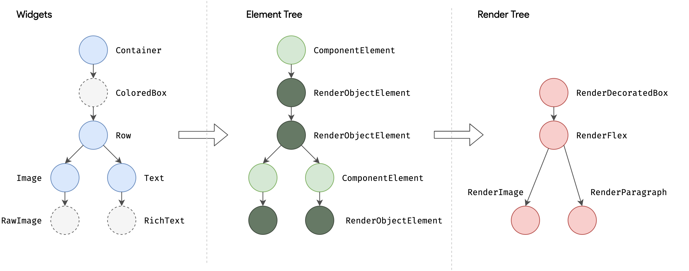

Flutter

## 项目地址

https://github.com/xqgithub/TestMyFlutterDemo/tree/master/test_my_flutter_demo

## 使用镜像

由于在国内访问Flutter有时可能会受到限制，Flutter官方为中国开发者搭建了临时镜像，大家可以将如下环境变量加入到用户环境变量中：

```
export PUB_HOSTED_URL=https://pub.flutter-io.cn
export FLUTTER_STORAGE_BASE_URL=https://storage.flutter-io.cn
```

## 系统要求

- Windows 7 或更高版本 (64-bit)
- [Git for Windows](https://git-scm.com/download/win) (Git命令行工具)
- 如果已安装Git for Windows，请确保命令提示符或PowerShell中运行 `git` 命令，不然在后面运行`flutter doctor`时将出现`Unable to find git in your PATH`错误, 此时需要手动添加`C:\Program Files\Git\bin`至`Path`系统环境变量中

## 获取Flutter SDK

1. 去flutter官网下载其最新可用的安装包，[点击下载](https://flutter.io/sdk-archive/#windows) 
2. 将安装包zip解压到你想安装Flutter SDK的路径（如：`C:\src\flutter`；注意，**不要**将flutter安装到需要一些高权限的路径如`C:\Program Files\`）。
3. 在Flutter安装目录的`flutter`文件下找到`flutter_console.bat`，双击运行并启动**flutter命令行**，接下来，你就可以在Flutter命令行运行flutter命令了

### 更新环境变量

要在终端运行 `flutter` 命令， 你需要添加以下环境变量到系统PATH：

- 转到 “控制面板>用户帐户>用户帐户>更改我的环境变量”
- 在“用户变量”下检查是否有名为“Path”的条目:
  - 如果该条目存在, 追加 `flutter\bin`的全路径，使用 `;` 作为分隔符.
  - 如果条目不存在, 创建一个新用户变量 `Path` ，然后将 `flutter\bin`的全路径作为它的值.
- 在“用户变量”下检查是否有名为”PUB_HOSTED_URL”和”FLUTTER_STORAGE_BASE_URL”的条目，如果没有，也添加它们。

重启Windows以应用此更改

## 创建Flutter app

### 一.基本结构介绍

```dart
import 'package:flutter/material.dart';

void main() => runApp(const MyApp());

class MyApp extends StatelessWidget {
  const MyApp({Key? key}) : super(key: key);

  @override
  Widget build(BuildContext context) {
    return MaterialApp(
      title: 'Welcome to Flutter',
      home: Scaffold(
        appBar: AppBar(
          title: const Text('Welcome to Flutter'),
        ),
        body: const Center(
          child: Text('Hello World'),
        ),
      ),
    );
  }
}
```

1. Material APP:[Material](https://material.io/guidelines/)是一种标准的移动端和web端的视觉设计语言。 Flutter提供了一套丰富的Material widgets。
2. main函数使用了(`=>`)符号, 这是Dart中单行函数或方法的简写。
3. 程序继承了 StatelessWidget，这将会使应用本身也成为一个widget。 在Flutter中，大多数东西都是widget，包括对齐(alignment)、填充(padding)和布局(layout)
4. Scaffold 是 Material library 中提供的一个widget, 它提供了默认的导航栏、标题和包含主屏幕widget树的body属性。widget树可以很复杂
5. widget的主要工作是提供一个build()方法来描述如何根据其他较低级别的widget来显示自己。
6. 本示例中的body的widget树中包含了一个Center widget, Center widget又包含一个 Text 子widget。 Center widget可以将其子widget树对其到屏幕中心

### 二.使用外部包(package)

1.  pubspec文件管理Flutter应用程序的assets(资源，如图片、package等)。 在pubspec.yaml中 添加外部应用包

   ```dart
   dependencies:
     flutter:
       sdk: flutter
   
   
     # The following adds the Cupertino Icons font to your application.
     # Use with the CupertinoIcons class for iOS style icons.
     cupertino_icons: ^1.0.2
   
     #打印日志
     logger: ^1.0.0
   ```

2. 在Android Studio的编辑器视图中查看pubspec时，单击右上角的 **Packages get**，这会将依赖包安装到您的项目。您可以在控制台中看到以下内容

   ```dart
   flutter packages get
   Running "flutter packages get" in startup_namer...
   Process finished with exit code 0
   ```

3. 在 **lib/main.dart** 中, 引入 `logger`

### 三.添加部件

1. Statelesswidgets 是不可变的, 这意味着它们的属性不能改变 - 所有的值都是最终的

2. Statefulwidgets 持有的状态可能在widget生命周期中发生变化. 实现一个 statefulwidget 至少需要两个类

   - 一个 StatefulWidget类
   - 一个 State类。 StatefulWidget类本身是不变的，但是 State类在widget生命周期中始终存在.

   ```dart
   import 'package:english_words/english_words.dart';
   import 'package:flutter/material.dart';
   
   void main() => runApp(const MyApp());
   
   class MyApp extends StatelessWidget {
     const MyApp({Key? key}) : super(key: key);
   
     @override
     Widget build(BuildContext context) {
       return MaterialApp(
         title: 'Welcome to Flutter',
         home: Scaffold(
           appBar: AppBar(
             title: const Text('Welcome to Flutter'),
           ),
           body: Center(
             // child: Text('Hello World'),
             child: RandomWords(),
           ),
         ),
       );
     }
   }
   
   class RandomWords extends StatefulWidget {
     @override
     State<StatefulWidget> createState() => RandomWordsState();
   }
   
   class RandomWordsState extends State<RandomWords> {
     @override
     Widget build(BuildContext context) {
       final wordPair = WordPair.random();
       return Text(wordPair.asPascalCase);
     }
   }
   ```

### 四.创建一个无限滚动ListView

1. 向RandomWordsState类中添加一个`_suggestions`列表以保存建议的单词对。 该变量以下划线（_）开头，在Dart语言中使用下划线前缀标识符，会强制其变成私有的；添加一个`biggerFont`变量来增大字体大小

2. 向RandomWordsState类添加一个 `_buildSuggestions()` 函数. 此方法构建显示建议单词对的ListView

3. 对于每一个单词对，`_buildSuggestions`函数都会调用一次`_buildRow`。 这个函数在ListTile中显示每个新词对，这使您在下一步中可以生成更漂亮的显示行

   ```dart
   import 'package:english_words/english_words.dart';
   import 'package:flutter/material.dart';
   import 'package:test_my_flutter_demo/PublicPracticalMethod.dart';
   
   void main() => runApp(const MyApp());
   
   class MyApp extends StatelessWidget {
     const MyApp({Key? key}) : super(key: key);
   
     @override
     Widget build(BuildContext context) {
       return MaterialApp(
         title: 'Welcome to Flutter',
         home: Scaffold(
           appBar: AppBar(
             title: const Text('Welcome to Flutter'),
           ),
           body: Center(
             // child: Text('Hello World'),
             child: RandomWords(),
           ),
         ),
       );
     }
   }
   
   class RandomWords extends StatefulWidget {
     @override
     State<StatefulWidget> createState() => RandomWordsState();
   }
   
   class RandomWordsState extends State<RandomWords> {
     final _suggestions = <WordPair>[];
     final _biggerFont = const TextStyle(fontSize: 18.0);
   
     @override
     Widget build(BuildContext context) {
       return Scaffold(
         appBar: AppBar(
           title: const Text('Startup Name Generator'),
         ),
         body: _buildSuggestions(),
       );
     }
   
     Widget _buildSuggestions() {
       return ListView.builder(
           padding: const EdgeInsets.all(16.0),
           // 对于每个建议的单词对都会调用一次itemBuilder，然后将单词对添加到ListTile行中
           // 在偶数行，该函数会为单词对添加一个ListTile row.
           // 在奇数行，该函数会添加一个分割线widget，来分隔相邻的词对。
           // 注意，在小屏幕上，分割线看起来可能比较吃力。
           itemBuilder: (context, i) {
             // 在每一列之前，添加一个1像素高的分隔线widget
             if (i.isOdd) return const Divider();
             // 语法 "i ~/ 2" 表示i除以2，但返回值是整形（向下取整），比如i为：1, 2, 3, 4, 5时，结果为0, 1, 1, 2, 2， 这可以计算出ListView中减去分隔线后的实际单词对数量
             final index = i ~/ 2;
             // 如果是建议列表中最后一个单词对
             if (index >= _suggestions.length) {
               // ...接着再生成10个单词对，然后添加到建议列表
               _suggestions.addAll(generateWordPairs().take(10));
             }
             return _buildRow(_suggestions[index]);
           });
     }
   
     Widget _buildRow(WordPair pair) {
       return ListTile(
         title: Text(
           pair.asPascalCase,
           style: _biggerFont,
         ),
       );
     }
   }
   ```

### 五.添加交互

1. 添加一个 `_saved` Set(集合) 到RandomWordsState。这个集合存储用户喜欢（收藏）的单词对。 在这里，Set比List更合适，因为Set中不允许重复的值
2. 在 `_buildRow` 方法中添加 `alreadySaved`来检查确保单词对还没有添加到收藏夹中
3. 同时在 `_buildRow()`中， 添加一个心形 ❤️ 图标到 ListTiles以启用收藏功能。接下来，你就可以给心形 ❤️ 图标添加交互能力了
4. 重新启动应用。你现在可以在每一行看到心形❤️图标️，但它们还没有交互
5. 在 `_buildRow`中让心形❤️图标变得可以点击。如果单词条目已经添加到收藏夹中， 再次点击它将其从收藏夹中删除。当心形❤️图标被点击时，函数调用`setState()`通知框架状态已经改变

<font color="#dd0000">提示: 在Flutter的响应式风格的框架中，调用setState() 会为State对象触发build()方法，从而导致对UI的更新</font>

## 路由管理

### 一.路由的意义

1. 路由（Route）在移动开发中通常指页面（Page），这跟 Web 开发中单页应用的 Route 概念意义是相同的，Route 在 Android中 通常指一个 Activity，在 iOS 中指一个 ViewController
2. 所谓路由管理，就是管理页面之间如何跳转，通常也可被称为导航管理
3. Flutter 中的路由管理和原生开发类似，无论是 Android 还是 iOS，导航管理都会维护一个路由栈，路由入栈（push）操作对应打开一个新页面，路由出栈（pop）操作对应页面关闭操作，而路由管理主要是指如何来管理路由栈

### 二.MaterialPageRoute

1. `MaterialPageRoute`继承自`PageRoute`类，`PageRoute`类是一个抽象类，表示占有整个屏幕空间的一个模态路由页面，它还定义了路由构建及切换时过渡动画的相关接口及属性

2. `MaterialPageRoute` 是 Material组件库提供的组件，它可以针对不同平台，实现与平台页面切换动画风格一致的路由切换动画：

   - 对于 Android，当打开新页面时，新的页面会从屏幕底部滑动到屏幕顶部；当关闭页面时，当前页面会从屏幕顶部滑动到屏幕底部后消失，同时上一个页面会显示到屏幕上。
   - 对于 iOS，当打开页面时，新的页面会从屏幕右侧边缘一直滑动到屏幕左边，直到新页面全部显示到屏幕上，而上一个页面则会从当前屏幕滑动到屏幕左侧而消失；当关闭页面时，正好相反，当前页面会从屏幕右侧滑出，同时上一个页面会从屏幕左侧滑入。

3. `MaterialPageRoute` 构造函数的各个参数的意义

   ```dart
     MaterialPageRoute({
       WidgetBuilder builder,
       RouteSettings settings,
       bool maintainState = true,
       bool fullscreenDialog = false,
     })
   ```

   - `builder` 是一个WidgetBuilder类型的回调函数，它的作用是构建路由页面的具体内容，返回值是一个widget。我们通常要实现此回调，返回新路由的实例。
   - `settings` 包含路由的配置信息，如路由名称、是否初始路由（首页）。
   - `maintainState`：默认情况下，当入栈一个新路由时，原来的路由仍然会被保存在内存中，如果想在路由没用的时候释放其所占用的所有资源，可以设置`maintainState`为 `false`。
   - `fullscreenDialog`表示新的路由页面是否是一个全屏的模态对话框，在 iOS 中，如果`fullscreenDialog`为`true`，新页面将会从屏幕底部滑入（而不是水平方向）。

<font color="#dd0000">如果想自定义路由切换动画，可以自己继承 PageRoute 来实现，我们将在后面介绍动画时，实现一个自定义的路由组件。</font>

### 三.Navigator

1. `Navigator`是一个路由管理的组件，它提供了打开和退出路由页方法
2. `Navigator`通过一个栈来管理活动路由集合。通常当前屏幕显示的页面就是栈顶的路由
3. `Navigator`提供了一系列方法来管理路由栈，在此我们只介绍其最常用的两个方法：
   - Future push(BuildContext context, Route route)：将给定的路由入栈（即打开新的页面），返回值是一个`Future`对象，用以接收新路由出栈（即关闭）时的返回数据。
   - bool pop(BuildContext context, [ result ])：将栈顶路由出栈，`result` 为页面关闭时返回给上一个页面的数据。
4. Navigator.push(BuildContext context, Route route)等价于Navigator.of(context).push(Route route)

### 四.路由传值

#### 非命名路由

```dart
class RouterTestRoute extends StatelessWidget {
  @override
  Widget build(BuildContext context) {
    return Center(
      child: ElevatedButton(
        onPressed: () async {
          // 打开`TipRoute`，并等待返回结果
          var result = await Navigator.push(
            context,
            MaterialPageRoute(
              builder: (context) {
                return TipRoute(
                  // 路由参数
                  text: "我是提示xxxx",
                );
              },
            ),
          );
          //输出`TipRoute`路由返回结果
          print("路由返回值: $result");
        },
        child: Text("打开提示页"),
      ),
    );
  }
}
```

#### 命令路由

命名路由（Named Route）即有名字的路由，我们可以先给路由起一个名字，然后就可以通过路由名字直接打开新的路由了，这为路由管理带来了一种直观、简单的方式。

##### 路由表

想使用命名路由，我们必须先提供并注册一个路由表（routing table），这样应用程序才知道哪个名字与哪个路由组件相对应。其实注册路由表就是给路由起名字

1. 注册一个路由

   ```dart
    routes:{
      "new_page":(context) => EchoRoute(),
     } ,
   ```

2. 路由页通过`RouteSetting`对象获取路由参数

   ```dart
   class EchoRoute extends StatelessWidget {
   
     @override
     Widget build(BuildContext context) {
       //获取路由参数  
       var args=ModalRoute.of(context).settings.arguments;
       //...省略无关代码
     }
   }
   ```

3. 打开路由时传递参数

   ```dart
   Navigator.of(context).pushNamed("new_page", arguments: "hi");
   ```

## Dart语言介绍

### 一.变量声明

1. var

   - 可以接收任何类型的变量，但最大的不同是 Dart 中 var 变量一旦赋值，类型便会确定则不能再改变其类型

     ```dart
     var t = "hi world";
     // 下面代码在dart中会报错，因为变量t的类型已经确定为String，
     // 类型一旦确定后则不能再更改其类型。
     t = 1000;
     ```

   - Dart 本身是一个强类型语言，任何变量都是有确定类型的，在 Dart 中，当用`var`声明一个变量后，Dart 在编译时会根据第一次赋值数据的类型来推断其类型，编译结束后其类型就已经被确定

2. **dynamic** 和 Object

   - `Object` 是 Dart 所有对象的根基类，也就是说在 Dart 中所有类型都是`Object`的子类(包括Function和Null)，所以任何类型的数据都可以赋值给`Object`声明的对象

   - `dynamic`与`Object`声明的变量都可以赋值任意对象，且后期可以改变赋值的类型，这和 `var` 是不同的

     ```dart
     dynamic t;
     Object x;
     t = "hi world";
     x = 'Hello Object';
     //下面代码没有问题
     t = 1000;
     x = 1000;
     ```

   - `dynamic`与`Object`不同的是`dynamic`声明的对象编译器会提供所有可能的组合，而`Object`声明的对象只能使用 `Object` 的属性与方法, 否则编译器会报错

3. final 和 const

   - 从未打算更改一个变量，那么使用 `final` 或 `const`，不是`var`，也不是一个类型

   - 一个 `final` 变量只能被设置一次

   - `const` 变量是一个编译时常量（编译时直接替换为常量值），`final`变量在第一次使用时被初始化

   - 被`final`或者`const`修饰的变量，变量类型可以省略

     ```dart
     //可以省略String这个类型声明
     final str = "hi world";
     //final String str = "hi world"; 
     const str1 = "hi world";
     //const String str1 = "hi world";
     ```

4. 空安全（null-safety）

   ```dart
   int i = 8; //默认为不可空，必须在定义时初始化。
   int? j; // 定义为可空类型，对于可空变量，我们在使用前必须判空。
   
   // 如果我们预期变量不能为空，但在定义时不能确定其初始值，则可以加上late关键字，
   // 表示会稍后初始化，但是在正式使用它之前必须得保证初始化过了，否则会报错
   late int k;
   k=9;
   ```

### 二.函数

1. 函数声明

   ```dart
   bool isNoble(int atomicNumber) {
     return _nobleGases[atomicNumber] != null;
   }
   ```

2. Dart函数声明如果没有显式声明返回值类型时会默认当做`dynamic`处理，注意，函数返回值没有类型推断

   ```dart
   typedef bool CALLBACK();
   
   //不指定返回类型，此时默认为dynamic，不是bool
   isNoble(int atomicNumber) {
     return _nobleGases[atomicNumber] != null;
   }
   
   void test(CALLBACK cb){
      print(cb()); 
   }
   //报错，isNoble不是bool类型
   test(isNoble);
   ```

3. 对于只包含一个表达式的函数，可以使用简写语法

   ```dart
   bool isNoble (int atomicNumber)=> true ;   
   ```

4. 函数作为变量

   ```dart
   var say = (str){
     print(str);
   };
   say("hi world");
   ```

5. 函数作为参数传递

   ```dart
   void execute(var callback) {
       callback();
   }
   execute(() => print("xxx"))
   ```

6. 可选的位置参数

   ```dart
   String say(String from, String msg, [String device]) {
     var result = '$from says $msg';
     if (device != null) {
       result = '$result with a $device';
     }
     return result;
   }
   ```

7. 可选的命名参数: 定义函数时，使用{param1, param2, …}，放在参数列表的最后面，用于指定命名参数

   ```dart
   //设置[bold]和[hidden]标志
   void enableFlags({bool bold, bool hidden}) {
       // ... 
   }
   ```

### 三.mixin

1. Dart 是不支持多继承的，但是它支持 mixin，简单来讲 mixin 可以 “组合” 多个类

   ```dart
   class Person {
     say() {
       print('say');
     }
   }
   
   mixin Eat {
     eat() {
       print('eat');
     }
   }
   
   mixin Walk {
     walk() {
       print('walk');
     }
   }
   
   mixin Code {
     code() {
       print('key');
     }
   }
   
   class Dog with Eat, Walk{}
   class Man extends Person with Eat, Walk, Code{}
   ```

2. 多个mixin 中有同名方法，with 时，会默认使用最后面的 mixin 的，mixin 方法中可以通过 super 关键字调用之前 mixin 或类中的方法

### 四.异步支持

1. Dart类库有非常多的返回`Future`或者`Stream`对象的函数。 这些函数被称为**异步函数**
2. `async`和`await`关键词支持了异步编程，允许您写出和同步代码很像的异步代码

#### Future

1. `Future`与JavaScript中的`Promise`非常相似，表示一个异步操作的最终完成（或失败）及其结果值的表示

2. 异步处理成功了就执行成功的操作，异步处理失败了就捕获错误或者停止后续操作。一个Future只会对应一个结果，要么成功，要么失败

3. `Future` 的所有API的返回值仍然是一个`Future`对象，所以可以很方便的进行链式调用。

4. Future一些API的使用

   - Future.then

     ```dart
     Future.delayed(Duration(seconds: 2),(){
        return "hi world!";
     }).then((data){
        print(data);
     });
     ```

   - Future.catchError

     ```dart
     Future.delayed(Duration(seconds: 2),(){
        //return "hi world!";
        throw AssertionError("Error");  
     }).then((data){
        //执行成功会走到这里  
        print("success");
     }).catchError((e){
        //执行失败会走到这里  
        print(e);
     });
     ```

   - Future.whenComplete

     ```dart
     Future.delayed(Duration(seconds: 2),(){
        //return "hi world!";
        throw AssertionError("Error");
     }).then((data){
        //执行成功会走到这里 
        print(data);
     }).catchError((e){
        //执行失败会走到这里   
        print(e);
     }).whenComplete((){
        //无论成功或失败都会走到这里
     });
     ```

   - Future.wait

     ```dart
     Future.wait([
       // 2秒后返回结果  
       Future.delayed(Duration(seconds: 2), () {
         return "hello";
       }),
       // 4秒后返回结果  
       Future.delayed(Duration(seconds: 4), () {
         return " world";
       })
     ]).then((results){
       print(results[0]+results[1]);
     }).catchError((e){
       print(e);
     });

#### Async/await

1. `async`用来表示函数是异步的，定义的函数会返回一个`Future`对象，可以使用 then 方法添加回调函数。

2. `await` 后面是一个`Future`，表示等待该异步任务完成，异步完成后才会往下走；`await`必须出现在 `async` 函数内部

   ```dart
   //先分别定义各个异步任务
   Future<String> login(String userName, String pwd){
   	...
       //用户登录
   };
   Future<String> getUserInfo(String id){
   	...
       //获取用户信息 
   };
   Future saveUserInfo(String userInfo){
   	...
   	// 保存用户信息 
   }; 
   
   
   task() async {
      try{
       String id = await login("alice","******");
       String userInfo = await getUserInfo(id);
       await saveUserInfo(userInfo);
       //执行接下来的操作   
      } catch(e){
       //错误处理   
       print(e);   
      }  
   }
   
   ```

#### Stream

1. `Stream` 也是用于接收异步事件数据，和 `Future` 不同的是，它可以接收多个异步操作的结果（成功或失败）
2. `Stream` 常用于会多次读取数据的异步任务场景，如网络内容下载、文件读写等

```dart
Stream.fromFutures([
  // 1秒后返回结果
  Future.delayed(Duration(seconds: 1), () {
    return "hello 1";
  }),
  // 抛出一个异常
  Future.delayed(Duration(seconds: 2),(){
    throw AssertionError("Error");
  }),
  // 3秒后返回结果
  Future.delayed(Duration(seconds: 3), () {
    return "hello 3";
  })
]).listen((data){
   print(data);
}, onError: (e){
   print(e.message);
},onDone: (){

});


I/flutter (17666): hello 1
I/flutter (17666): Error
I/flutter (17666): hello 3

```

## Flutter应用

### 一.widget介绍

#### widget概念

1. 在Flutter中几乎所有的对象都是一个 widget
2. Flutter 中的 widget 的概念更广泛，它不仅可以表示UI元素，也可以表示一些功能性的组件如：用于手势检测的 `GestureDetector` 、用于APP主题数据传递的 `Theme` 等等
3. Flutter 中是通过 Widget 嵌套 Widget 的方式来构建UI和进行实践处理的，所以记住，Flutter 中万物皆为Widget。

#### widget接口

1.  Widget 中定义的属性（即配置信息）必须是不可变的（final），Flutter 中如果属性发生则会重新构建Widget树，即重新创建新的 Widget 实例来替换旧的 Widget 实例。
2.  Flutter 开发中，我们一般都不用直接继承`Widget`类来实现一个新组件，相反，我们通常会通过继承`StatelessWidget`或`StatefulWidget`来间接继承`widget`类来实现。

#### Flutter中的四棵树



1. 三棵树中，Widget 和 Element 是一一对应的，但并不和 RenderObject 一一对应。比如 `StatelessWidget` 和 `StatefulWidget` 都没有对应的 RenderObject
2. 渲染树在上屏前会生成一棵 Layer 树，这个我们将在后面原理篇介绍，在前面的章节中读者只需要记住以上三棵树就行

#### StatelessWidget

1. `StatelessWidget`相对比较简单，它继承自`widget`类，重写了`createElement()`方法。
2. `StatelessWidget`用于不需要维护状态的场景，它通常在`build`方法中通过嵌套其它 widget 来构建UI，在构建过程中会递归的构建其嵌套的 widget。

#### Context

1. `build`方法有一个`context`参数，它是`BuildContext`类的一个实例，表示当前 widget 在 widget 树中的上下文，每一个 widget 都会对应一个 context 对象（因为每一个 widget 都是 widget 树上的一个节点）

   ```dart
   class ContextRoute extends StatelessWidget {
     @override
     Widget build(BuildContext context) {
       return Scaffold(
         appBar: AppBar(
           title: const Text("Context测试"),
         ),
         body: Container(
           child: Builder(builder: (context) {
             // 在 widget 树中向上查找最近的父级`Scaffold`  widget
             Scaffold? scaffold =
                 context.findAncestorWidgetOfExactType<Scaffold>();
             // 直接返回 AppBar的title， 此处实际上是Text("Context测试")
             return (scaffold?.appBar as AppBar).title!;
           }),
         ),
       );
     }
   }
   ```

#### StatefulWidget

1. `StatelessWidget`一样，`StatefulWidget`也是继承自`widget`类，并重写了`createElement()`方法，不同的是返回的Element 对象并不相同；另外`StatefulWidget`类中添加了一个新的接口`createState()`
2. `StatefulElement` 间接继承自`Element`类，与`StatefulWidget`相对应（作为其配置数据）。`StatefulElement`中可能会多次调用`createState()`来创建状态（State）对象
3. `createState()` 用于创建和 `StatefulWidget` 相关的状态，它在`StatefulWidget` 的生命周期中可能会被多次调用

#### State

1. StatefulWidget 类会对应一个 State 类，State表示与其对应的 StatefulWidget 要维护的状态，State 中的保存的状态信息可以:

   - 在 widget 构建时可以被同步读取
   - 在 widget 生命周期中可以被改变，当State被改变时，可以手动调用其`setState()`方法通知Flutter 框架状态发生改变，Flutter 框架在收到消息后，会重新调用其`build`方法重新构建 widget 树，从而达到更新UI的目的

2. State 中有两个常用属性:

   - `widget`，它表示与该 State 实例关联的 widget 实例，由Flutter 框架动态设置.State实例只会在第一次插入到树中时被创建，当在重新构建时，如果 widget 被修改了，Flutter 框架会动态设置State. widget 为新的 widget 实例
   - `context`。StatefulWidget对应的 BuildContext，作用同StatelessWidget 的BuildContext。

3. state生命周期

   ```dart
   ///State生命周期 测试
   class CounterWidget extends StatefulWidget {
     const CounterWidget({Key? key, this.initValue = 0}) : super(key: key);
   
     final int initValue;
   
     @override
     _CounterWidgetState createState() => _CounterWidgetState();
   }
   
   class _CounterWidgetState extends State<CounterWidget> {
     int _counter = 0;
   
     ///当 widget 第一次插入到 widget 树时会被调用，对于每一个State对象，Flutter 框架只会调用一次该回调
     @override
     void initState() {
       super.initState();
       _counter = widget.initValue;
       LogUtils.i('initState =-= ');
     }
   
     ///当State对象的依赖发生变化时会被调用
     @override
     void didChangeDependencies() {
       super.didChangeDependencies();
       LogUtils.i('didChangeDependencies =-= ');
     }
   
     ///主要是用于构建 widget 子树的，会在如下场景被调用:
     ///1.在调用initState()之后
     ///2.在调用didUpdateWidget()之后。
     ///3.在调用setState()之后。
     ///4.在调用didChangeDependencies()之后。
     @override
     Widget build(BuildContext context) {
       LogUtils.i('build =-= ');
       return Scaffold(
         body: Center(
           child: TextButton(
             child: Text('$_counter'),
   
             ///点击后计数器自增
             onPressed: () {
               setState(() {
                 ++_counter;
               });
             },
           ),
         ),
       );
     }
   
     ///在 widget 重新构建时，Flutter 框架会调用widget.canUpdate来检测 widget 树中同一位置的新旧节点，然后决定是否需要更新
     @override
     void didUpdateWidget(covariant CounterWidget oldWidget) {
       super.didUpdateWidget(oldWidget);
       LogUtils.i('didUpdateWidget =-= ');
     }
   
     ///当 State 对象从树中被移除时，会调用此回调
     @override
     void deactivate() {
       super.deactivate();
       LogUtils.i('deactivate =-= ');
     }
   
     ///当 State 对象从树中被永久移除时调用；通常在此回调中释放资源
     @override
     void dispose() {
       super.dispose();
       LogUtils.i('dispose =-= ');
     }
   
     ///此回调是专门为了开发调试而提供的，在热重载(hot reload)时会被调用，此回调在Release模式下永远不会被调用
     @override
     void reassemble() {
       super.reassemble();
       LogUtils.i('reassemble =-= ');
     }
   }
   ```

   - 打开路由进入页面，initState -> didChangeDependencies -> build

   - 热重载,reassemble -> didUpdateWidget -> build

   - 在 widget 树中移除`CounterWidget`然后重载，reassemble -> deactive -> dispose

   - 退出该页面，deactivate -> dispose

     

#### 在widget树中获取State对象

1. 通过Context获取

   - `context`对象有一个`findAncestorStateOfType()`方法，该方法可以从当前节点沿着 widget 树向上查找指定类型的 StatefulWidget 对应的 State 对象

     ```dart
     // 查找父级最近的Scaffold对应的ScaffoldState对象
     ScaffoldState _state = context.findAncestorStateOfType<ScaffoldState>()!;
     ```

   - `Scaffold`也提供了一个`of`方法，我们其实是可以直接调用它

     ```dart
     // 直接通过of静态方法来获取ScaffoldState
      ScaffoldState _state=Scaffold.of(context);
     ```

2. 通过GlobalKey

   - 给目标`StatefulWidget`添加`GlobalKey`

     ```dart
     //定义一个globalKey, 由于GlobalKey要保持全局唯一性，我们使用静态变量存储
     static GlobalKey<ScaffoldState> _globalKey= GlobalKey();
     ...
     Scaffold(
         key: _globalKey , //设置key
         ...  
     )
     ```

   - 通过`GlobalKey`来获取`State`对象

     ```dart
     _globalKey.currentState.openDrawer()
     ```

   - 如果一个 widget 设置了`GlobalKey`，那么我们便可以通过`globalKey.currentWidget`获得该 widget 对象;`globalKey.currentElement`来获得 widget 对应的element对象;当前 widget 是`StatefulWidget`，则可以通过`globalKey.currentState`来获得该 widget 对应的state对象

     <font color="#dd0000">使用 GlobalKey 开销较大，如果有其他可选方案，应尽量避免使用它。另外，同一个 GlobalKey 在整个 widget 树中必须是唯一的，不能重复。</font>

#### 通过RenderObject自定义Widget

1. `StatelessWidget` 和 `StatefulWidget` 都是用于组合其它组件的，它们本身没有对应的 RenderObject

2. Flutter 组件库中的很多基础组件都不是通过`StatelessWidget` 和 `StatefulWidget` 来实现的，比如 Text 、Column、Align等

3. 积木都是通过自定义 RenderObject 来实现的

   - 如果组件不会包含子组件，则我们可以直接继承自 LeafRenderObjectWidget

   - 自定义的 widget 可以包含子组件，则可以根据子组件的数量来选择继承SingleChildRenderObjectWidget 或 MultiChildRenderObjectWidget

     ```dart
     class CustomWidget extends LeafRenderObjectWidget{
       @override
       RenderObject createRenderObject(BuildContext context) {
         // 创建 RenderObject
         return RenderCustomObject();
       }
       @override
       void updateRenderObject(BuildContext context, RenderCustomObject  renderObject) {
         // 更新 RenderObject
         super.updateRenderObject(context, renderObject);
       }
     }
     
     class RenderCustomObject extends RenderBox{
     
       @override
       void performLayout() {
         // 实现布局逻辑
       }
     
       @override
       void paint(PaintingContext context, Offset offset) {
         // 实现绘制
       }
     }
     ```

#### Flutter SDK 内置组件库介绍

##### 基础组件

1. 导包：package:flutter/widgets.dart
2. Text:该组件可让您创建一个带格式的文本
3. Row、Colum：这些具有弹性空间的布局类 widget 可让您在水平（Row）和垂直（Column）方向上创建灵活的布局
4. Stack：取代线性布局，允许子 widget 堆叠， 你可以使用Positioned来定位他们相对Stack的上下左右四条边的位置。
5. Container：可让您创建矩形视觉元素。可以装饰一个BoxDecoration，如background、一个边框、或者一个阴影。具有边距（margins）、填充(padding)和应用于其大小的约束(constraints)。可以使用矩阵在三维空间中对其进行变换

##### Material组件

1. 导包：package:flutter/material.dart
2. Scaffold、AppBar、TextButton等

##### Cupertino组件

IOS风格UI

### 二.状态管理

#### 管理状态的最常见的方法

1. Widget 管理自己的状态。
2. Widget 管理子 Widget 状态。
3. 混合管理（父 Widget 和子 Widget 都管理状态）。

#### 如何决定哪种管理方法

1. 如果状态是用户数据，如复选框的选中状态、滑块的位置，则该状态最好由父 Widget 管理
2. 如果状态是有关界面外观效果的，例如颜色、动画，那么状态最好由 Widget 本身来管理
3. 果某一个状态是不同 Widget 共享的则最好由它们共同的父 Widget 管理


#### Widget管理自身状态

- 管理TapboxA的状态
- 定义`_active`：确定盒子的当前颜色的布尔值。
- 定义`_handleTap()`函数，该函数在点击该盒子时更新`_active`，并调用`setState()`更新UI。
- 实现widget的所有交互式行为。

```dart
class WidgetStateManagement extends StatelessWidget {
  @override
  Widget build(BuildContext context) {
    return TapboxA();
  }
}

///Widget管理自身状态
class TapboxA extends StatefulWidget {
  TapboxA({Key? key}) : super(key: key);

  @override
  _TapboxAState createState() => _TapboxAState();
}

class _TapboxAState extends State<TapboxA> {
  ///确定盒子的当前颜色的布尔值。
  bool _active = false;

  ///设置开关状态
  void _handleTap() {
    setState(() {
      _active = !_active;
    });
  }

  @override
  Widget build(BuildContext context) {
    return GestureDetector(
      onTap: _handleTap,
      child: Container(
        child: Center(
          child: Text(
            _active ? 'Active' : 'Inactive',
            style: const TextStyle(
                fontSize: 32.0,
                color: Colors.white,
                decoration: TextDecoration.none),
          ),
        ),
        width: 200.0,
        height: 200.0,
        decoration: BoxDecoration(
          color: _active ? Colors.lightGreen[700] : Colors.grey[600],
        ),
      ),
    );
  }
}
```

#### 父Widget管理子Widget的状态

- 为TapboxB 管理`_active`状态

- 实现`_handleTapboxChanged()`，当盒子被点击时调用的方法。

- 当状态改变时，调用`setState()`更新UI。

  ```dart
  class WidgetStateManagement extends StatelessWidget {
    @override
    Widget build(BuildContext context) {
      return ParentWidget();
    }
  }
  
  ///父Widget管理子Widget的状态
  class ParentWidget extends StatefulWidget {
    @override
    _ParentWidgetState createState() => _ParentWidgetState();
  }
  
  class _ParentWidgetState extends State<ParentWidget> {
    ///确定盒子的当前颜色的布尔值。
    bool _active = false;
  
    ///设置开关状态
    void _handleTapboxChanged(bool newValue) {
      setState(() {
        _active = !_active;
      });
    }
  
    @override
    Widget build(BuildContext context) {
      return Container(
        color: Colors.white,
        child: TapboxB(active: _active, onChanged: _handleTapboxChanged),
      );
    }
  }
  
  class TapboxB extends StatelessWidget {
    TapboxB({Key? key, this.active = false, required this.onChanged})
        : super(key: key);
  
    final bool active;
    final ValueChanged<bool> onChanged;
  
    void _handleTap() {
      onChanged(!active);
    }
  
    @override
    Widget build(BuildContext context) {
      return GestureDetector(
        onTap: _handleTap,
        child: Center(
          child: Container(
            child: Text(
              active ? 'Active' : 'Inactive',
              style: const TextStyle(
                  fontSize: 32.0,
                  color: Colors.white,
                  decoration: TextDecoration.none),
            ),
            alignment: Alignment.topLeft,
            width: 500.0,
            height: 250.0,
            padding: const EdgeInsets.fromLTRB(20.0, 10.0, 0.0, 0.0),
            margin: const EdgeInsets.fromLTRB(20.0, 0.0, 20.0, 0.0),
            decoration: BoxDecoration(
              color: active ? Colors.lightGreen[700] : Colors.grey[600],
              border: Border.all(
                width: 2.0,
                color: Colors.red,
              ),
              borderRadius: BorderRadius.circular(12),
            ),
          ),
        ),
      );
    }
  }
  ```

#### 混合状态管理

1. `_ParentWidgetStateC`类:
   - 管理`_active` 状态
   - 实现 `_handleTapboxChanged()` ，当盒子被点击时调用。
   - 当点击盒子并且`_active`状态改变时调用`setState()`更新UI。

2. `_TapboxCState` 对象:

   - 管理`_highlight` 状态
   - `GestureDetector`监听所有tap事件。当用户点下时，它添加高亮（深绿色边框）；当用户释放时，会移除高亮
   - 当按下、抬起、或者取消点击时更新`_highlight`状态，调用`setState()`更新UI。
   - 当点击时，将状态的改变传递给父组件

   ```dart
   class WidgetStateManagement extends StatelessWidget {
     @override
     Widget build(BuildContext context) {
       return ParentWidgetC();
     }
   }
   
   ///混合状态管理
   class ParentWidgetC extends StatefulWidget {
     @override
     _ParentWidgetCState createState() => _ParentWidgetCState();
   }
   
   class _ParentWidgetCState extends State<ParentWidgetC> {
     bool _active = false;
   
     void _handleTapboxChanged(bool newValue) {
       setState(() {
         _active = newValue;
       });
     }
   
     @override
     Widget build(BuildContext context) {
       return Container(
         color: Colors.white,
         child: TapboxC(active: _active, onChanged: _handleTapboxChanged),
       );
     }
   }
   
   class TapboxC extends StatefulWidget {
     const TapboxC({Key? key, this.active = false, required this.onChanged})
         : super(key: key);
   
     final bool active;
     final ValueChanged<bool> onChanged;
   
     @override
     _TapboxCState createState() => _TapboxCState();
   }
   
   class _TapboxCState extends State<TapboxC> {
     bool _highlight = false;
   
     void _handleTapDown(TapDownDetails details) {
       setState(() {
         _highlight = true;
       });
     }
   
     void _handleTapUp(TapUpDetails details) {
       setState(() {
         _highlight = false;
       });
     }
   
     void _handleTapCancel() {
       setState(() {
         _highlight = false;
       });
     }
   
     void _handleTap() {
       widget.onChanged(!widget.active);
     }
   
     @override
     Widget build(BuildContext context) {
       return GestureDetector(
         onTapDown: _handleTapDown,
         //处理按下事件
         onTapUp: _handleTapUp,
         //处理抬起事件
         onTap: _handleTap,
         onTapCancel: _handleTapCancel,
         child: Center(
           child: Container(
             child: Text(
               widget.active ? 'Active' : 'Inactive',
               style: const TextStyle(
                   fontSize: 32.0,
                   color: Colors.white,
                   decoration: TextDecoration.none),
             ),
             alignment: Alignment.topLeft,
             width: 500.0,
             height: 250.0,
             padding: const EdgeInsets.fromLTRB(20.0, 10.0, 0.0, 0.0),
             margin: const EdgeInsets.fromLTRB(20.0, 0.0, 20.0, 0.0),
             decoration: BoxDecoration(
               color: widget.active ? Colors.lightGreen[700] : Colors.grey[600],
               border: _highlight
                   ? Border.all(
                       width: 2.0,
                       color: Colors.red,
                     )
                   : null,
               borderRadius: BorderRadius.circular(12),
             ),
           ),
         ),
   
       );
     }
   }
   ```

### 三.包管理

1. 可共享的独立模块统一称为“包”（ Package）

2. 包的结构说明：

   ```yaml
   name: flutter_in_action
   description: First Flutter Application.
   
   version: 1.0.0+1
   
   dependencies:
     flutter:
       sdk: flutter
     cupertino_icons: ^0.1.2
   
   dev_dependencies:
     flutter_test:
       sdk: flutter
       
   flutter:
     uses-material-design: true
   ```

   - name:应用或包名称
   - description:应用或包的描述、简介
   - version：应用或包的版本号
   - dependencies:应用或包依赖的其它包或插件
   - dev_dependencies：开发环境依赖的工具包（而不是flutter应用本身依赖的包）
   - flutter:flutter相关的配置选项

#### pub仓库

Pub（https://pub.dev/ ）是 Google 官方的 Dart Packages 仓库，类似于 node 中的 npm仓库、Android中的 jcenter。我们可以在 Pub 上面查找我们需要的包和插件，也可以向 Pub 发布我们的包和插件。我们将在后面的章节中介绍如何向 Pub 发布我们的包和插件

#### 其他依赖方式

- 依赖本地包

  ```yaml
  dependencies:
  	pkg1:
          path: ../../code/pkg1
              
   //路径可以是相对的，也可以是绝对的
  ```

- 依赖Git：你也可以依赖存储在Git仓库中的包。如果软件包位于仓库的根目录中，请使用以下语法

  ```yaml
  dependencies:
    pkg1:
      git:
        url: git://github.com/xxx/pkg1.git
  ```

- 不是这种情况，可以使用path参数指定相对位置

  ```yaml
  dependencies:
    package1:
      git:
        url: git://github.com/flutter/packages.git
        path: packages/package1  
  ```

### 四.资源管理

#### 指定assets

```yaml
flutter:
  uses-material-design: true
  assets:
      - assets/images/
```

- `assets`指定应包含在应用程序中的文件， 每个 asset 都通过相对于`pubspec.yaml`文件所在的文件系统路径来标识自身的路径。asset 的声明顺序是无关紧要的，asset的实际目录可以是任意文件夹

#### Asset变体(variant)

- …/graphics/my_icon.png
- …/graphics/background.png
- …/graphics/dark/**background.png**

```yaml
flutter:
  assets:
    - graphics/background.png
```

#### 指定assets中的字体

```yaml
  fonts:
    - family: Charmonman
      fonts:
        - asset: assets/fonts/Charmonman-Bold.ttf
        - asset: assets/fonts/Charmonman-Regular.ttf
          weight: 500
    - family: Iconfont
      fonts:
        - asset: assets/fonts/iconfont.ttf
```

#### 加载assets资源中的图片

1. 加载assets中的图片

   - Image.asset("assets/images/iocn_diqiu.png", width: 60, height: 60)

   - Image(image: AssetImage("assets/images/error_null.png"),width: 60,height: 60)

     ```dart
     class LoadAssets extends StatelessWidget {
       @override
       Widget build(BuildContext context) {
         return Scaffold(
           appBar: AppBar(
             title: const Text('加载assets文件中的内容'),
           ),
           body: LoadAssetsImg(),
         );
       }
     }
     
     ///加载图片
     class LoadAssetsImg extends StatefulWidget {
       @override
       _LoadAssetsImgState createState() => _LoadAssetsImgState();
     }
     
     class _LoadAssetsImgState extends State<LoadAssetsImg> {
       @override
       Widget build(BuildContext context) {
         return Column(
           mainAxisAlignment: MainAxisAlignment.start,
           crossAxisAlignment: CrossAxisAlignment.end,
           children: <Widget>[
             Row(
               children: [
                 Image.asset("assets/images/iocn_diqiu.png", width: 60, height: 60),
               ],
             ),
             const Image(
                 image: AssetImage("assets/images/error_null.png"),
                 width: 60,
                 height: 60),
           ],
         );
       }
     }
     ```

2. 加载依赖包中的资源图片

   - AssetImage('icons/heart.png', package: 'my_icons')
   - Image.asset('icons/heart.png', package: 'my_icons')

   假设您的应用程序依赖一个名为"my_icons"的包 

#### 加载文本assets

- 通过`rootBundle`对象加载：全局静态的`rootBundle`对象来加载asset即可

  ```dart
  import 'dart:async' show Future;
  import 'package:flutter/services.dart' show rootBundle;
  
  Future<String> loadAsset() async {
    return await rootBundle.loadString('assets/config.json');
  }
  ```

  

- 通过DefaultAssetBundle对象加载：建议使用 `DefaultAssetBundle`来获取当前 BuildContext 的AssetBundle

  ```dart
  import 'dart:convert' show json;
  import 'package:flutter/material.dart';
  
  ///加载json文件
  class JsonView extends StatefulWidget {
    @override
    State<StatefulWidget> createState() {
      return new _JsonViewState();
    }
  }
  
  class _JsonViewState extends State<JsonView> {
    @override
    Widget build(BuildContext context) {
      return new FutureBuilder(
          future:
              DefaultAssetBundle.of(context).loadString("assets/country.json"),
          builder: (context, snapshot) {
            if (snapshot.hasData) {
              List<dynamic> data = json.decode(snapshot.data.toString());
              return ListView.builder(
                itemCount: data.length,
                itemBuilder: (BuildContext context, int index) {
                  return new Card(
                    child: new Column(
                      crossAxisAlignment: CrossAxisAlignment.stretch,
                      children: <Widget>[
                        new Text("Name: ${data[index]["name"]}"),
                        new Text("Age: ${data[index]["age"]}"),
                        new Text("Height: ${data[index]["height"]}"),
                        new Text("Gender: ${data[index]["gender"]}"),
                      ],
                    ),
                  );
                },
              );
            }
            return new CircularProgressIndicator();
          });
    }
  }
  ```


### 五.调试Flutter应用

#### 1.degbugger()声明

- 可以使用该`debugger()`语句插入编程式断点
- 要使用这个，你必须添加`import 'dart:developer'`
- `debugger()`语句采用一个可选`when`参数，我们可以指定该参数仅在特定条件为真时中断

#### 2.print、debugPrint、flutter logs

#### 3.DevTools

### 六.Flutter异常捕获

#### 1.Dart单线程模型

1. Dart是单线程模式，如果程序发生异常而未被捕获，程序是不会因崩溃而终止的。

2. Dart大致的运行原理:

   

   - 微任务队列” **microtask queue**;“事件队列” **event queue**

   - 入口函数 main() 执行完后，消息循环机制便启动了,在这种情况下，整个线程的执行过程便是一直在循环，不会退出，而Flutter中，主线程的执行过程正是如此，永不终止

   - 微任务太多，执行时间总和就越久，事件队列任务的延迟也就越久

   - 可以通过`Future.microtask(…)`方法向微任务队列插入一个任务

   - 事件循环中，当某个任务发生异常并没有被捕获时，程序并不会退出，而直接导致的结果是**当前任务**的后续代码就不会被执行了，也就是说一个任务中的异常是不会影响其它任务执行的


#### 2.异常捕获

   1. 发生异常时，Flutter默认的处理方式是弹一个ErrorWidget

      ```dart
      @override
      void performRebuild() {
       ...
        try {
          //执行build方法  
          built = build();
        } catch (e, stack) {
          // 有异常时则弹出错误提示  
          built = ErrorWidget.builder(_debugReportException('building $this', e, stack));
        } 
        ...
      } 
      ```

   2. 我们想自己上报异常，只需要提供一个自定义的错误处理回调即可

      ```dart
      void main() {
        FlutterError.onError = (FlutterErrorDetails details) {
          reportError(details);
        };
       ...
      }
      ```

   #### 3.其他异常捕获与日志收集

1. 同步异常：同步异常可以通过`try/catch`捕获

2. 异步异常：`runZoned(...)` 方法，可以给执行对象指定一个Zone

   ```dart
   runZoned(
     () => runApp(MyApp()),
     zoneSpecification: ZoneSpecification(
       // 拦截print 蜀西湖
       print: (Zone self, ZoneDelegate parent, Zone zone, String line) {
         parent.print(zone, "Interceptor: $line");
       },
       // 拦截未处理的异步错误
       handleUncaughtError: (Zone self, ZoneDelegate parent, Zone zone,
                             Object error, StackTrace stackTrace) {
         parent.print(zone, '${error.toString()} $stackTrace');
       },
     ),
   );
   ```

## 基础组件

### 一.文本及样式

#### 1.Text

- 用于显示简单样式文本，它包含一些控制文本显示样式的一些属性
- textAlign：文本的对齐方式；可以选择左对齐、右对齐还是居中。对齐的参考系是Text widget 本身
- maxLines、overflow：指定文本显示的最大行数，默认情况下，文本是自动折行的，如果指定此参数，则文本最多不会超过指定的行。如果有多余的文本，可以通过`overflow`来指定截断方式
- textScaleFactor：代表文本相对于当前字体大小的缩放因子

```dart
///基础组件
class BasicComponents extends StatelessWidget {
  @override
  Widget build(BuildContext context) {
    return TextComponent();
  }
}

///Text
class TextComponent extends StatefulWidget {
  @override
  _TextComponent createState() => _TextComponent();
}

class _TextComponent extends State<TextComponent> {
  @override
  Widget build(BuildContext context) {
    return Scaffold(
      appBar: AppBar(
        title: const Text('Text组件'),
      ),
      body: Column(
        children: [
          Container(
            color: Colors.red[300],
            width: 500.0,
            child: const Text(
              "Hello world",
              textAlign: TextAlign.start,
            ),
          ),
          Container(
            color: Colors.deepOrange[300],
            width: 500.0,
            child: Text(
              "Hello world! I'm Jack." * 4,
              maxLines: 1,
              overflow: TextOverflow.ellipsis,
            ),
          ),
          Container(
            color: Colors.yellow[300],
            width: 500.0,
            child: const Text(
              "Hello world",
              textScaleFactor: 1.5,
            ),
          ),
          Container(
            color: Colors.greenAccent[400],
            width: 450.0,
            child: Text(
              "Hello world"*8,
              textAlign: TextAlign.center,
            ),
          ),
        ],
      ),
    );
  }
}
```


#### 2.TextStyle

- `TextStyle`用于指定文本显示的样式如颜色、字体、粗细、背景等

```dart
Text("Hello world",
  style: TextStyle(
    color: Colors.blue,
    fontSize: 18.0,
    height: 1.2,  
    fontFamily: "Courier",
    background: Paint()..color=Colors.yellow,
    decoration:TextDecoration.underline,
    decorationStyle: TextDecorationStyle.dashed
  ),
);
```

#### 3.TextSpan

- Text 的所有文本内容只能按同一种样式，如果我们需要对一个 Text 内容的不同部分按照不同的样式显示，这时就可以使用`TextSpan`

```dart
          Container(
            width: 450.0,
            child: Text.rich(
              TextSpan(
                children: [
                  const TextSpan(text: "我将会成为"),
                  TextSpan(
                    text: "【海贼王】",
                    style: TextStyle(
                        fontSize: 26.0,
                        color: _discoloration ? Colors.green : Colors.red),
                    recognizer: _tapGestureRecognizer
                      ..onTap = () {
                        setState(() {
                          _discoloration = !_discoloration;
                          LogUtils.i("我被点击了");
                        });
                      },
                  ),
                  const TextSpan(text: "的男人"),
                ],
              ),
            ),
          )
```

#### 4.DefaultTextStyle

- 在 Widget 树的某一个节点处设置一个默认的文本样式，那么该节点的子树中所有文本都会默认使用这个样式，而`DefaultTextStyle`正是用于设置默认文本样式的

```dart
DefaultTextStyle(
  //1.设置文本默认样式  
  style: TextStyle(
    color:Colors.red,
    fontSize: 20.0,
  ),
  textAlign: TextAlign.start,
  child: Column(
    crossAxisAlignment: CrossAxisAlignment.start,
    children: <Widget>[
      Text("hello world"),
      Text("I am Jack"),
      Text("I am Jack",
        style: TextStyle(
          inherit: false, //2.不继承默认样式
          color: Colors.grey
        ),
      ),
    ],
  ),
);
```

#### 5.字体

- 在pubspec.yaml文件中配置后，在TextStyle中使用

```yaml
  fonts:
    - family: Charmonman
      fonts:
        - asset: assets/fonts/Charmonman-Bold.ttf
        - asset: assets/fonts/Charmonman-Regular.ttf
          weight: 500
    - family: youyuan
      fonts:
        - asset: assets/fonts/youyuan.ttf
    - family: pingguolihei
      fonts:
        - asset: assets/fonts/pingguolihei.ttf
    - family: Iconfont
      fonts:
        - asset: assets/fonts/iconfont.ttf
```

### 二.按钮

- Material 组件库中提供了多种按钮组件如`ElevatedButton`、`TextButton`、`OutlineButton`等
- 它们都是直接或间接对`RawMaterialButton`组件的包装定制,他们大多数属性都和`RawMaterialButton`一样

#### 1.ElevatedButton

- "漂浮"按钮，它默认带有阴影和灰色背景。按下后，阴影会变大

  ```dart
                ElevatedButton(
                  onPressed: () {
                    LogUtils.i("ElevatedButton按钮  被点击了");
                  },
                  child: const Text("ElevatedButton按钮"),
                ),
  ```

#### 2.TextButton

- 文本按钮，默认背景透明并不带阴影。按下后，会有背景色

  ```dart
  TextButton(
              onPressed: () {
                LogUtils.i("TextButton按钮  被点击了");
              },
              child: const Text("TextButton按钮"),
              style: ButtonStyle(
                backgroundColor: MaterialStateProperty.resolveWith(
                    (states) => _TextButtoncolor(context, states)),
              ),
            ),
  
  
  ///设置 TextButton按钮背景色方法
  _TextButtoncolor(BuildContext context, Set<MaterialState> states) {
    if (states.contains(MaterialState.pressed)) {
      return Theme.of(context).colorScheme.primary.withOpacity(0.5);
    } else {
      return Colors.purple[200];
    }
  }
  ```

#### 3.OutlinedButton

- 默认有一个边框，不带阴影且背景透明。按下后，边框颜色会变亮、同时出现背景和阴影

  ```dart
            OutlinedButton(
              onPressed: () {
                LogUtils.i("OutlinedButton  被点击了");
              },
              child: const Text("OutlinedButton按钮"),
            ),
  ```

#### 4.IconButton

- 一个可点击的Icon，不包括文字，默认没有背景，点击后会出现背景

  ```dart
            IconButton(
              onPressed: () {
                LogUtils.i("IconButton按钮  被点击了");
              },
              icon: const Icon(Icons.thumb_up),
            ),
  ```

#### 5.带图标的按钮

- `ElevatedButton`、`TextButton`、`OutlineButton`都有一个`icon` 构造函数，通过它可以轻松创建带图标的按钮

### 三.图片及Icon

#### 1.ImageProvider

- 一个抽象类，主要定义了图片数据获取的接口`load()`

- 从不同的数据源获取图片需要实现不同的`ImageProvider` ，如`AssetImage`是实现了从Asset中加载图片的 ImageProvider，而`NetworkImage` 实现了从网络加载图片的 ImageProvider

- 加载本地图片

  - ```dart
    Image.asset("assets/images/iocn_diqiu.png", width: 60, height: 60),
    ```

  - ```dart
    Image(
          image: AssetImage("assets/images/error_null.png"),
          width: 60,
          height: 60)
    ```

- 网路加载图片

  - ```dart
    Image(
      image: NetworkImage(
          "https://avatars2.githubusercontent.com/u/20411648?s=460&v=4"),
      width: 100.0,
    )
    ```

  - ```dart
    Image.network(
      "https://avatars2.githubusercontent.com/u/20411648?s=460&v=4",
      width: 100.0,
    )
    ```

- image缓存：Flutter框架对加载过的图片是有缓存的（内存），关于Image的详细内容及原理我们将会在后面进阶部分深入介绍

#### 2.ICON

- 像Web开发一样使用 iconfont，iconfont 即“字体图标”，它是将图标做成字体文件，然后通过指定不同的字符而显示不同的图片

### 四.单选开关和复选框

- Material 风格的单选开关`Switch`和复选框`Checkbox`，虽然它们都是继承自`StatefulWidget`，但它们本身不会保存当前选中状态，选中状态都是由父组件来管理的
- 当`Switch`或`Checkbox`被点击时，会触发它们的`onChanged`回调，我们可以在此回调中处理选中状态改变逻辑

### 五.输入框及表单

- Material 组件库中提供了输入框组件`TextField`和表单组件`Form`

#### 1.TextField

- 用于文本输入，它提供了很多属性

  ```dart
  const TextField({
    ...
    //编辑框的控制器，通过它可以设置/获取编辑框的内容、选择编辑内容、监听编辑文本改变事件。大多数情况下我们都需要显式提供一个controller来与文本框交互。如果没有提供controller，则       TextField内部会自动创建一个    
    TextEditingController controller, 
    //用于控制TextField是否占有当前键盘的输入焦点。它是我们和键盘交互的一个句柄（handle）  
    FocusNode focusNode,
    //用于控制TextField的外观显示，如提示文本、背景颜色、边框等
    InputDecoration decoration = const InputDecoration(),
    //用于设置该输入框默认的键盘输入类型
    TextInputType keyboardType,
    //键盘动作按钮图标(即回车键位图标)，它是一个枚举值，有多个可选值,全部的取值列表读者可以查看API文档
    TextInputAction textInputAction,
    //正在编辑的文本样式  
    TextStyle style,
    //输入框内编辑文本在水平方向的对齐方式  
    TextAlign textAlign = TextAlign.start,
    //是否自动获取焦点  
    bool autofocus = false,
    //是否隐藏正在编辑的文本，如用于输入密码的场景等，文本内容会用“•”替换  
    bool obscureText = false,
    //输入框的最大行数，默认为1；如果为null，则无行数限制  
    int maxLines = 1,
    //maxLength代表输入框文本的最大长度，设置后输入框右下角会显示输入的文本计数  
    int maxLength,
    //决定当输入文本长度超过maxLength时如何处理，如截断、超出等  
    this.maxLengthEnforcement,
    //长按或鼠标右击时出现的菜单，包括 copy、cut、paste 以及 selectAll  
    ToolbarOptions? toolbarOptions,
    //输入框内容改变时的回调函数；注：内容改变事件也可以通过controller来监听  
    ValueChanged<String> onChanged,
    //onEditingComplete和onSubmitted：这两个回调都是在输入框输入完成时触发，比如按了键盘的完成键（对号图标）或搜索键（🔍图标）。不同的是两个回调签名不同，onSubmitted回调是ValueChanged<String>类型，它接收当前输入内容做为参数，而onEditingComplete不接收参数。  
    VoidCallback onEditingComplete,
    ValueChanged<String> onSubmitted,
    //用于指定输入格式；当用户输入内容改变时，会根据指定的格式来校验  
    List<TextInputFormatter> inputFormatters,
    //如果为false，则输入框会被禁用，禁用状态不接收输入和事件，同时显示禁用态样式  
    bool enabled,
    //这三个属性是用于自定义输入框光标宽度、圆角和颜色的  
    this.cursorWidth = 2.0,
    this.cursorRadius,
    this.cursorColor,
    this.onTap,
    ...
  })
  ```

#### 2.表单Form

### 六.进度指示器

#### 1.两种进度指示器

- LinearProgressIndicator

  1. `LinearProgressIndicator`是一个线性、条状的进度条

  2. ```dart
     LinearProgressIndicator({
       double value,
       Color backgroundColor,
       Animation<Color> valueColor,
       ...
     })
     ```

     - `value`表示当前的进度，取值范围为[0,1]，如果`value`为`null`时则指示器会执行一个循环动画（模糊进度），当`value`不为`null`时，指示器为一个具体进度的进度条。
     - `backgroundColor`：指示器的背景色。
     - `valueColor`: 指示器的进度条颜色；值得注意的是，该值类型是`Animation<Color>`，这允许我们对进度条的颜色也可以指定动画。如果我们不需要对进度条颜色执行动画，换言之，我们想对进度条应用一种固定的颜色，此时我们可以通过`AlwaysStoppedAnimation`来指定。

- CircularProgressIndicator

  1. `CircularProgressIndicator`是一个圆形进度条

  2. ```dart
      CircularProgressIndicator({
       double value,
       Color backgroundColor,
       Animation<Color> valueColor,
       this.strokeWidth = 4.0,
       ...   
     }) 
     ```

     - 前三个参数和`LinearProgressIndicator`相同，不再赘述。`strokeWidth` 表示圆形进度条的粗细

#### 2.自定义进度指示器样式

可以通过`CustomPainter` Widget 来自定义绘制逻辑

## 布局类组件

### 一.布局类组件简介

1. 布局类组件都会包含一个或多个子组件，不同的布局类组件对子组件排列（layout）方式不同。
   - LeafRenderObjectWidget：非容器类组件基类，Widget树的叶子节点，用于没有子节点的widget，通常基础组件都属于这一类，如Image
   - SingleChildRenderObjectWidget：单子组件基类，包含一个子Widget，如：ConstrainedBox、DecoratedBox等
   - MultiChildRenderObjectWidget：多子组件基类，包含多个子Widget，一般都有一个children参数，接受一个Widget数组。如Row、Column、Stack等
2. 布局类组件就是指直接或间接继承(包含)`SingleChildRenderObjectWidget` 和`MultiChildRenderObjectWidget`的Widget

### 二.布局原理与约束(constraints)

1. 尺寸限制类容器用于限制容器大小，Flutter中提供了多种这样的容器，如`ConstrainedBox`、`SizedBox`、`UnconstrainedBox`、`AspectRatio` 等

2. BoxConstraints

   - ```dart
     const BoxConstraints({
       this.minWidth = 0.0, //最小宽度
       this.maxWidth = double.infinity, //最大宽度
       this.minHeight = 0.0, //最小高度
       this.maxHeight = double.infinity //最大高度
     })
     ```

3. ConstrainedBox

   - `ConstrainedBox`用于对子组件添加额外的约束

   - ```dart
     ConstrainedBox(
       constraints: BoxConstraints(
         minWidth: double.infinity, //宽度尽可能大
         minHeight: 50.0 //最小高度为50像素
       ),
       child: Container(
         height: 5.0, 
         child: redBox ,
       ),
     )
     ```

4. `SizedBox`用于给子元素指定固定的宽高

   - ```dart
     SizedBox(
       width: 80.0,
       height: 80.0,
       child: redBox
     )
     ```

   - 实际上`SizedBox`只是`ConstrainedBox`的一个定制

     - ```dart
       上面的代码等价于
       ConstrainedBox(
         constraints: BoxConstraints.tightFor(width: 80.0,height: 80.0),
         child: redBox, 
       )
       等价于
       ConstrainedBox(
         constraints: BoxConstraints(minHeight: 80.0,maxHeight: 80.0,minWidth: 80.0,maxWidth: 80.0),
         child: redBox, 
       )
           
           
       ```

   - 实际上`ConstrainedBox`和`SizedBox`都是通过`RenderConstrainedBox`来渲染的，我们可以看到`ConstrainedBox`和`SizedBox`的`createRenderObject()`方法都返回的是一个`RenderConstrainedBox`

5. 多重限制

   - 有多重限制时，对于`minWidth`和`minHeight`来说，是取父子中相应数值较大的。实际上，只有这样才能保证父限制与子限制不冲突

6. UnconstrainedBox

   - `UnconstrainedBox` 的子组件将不再受到约束，大小完全取决于自己。一般情况下，我们会很少直接使用此组件，但在"去除"多重限制的时候也许会有帮助

   - ```dart
     ConstrainedBox(
       constraints: BoxConstraints(minWidth: 60.0, minHeight: 100.0),  //父
       child: UnconstrainedBox( //“去除”父级限制
         child: ConstrainedBox(
           constraints: BoxConstraints(minWidth: 90.0, minHeight: 20.0),//子
           child: redBox,
         ),
       )
     )
     ```

   - **任何时候子组件都必须遵守其父组件的约束**，所以在此提示读者，在定义一个通用的组件时，如果要对子组件指定约束，那么一定要注意，因为一旦指定约束条件，子组件自身就不能违反约束

   - 当我们发现已经使用 `SizedBox` 或 `ConstrainedBox`给子元素指定了固定宽高，但是仍然没有效果时，几乎可以断定：已经有父组件指定了约束

   - **如果UnconstrainedBox 的大小超过它父组件约束时，也会导致溢出报错**

### 三.线性布局(Row和Column)

#### 1.主轴和纵轴

- 沿水平方向，那么主轴就是指水平方向，纵轴即垂直方向
- 布局沿垂直方向，那么主轴就是指垂直方向，而纵轴就是水平方向
- 两个定义对齐方式的枚举类`MainAxisAlignment`和`CrossAxisAlignment`，分别代表主轴对齐和纵轴对

#### 2.Row

- 可以沿水平方向排列其子widget

  ```dart
  Row({
    ...  
    TextDirection textDirection,//表示水平方向子组件的布局顺序(是从左往右还是从右往左)
    MainAxisSize mainAxisSize = MainAxisSize.max,//尽可能多的占用水平方向的空间    
    MainAxisAlignment mainAxisAlignment = MainAxisAlignment.start,//所占用的水平空间内对齐方式
    VerticalDirection verticalDirection = VerticalDirection.down, //表示Row纵轴（垂直）的对齐方向，默认是VerticalDirection.down，表示从上到下 
    CrossAxisAlignment crossAxisAlignment = CrossAxisAlignment.center,//表示子组件在纵轴方向的对齐方式
    List<Widget> children = const <Widget>[],//子组件数组
  })
  ```

#### 3.Column

- 在垂直方向排列其子组件,参数和`Row`一样
- 布局方向为垂直，主轴纵轴正好相反，读者可类比`Row`来理解

#### 4.特殊情况

- `Row`里面嵌套`Row`，或者`Column`里面再嵌套`Column`，那么只有最外面的`Row`或`Column`会占用尽可能大的空间，里面`Row`或`Column`所占用的空间为实际大小
- 要让里面的`Column`占满外部`Column`，可以使用`Expanded` 组件

### 四.弹性布局(Flex)

#### 1.flex

- `Flex`组件可以沿着水平或垂直方向排列子组件，如果你知道主轴方向，使用`Row`或`Column`会方便一些

- **`Row`和`Column`都继承自`Flex`**

- `Flex`本身功能是很强大的，它也可以和`Expanded`组件配合实现弹性布局

  - ```dart
    Flex({
      ...
      required this.direction, //弹性布局的方向, Row默认为水平方向，Column默认为垂直方向
      List<Widget> children = const <Widget>[],
    })
    ```

#### 2.Expanded

- Expanded 只能作为 Flex 的孩子（否则会报错），它可以按比例“扩伸”`Flex`子组件所占用的空间。因为 `Row`和`Column` 都继承自 Flex，所以 Expanded 也可以作为它们的孩子

- ```dart
  const Expanded({
    int flex = 1, 
    required Widget child,
  })
  ```

### 五.流式布局(Wrap、Flow)

- 超出屏幕显示范围会自动折行的布局称为流式布局

#### 1.Warp

- ```dart
  Wrap({
    ...
    this.direction = Axis.horizontal,
    this.alignment = WrapAlignment.start,
    this.spacing = 0.0,
    this.runAlignment = WrapAlignment.start,
    this.runSpacing = 0.0,
    this.crossAxisAlignment = WrapCrossAlignment.start,
    this.textDirection,
    this.verticalDirection = VerticalDirection.down,
    List<Widget> children = const <Widget>[],
  })
  ```

#### 2.Flow

- 很少会使用`Flow`，因为其过于复杂，需要自己实现子 widget 的位置转换，在很多场景下首先要考虑的是`Wrap`是否满足需求
- `Flow`主要用于一些需要自定义布局策略或性能要求较高(如动画中)的场景
- 优点：
  - 性能好
  - 灵活
- 缺点：
  - 使用复杂
  - Flow 不能自适应子组件大小，必须通过指定父容器大小或实现`TestFlowDelegate`的`getSize`返回固定大小

### 六.层叠布局(Stack、Positioned)

- 层叠布局和 Web 中的绝对定位、Android 中的 Frame 布局是相似的，子组件可以根据距父容器四个角的位置来确定自身的位置
- 层叠布局允许子组件按照代码中声明的顺序堆叠起来。Flutter中使用`Stack`和`Positioned`这两个组件来配合实现绝对定位。`Stack`允许子组件堆叠，而`Positioned`用于根据`Stack`的四个角来确定子组件的位置

#### 1.Stack

- ```dart
  Stack({
    this.alignment = AlignmentDirectional.topStart,//此参数决定如何去对齐没有定位（没有使用Positioned）或部分定位的子组件。所谓部分定位，在这里特指没有在某一个轴上定位：left、right为横轴，top、bottom为纵轴，只要包含某个轴上的一个定位属性就算在该轴上有定位
    this.textDirection,
    this.fit = StackFit.loose,//此参数用于确定没有定位的子组件如何去适应Stack的大小。StackFit.loose表示使用子组件的大小，StackFit.expand表示扩伸到Stack的大小
    this.clipBehavior = Clip.hardEdge,//此属性决定对超出Stack显示空间的部分如何剪裁，Clip枚举类中定义了剪裁的方式，Clip.hardEdge 表示直接剪裁，不应用抗锯齿
    List<Widget> children = const <Widget>[],
  })
  ```

- ```dart
  const Positioned({
    Key? key,
    this.left, 
    this.top,
    this.right,
    this.bottom,
    this.width,
    this.height,
    required Widget child,
  })
  ```


#### 2.Positioned

- ```dart
  const Positioned({
    Key? key,
    this.left, 
    this.top,
    this.right,
    this.bottom,
    this.width,
    this.height,
    required Widget child,
  })
  ```

### 七.对齐与相对定位(Align)

#### 1.`Align` 

- 组件可以调整子组件的位置

- ```dart
  Align({
    Key key,
    this.alignment = Alignment.center,
    this.widthFactor,
    this.heightFactor,
    Widget child,
  })
  ```

#### 2.Alignment

- `Alignment`继承自`AlignmentGeometry`，表示矩形内的一个点，他有两个属性`x`、`y`，分别表示在水平和垂直方向的偏移

- ```dart
  Alignment(this.x, this.y)
  ```

- `Alignment` Widget会以**矩形的中心点作为坐标原点**

- 

- ```text
  //计算公式
  实际偏移量 = (Alignment.x*childWidth/2+childWidth/2, Alignment.y*childHeight/2+childHeight/2)
  ```

#### 3.FractionalOffset

- `FractionalOffset` 的坐标原点为矩形的左侧顶点，这和布局系统的一致，所以理解起来会比较容易

- ```dart
  实际偏移 = (FractionalOffse.x * childWidth, FractionalOffse.y * childHeight)
  ```

#### 4.Align和Stack对比

- `Align`和`Stack`/`Positioned`都可以用于指定子元素相对于父元素的偏移，但它们还是有两
- 定位参考系统不同；`Stack`/`Positioned`定位的的参考系可以是父容器矩形的四个顶点；而`Align`则需要先通过`alignment` 参数来确定坐标原点，不同的`alignment`会对应不同原点，最终的偏移是需要通过`alignment`的转换公式来计算出
- `Stack`可以有多个子元素，并且子元素可以堆叠，而`Align`只能有一个子元素，不存在堆叠

#### 5.Center组件

- `Center`继承自`Align`，它比`Align`只少了一个`alignment` 参数

### 八.LayoutBuilder、AfterLayout

#### 1.LayoutBuilder

- 通过 LayoutBuilder，我们可以在**布局过程**中拿到父组件传递的约束信息，然后我们可以根据约束信息动态的构建不同的布局

#### 2.AfterLayout

- 获取组件大小和相对于屏幕的坐标

  - 希望在布局一结束就去获取大小和位置信息，为了解决这个问题，笔者封装了一个 AfterLayout 组件

  - ```dart
    AfterLayout(
      callback: (RenderAfterLayout ral) {
        print(ral.size); //子组件的大小
        print(ral.offset);// 子组件在屏幕中坐标
      },
      child: Text('flutter@wendux'),
    ),
    ```

- 获取组件相对于某个父组件的坐标

## 容器类组件

### 一.填充(Padding)

- 可以给其子节点添加填充（留白），和边距效果类似。我们在前面很多示例中都已经使用过它了

- ```dart
  Padding({
    ...
    EdgeInsetsGeometry padding,//EdgeInsetsGeometry是一个抽象类，开发中，我们一般都使用EdgeInsets类
    Widget child,
  })
  ```

- EdgeInsets

  - `fromLTRB(double left, double top, double right, double bottom)`：分别指定四个方向的填充。
  - `all(double value)` : 所有方向均使用相同数值的填充。
  - `only({left, top, right ,bottom })`：可以设置具体某个方向的填充(可以同时指定多个方向)。
  - `symmetric({ vertical, horizontal })`：用于设置对称方向的填充，`vertical`指`top`和`bottom`，`horizontal`指`left`和`right`。

### 二.装饰容器(DecoratedBox)

#### 1.DecoratedBox

- 可以在其子组件绘制前(或后)绘制一些装饰（Decoration），如背景、边框、渐变等

- ```dart
  const DecoratedBox({
    Decoration decoration,
    DecorationPosition position = DecorationPosition.background,
    Widget? child
  })
  ```

#### 2.BoxDecoration

- 通常会直接使用`BoxDecoration`类，它是一个Decoration的子类，实现了常用的装饰元素的绘制

- ```dart
  BoxDecoration({
    Color color, //颜色
    DecorationImage image,//图片
    BoxBorder border, //边框
    BorderRadiusGeometry borderRadius, //圆角
    List<BoxShadow> boxShadow, //阴影,可以指定多个
    Gradient gradient, //渐变
    BlendMode backgroundBlendMode, //背景混合模式
    BoxShape shape = BoxShape.rectangle, //形状
  })
  ```

### 三.变换（Transform）

#### 1.平移

- `Transform.translate`接收一个`offset`参数，可以在绘制时沿`x`、`y`轴对子组件平移指定的距离

#### 2.旋转

- `Transform.rotate`可以对子组件进行旋转变换

#### 3.缩放

- `Transform.scale`可以对子组件进行缩小或放大

#### 4.RotatedBox

- `RotatedBox`和`Transform.rotate`功能相似，它们都可以对子组件进行旋转变换，但是有一点不同：`RotatedBox`的变换是在layout阶段，会影响在子组件的位置和大小

### 四.容器组件(Container)

- `Container`是一个组合类容器，它本身不对应具体的`RenderObject`，它是`DecoratedBox`、`ConstrainedBox、Transform`、`Padding`、`Align`等组件组合的一个多功能容器
- Padding和Margin
  - 感觉就是`margin`的留白是在容器外部，而`padding`的留白是在容器内部

### 五. 剪裁(Clip)

#### 1.剪裁类组件

- ClipOval:子组件为正方形时剪裁成内贴圆形；为矩形时，剪裁成内贴椭圆
- ClipRRect:将子组件剪裁为圆角矩形
- ClipRect:默认剪裁掉子组件布局空间之外的绘制内容（溢出部分剪裁）
- ClipPath:按照自定义的路径剪裁

#### 2.自定义裁剪（CustomClipper）

- 使用`CustomClipper`来自定义剪裁区域

- ```dart
  class MyClipper extends CustomClipper<Rect> {
    @override
    Rect getClip(Size size) => Rect.fromLTWH(10.0, 15.0, 40.0, 30.0);
  
    @override
    bool shouldReclip(CustomClipper<Rect> oldClipper) => false;
  }
  ```

  - `getClip()`是用于获取剪裁区域的接口，由于图片大小是60×60，我们返回剪裁区域为`Rect.fromLTWH(10.0, 15.0, 40.0, 30.0)`，即图片中部40×30像素的范围
  - `shouldReclip()` 接口决定是否重新剪裁。如果在应用中，剪裁区域始终不会发生变化时应该返回`false`，这样就不会触发重新剪裁，避免不必要的性能开销.如果剪裁区域会发生变化（比如在对剪裁区域执行一个动画），那么变化后应该返回`true`来重新执行剪裁

### 六.空间适配(FittedBox)

#### 1.FittedBox

- 子组件大小超出了父组件大小时，如果不经过处理的话 Flutter 中就会显示一个溢出警告并在控制台打印错误日志

- ```dart
  const FittedBox({
    Key? key,
    this.fit = BoxFit.contain, // 适配方式
    this.alignment = Alignment.center, //对齐方式
    this.clipBehavior = Clip.none, //是否剪裁
    Widget? child,
  })
  ```

- 适配原理

  1. FittedBox 在布局子组件时会忽略其父组件传递的约束，可以允许子组件无限大，即FittedBox 传递给子组件的约束为（0<=width<=double.infinity, 0<= height <=double.infinity）。
  2. FittedBox 对子组件布局结束后就可以获得子组件真实的大小。
  3. FittedBox 知道子组件的真实大小也知道他父组件的约束，那么FittedBox 就可以通过指定的适配方式（BoxFit 枚举中指定），让起子组件在 FittedBox 父组件的约束范围内按照指定的方式显示

#### 2.实例:单行缩放布局

- 数据太长或屏幕太窄时三个数据无法在一行显示，因此，我们希望当无法在一行显示时能够对组件进行适当的缩放以确保一行能够显示的下

### 七.页面骨架(Scaffold)

#### 1.Scaffold

- `Scaffold` 是一个路由页的骨架，我们使用它可以很容易地拼装出一个完整的页面
- AppBar:一个导航栏骨架
- MyDrawer:抽屉菜单
- BottomNavigationBar:底部导航栏
- FloatingActionButton:漂浮按钮

#### 2.AppBar

- 设置导航栏标题、导航栏菜单、导航栏底部的Tab标题等

- ```dart
  AppBar({
    Key? key,
    this.leading, //导航栏最左侧Widget，常见为抽屉菜单按钮或返回按钮。
    this.automaticallyImplyLeading = true, //如果leading为null，是否自动实现默认的leading按钮
    this.title,// 页面标题
    this.actions, // 导航栏右侧菜单
    this.bottom, // 导航栏底部菜单，通常为Tab按钮组
    this.elevation = 4.0, // 导航栏阴影
    this.centerTitle, //标题是否居中 
    this.backgroundColor,
    ...   //其它属性见源码注释
  })
  ```

#### 3.抽屉菜单Drawer

- `Scaffold`的`drawer`和`endDrawer`属性可以分别接受一个Widget来作为页面的左、右抽屉菜单

#### 4.FloatingActionButton

- `FloatingActionButton`是Material设计规范中的一种特殊Button，通常悬浮在页面的某一个位置作为某种常用动作的快捷入口，如本节示例中页面右下角的"➕"号按钮

#### 5.底部Tab导航栏

- `Scaffold`的`bottomNavigationBar`属性来设置底部导航

## 可滚动组件

### 一.可滚动组件简介

#### 1.Sliver布局模型

- 基于 RenderBox 的盒模型布局。
- 基于 Sliver ( RenderSliver ) 按需加载列表布局。
- Flutter 中的可滚动主要由三个角色组成：Scrollable、Viewport 和 Sliver
  - Scrollable ：用于处理滑动手势，确定滑动偏移，滑动偏移变化时构建 Viewport 。
  - Viewport：显示的视窗，即列表的可视区域；
  - Sliver：视窗里显示的元素。

#### 2.Scrollable

- 用于处理滑动手势，确定滑动偏移，滑动偏移变化时构建 Viewport

- ```dart
  Scrollable({
    ...
    this.axisDirection = AxisDirection.down,
    this.controller,
    this.physics,
    required this.viewportBuilder, //后面介绍
  })
  ```

  - `axisDirection` 滚动方向。
  - `physics`：此属性接受一个`ScrollPhysics`类型的对象，它决定可滚动组件如何响应用户操作，比如用户滑动完抬起手指后，继续执行动画；或者滑动到边界时，如何显示。默认情况下，Flutter会根据具体平台分别使用不同的`ScrollPhysics`对象，应用不同的显示效果，如当滑动到边界时，继续拖动的话，在 iOS 上会出现弹性效果，而在 Android 上会出现微光效果。如果你想在所有平台下使用同一种效果，可以显式指定一个固定的`ScrollPhysics`，Flutter SDK中包含了两个`ScrollPhysics`的子类，他们可以直接使用：
    - `ClampingScrollPhysics`：列表滑动到边界时将不能继续滑动，通常在Android 中 配合 `GlowingOverscrollIndicator`（实现微光效果的组件） 使用。
    - `BouncingScrollPhysics`：iOS 下弹性效果。
  - `controller`：此属性接受一个`ScrollController`对象。`ScrollController`的主要作用是控制滚动位置和监听滚动事件。默认情况下，Widget树中会有一个默认的`PrimaryScrollController`，如果子树中的可滚动组件没有显式的指定`controller`，并且`primary`属性值为`true`时（默认就为`true`），可滚动组件会使用这个默认的`PrimaryScrollController`。这种机制带来的好处是父组件可以控制子树中可滚动组件的滚动行为，例如，`Scaffold`正是使用这种机制在iOS中实现了点击导航栏回到顶部的功能。我们将在本章后面“滚动控制”一节详细介绍`ScrollController`。
  - `viewportBuilder`：构建 Viewport 的回调。当用户滑动时，Scrollable 会调用此回调构建新的 Viewport，同时传递一个 ViewportOffset 类型的 offset 参数，该参数描述 Viewport 应该显示那一部分内容。注意重新构建 Viewport 并不是一个昂贵的操作，因为 Viewport 本身也是 Widget，只是配置信息，Viewport 变化时对应的 RenderViewport 会更新信息，并不会随着 Widget 进行重新构建。

#### 3.Viewport

- 用于渲染当前视口中需要显示 Sliver

- ```dart
  Viewport({
    Key? key,
    this.axisDirection = AxisDirection.down,
    this.crossAxisDirection,
    this.anchor = 0.0,
    required ViewportOffset offset, // 用户的滚动偏移
    // 类型为Key，表示从什么地方开始绘制，默认是第一个元素
    this.center,
    this.cacheExtent, // 预渲染区域
    //该参数用于配合解释cacheExtent的含义，也可以为主轴长度的乘数
    this.cacheExtentStyle = CacheExtentStyle.pixel, 
    this.clipBehavior = Clip.hardEdge,
    List<Widget> slivers = const <Widget>[], // 需要显示的 Sliver 列表
  })
  ```

  - offset：该参数为Scrollabel 构建 Viewport 时传入，它描述了 Viewport 应该显示那一部分内容。
  - cacheExtent 和 cacheExtentStyle：CacheExtentStyle 是一个枚举，有 pixel 和 viewport 两个取值。当 cacheExtentStyle 值为 pixel 时，cacheExtent 的值为预渲染区域的具体像素长度；当值为 viewport 时，cacheExtent 的值是一个乘数，表示有几个 viewport 的长度，最终的预渲染区域的像素长度为：cacheExtent * viewport 的积， 这在每一个列表项都占满整个 Viewport 时比较实用，这时 cacheExtent 的值就表示前后各缓存几个页面。

### 二.SingleChildScrollView

#### 1.简介

- `SingleChildScrollView`类似于Android中的`ScrollView`，它只能接收一个子组件

- ```dart
  SingleChildScrollView({
    this.scrollDirection = Axis.vertical, //滚动方向，默认是垂直方向
    this.reverse = false, 
    this.padding, 
    bool primary, //表示是否使用 widget 树中默认的PrimaryScrollController
    this.physics, 
    this.controller,
    this.child,
  })
  ```

- **通常`SingleChildScrollView`只应在期望的内容不会超过屏幕太多时使用**，这是因为`SingleChildScrollView`不支持基于 Sliver 的延迟加载模型，所以如果预计视口可能包含超出屏幕尺寸太多的内容时，那么使用`SingleChildScrollView`将会非常昂贵（性能差），此时应该使用一些支持Sliver延迟加载的可滚动组件，如`ListView`

#### 2.实例

### 三.Listview

#### 1.默认构造函数

```dart
ListView({
  ...  
  //可滚动widget公共参数
  Axis scrollDirection = Axis.vertical,
  bool reverse = false,
  ScrollController? controller,
  bool? primary,
  ScrollPhysics? physics,
  EdgeInsetsGeometry? padding,
  
  //ListView各个构造函数的共同参数  
  double? itemExtent,
  Widget? prototypeItem, //列表项原型，后面解释
  bool shrinkWrap = false,
  bool addAutomaticKeepAlives = true,
  bool addRepaintBoundaries = true,
  double? cacheExtent, // 预渲染区域长度
    
  //子widget列表
  List<Widget> children = const <Widget>[],
})
```

#### 2.ListView.builder

- `ListView.builder`适合列表项比较多或者列表项不确定的情况

- ```dart
  ListView.builder({
    // ListView公共参数已省略  
    ...
    required IndexedWidgetBuilder itemBuilder,
    int itemCount,
    ...
  })
  ```

#### 3.ListView.separated

- `ListView.separated`可以在生成的列表项之间添加一个分割组件，它比`ListView.builder`多了一个`separatorBuilder`参数，该参数是一个分割组件生成器

#### 4.固定高度列表

- 给列表指定 `itemExtent` 或 `prototypeItem` 会有更高的性能，**所以当我们知道列表项的高度都相同时，强烈建议指定 `itemExtent` 或 `prototypeItem`**

#### 5.ListView 原理

ListView 内部组合了 Scrollable、Viewport 和 Sliver，需要注意：

1. ListView 中的列表项组件都是 RenderBox，**并不是 Sliver**， 这个一定要注意。
2. 一个 ListView 中只有一个Sliver，对列表项进行按需加载的逻辑是 Sliver 中实现的。
3. ListView 的 Sliver 默认是 SliverList，如果指定了 `itemExtent` ，则会使用 SliverFixedExtentList；如果 `prototypeItem` 属性不为空，则会使用 SliverPrototypeExtentList，无论是是哪个，都实现了子组件的按需加载模型。

### 四.滚动监听及控制

#### 1.ScrollController

- ```dart
  ScrollController({
    double initialScrollOffset = 0.0, //初始滚动位置
    this.keepScrollOffset = true,//是否保存滚动位置
    ...
  })
  ```


#### 2.滚动监听

- Flutter Widget树中子Widget可以通过发送通知（Notification）与父(包括祖先)Widget通信
- 父级组件可以通过`NotificationListener`组件来监听自己关注的通知
- 通过`NotificationListener`监听滚动事件和通过`ScrollController`有两个主要的不同:
  - 通过NotificationListener可以在从可滚动组件到widget树根之间任意位置都能监听。而`ScrollController`只能和具体的可滚动组件关联后才可以。
  - 收到滚动事件后获得的信息不同；`NotificationListener`在收到滚动事件时，通知中会携带当前滚动位置和ViewPort的一些信息，而`ScrollController`只能获取当前滚动位置
- 接收到滚动事件时，参数类型为`ScrollNotification`，它包括一个`metrics`属性，它的类型是`ScrollMetrics`，该属性包含当前ViewPort及滚动位置等信息
  - `pixels`：当前滚动位置。
  - `maxScrollExtent`：最大可滚动长度。
  - `extentBefore`：滑出ViewPort顶部的长度；此示例中相当于顶部滑出屏幕上方的列表长度。
  - `extentInside`：ViewPort内部长度；此示例中屏幕显示的列表部分的长度。
  - `extentAfter`：列表中未滑入ViewPort部分的长度；此示例中列表底部未显示到屏幕范围部分的长度。
  - `atEdge`：是否滑到了可滚动组件的边界（此示例中相当于列表顶或底部）。

### 五.AnimatedList

- AnimatedList 和 ListView 的功能大体相似，不同的是， AnimatedList 可以在列表中插入或删除节点时执行一个动画，在需要添加或删除列表项的场景中会提高用户体验

### 六.GridView

#### 1.默认构造函数

- ```dart
   GridView({
      Key? key,
      Axis scrollDirection = Axis.vertical,
      bool reverse = false,
      ScrollController? controller,
      bool? primary,
      ScrollPhysics? physics,
      bool shrinkWrap = false,
      EdgeInsetsGeometry? padding,
      required this.gridDelegate,  //下面解释
      bool addAutomaticKeepAlives = true,
      bool addRepaintBoundaries = true,
      double? cacheExtent, 
      List<Widget> children = const <Widget>[],
      ...
    })
  ```

- 唯一需要关注的是`gridDelegate`参数，类型是`SliverGridDelegate`，它的作用是控制`GridView`子组件如何排列(layout)

- `SliverGridDelegate`的子类：SliverGridDelegateWithFixedCrossAxisCount`和`SliverGridDelegateWithMaxCrossAxisExtent

  1. SliverGridDelegateWithFixedCrossAxisCount

     ```dart
     SliverGridDelegateWithFixedCrossAxisCount({
       @required double crossAxisCount, //横轴子元素的数量。此属性值确定后子元素在横轴的长度就确定了，即ViewPort横轴长度除以crossAxisCount的商
       double mainAxisSpacing = 0.0,//主轴方向的间距。
       double crossAxisSpacing = 0.0,//横轴方向子元素的间距。
       double childAspectRatio = 1.0,//子元素在横轴长度和主轴长度的比例。由于crossAxisCount指定后，子元素横轴长度就确定了，然后通过此参数值就可以确定子元素在主轴的长度。
     })
     ```

  2. SliverGridDelegateWithMaxCrossAxisExtent

     ```dart
     //实现了一个横轴子元素为固定最大长度的layout算法
     SliverGridDelegateWithMaxCrossAxisExtent({
       double maxCrossAxisExtent,
       double mainAxisSpacing = 0.0,
       double crossAxisSpacing = 0.0,
       double childAspectRatio = 1.0,
     })
     ```

#### 2.GridView.count

- 构造函数内部使用了`SliverGridDelegateWithFixedCrossAxisCount`，我们通过它可以快速的创建横轴固定数量子元素的`GridView`

#### 3.GridView.extent

- 构造函数内部使用了SliverGridDelegateWithMaxCrossAxisExtent，我们通过它可以快速的创建横轴子元素为固定最大长度的的GridView

#### 4.GridView.builder

- 当子widget比较多时，我们可以通过`GridView.builder`来动态创建子widget

### 七.PageView与页面缓存

#### 1.PageView

- 要实现页面切换和 Tab 布局，我们可以使用 PageView 组件

- ```dart
  PageView({
    Key? key,
    this.scrollDirection = Axis.horizontal, // 滑动方向
    this.reverse = false,
    PageController? controller,
    this.physics,
    List<Widget> children = const <Widget>[],
    this.onPageChanged,
    
    //每次滑动是否强制切换整个页面，如果为false，则会根据实际的滑动距离显示页面
    this.pageSnapping = true,
    //主要是配合辅助功能用的，后面解释
    this.allowImplicitScrolling = false,
    //后面解释
    this.padEnds = true,
  })
  ```

#### 2.页面缓存

- 每当页面切换时都会触发新 Page 页的 build,可见 PageView 默认并没有缓存功能

### 八.可滚动组件子项缓存

#### 1.AutomaticKeepAlive

- 当 keepAlive 标记为 false 时，如果列表项滑出加载区域时，列表组件将会被销毁。

- 当 keepAlive 标记为 true 时，当列表项滑出加载区域后，Viewport 会将列表组件缓存起来；当列表项进入加载区域时，Viewport 从先从缓存中查找是否已经缓存，如果有则直接复用，如果没有则重新创建列表项

- ```dart
  class _PageState extends State<Page> with AutomaticKeepAliveClientMixin {
  
    @override
    Widget build(BuildContext context) {
      super.build(context); // 必须调用
      return Center(child: Text("${widget.text}", textScaleFactor: 5));
    }
  
    @override
    bool get wantKeepAlive => true; // 是否需要缓存
  }
  ```

#### 2.KeepAliveWrapper

- 哪个列表项需要缓存，只需要使用 KeepAliveWrapper 包裹一下它即可

- ```dart
  @override
  Widget build(BuildContext context) {
    var children = <Widget>[];
    for (int i = 0; i < 6; ++i) {
      //只需要用 KeepAliveWrapper 包装一下即可
      children.add(KeepAliveWrapper(child:Page( text: '$i'));
    }
    return PageView(children: children);
  }
  ```

### 九.TabBarView

#### 1.TabBarView

- TabBarView 封装了 PageView

- ```dart
   TabBarView({
    Key? key,
    required this.children, // tab 页
    this.controller, // TabController,用于监听和控制 TabBarView 的页面切换，通常和 TabBar 联动。如果没有指定，则会在组件树中向上查找并使用最近的一个 DefaultTabController
    this.physics,
    this.dragStartBehavior = DragStartBehavior.start,
  }) 
  ```

#### 2.TabBar

- ```dart
  const TabBar({
    Key? key,
    required this.tabs, // 具体的 Tabs，需要我们创建
    this.controller,
    this.isScrollable = false, // 是否可以滑动
    this.padding,
    this.indicatorColor,// 指示器颜色，默认是高度为2的一条下划线
    this.automaticIndicatorColorAdjustment = true,
    this.indicatorWeight = 2.0,// 指示器高度
    this.indicatorPadding = EdgeInsets.zero, //指示器padding
    this.indicator, // 指示器
    this.indicatorSize, // 指示器长度，有两个可选值，一个tab的长度，一个是label长度
    this.labelColor, 
    this.labelStyle,
    this.labelPadding,
    this.unselectedLabelColor,
    this.unselectedLabelStyle,
    this.mouseCursor,
    this.onTap,
    ...
  })
  ```

- tab 可以是任何 Widget，不过Material 组件库中已经实现了一个 Tab 组件，我们一般都会直接使用它

  - ```dart
    const Tab({
      Key? key,
      this.text, //文本
      this.icon, // 图标
      this.iconMargin = const EdgeInsets.only(bottom: 10.0),
      this.height,
      this.child, // 自定义 widget
    })
    ```

### 十.CustomScrollView 和 Slivers

#### 1.CustomScrollView

- Flutter 提供了一个 `CustomScrollView` 组件来帮助我们创建一个公共的 Scrollable 和 Viewport ，然后它的 slivers 参数接受一个 Sliver 数组，这样我们就可以使用CustomScrollView来实现组合列表
- **如果 CustomScrollView 有孩子也是一个完整的可滚动组件且它们的滑动方向一致，则 CustomScrollView 不能正常工作**

#### 2.Flutter 中常用的 Sliver

- SliverList
  - 功能：列表
  - 对应的可滚动组件:ListView
- SliverFixedExtentList
  - 高度固定的列表
  - ListView，指定`itemExtent`时
- SliverAnimatedList
  - 添加/删除列表项可以执行动画
  - AnimatedList
- SliverGrid
  - 网格
  - GridView
- SliverPrototypeExtentList
  - 根据原型生成高度固定的列表
  - ListView，指定`prototypeItem` 时
- SliverFillViewport
  - 包含多个子组件，每个都可以填满屏幕
  - PageView
- SliverPadding ---- Padding
- SliverVisibility、SliverOpacity ---- Visibility、Opacity
- SliverFadeTransition ---- FadeTransition
- SliverLayoutBuilder ---- LayoutBuilder
- SliverAppBar ---- 对应 AppBar，主要是为了在 CustomScrollView 中使用。
- SliverToBoxAdapter ---- 一个适配器，可以将 RenderBox 适配为 Sliver，后面介绍
- SliverPersistentHeader ---- 滑动到顶部时可以固定住

### 十一.自定义Sliver

#### 1.Sliver 布局协议

1. Viewport 将当前布局和配置信息通过 SliverConstraints 传递给 Sliver

2. Sliver 确定自身的位置、绘制等信息，保存在 geometry 中（一个 SliverGeometry 类型的对象）

3. Viewport 读取 geometry 中的信息来对 Sliver 进行布局和绘制

4. SliverConstraints 的定义

   - ```dart
     class SliverConstraints extends Constraints {
         //主轴方向
         AxisDirection? axisDirection;
         //Sliver 沿着主轴从列表的哪个方向插入？枚举类型，正向或反向
         GrowthDirection? growthDirection;
         //用户滑动方向
         ScrollDirection? userScrollDirection;
         //当前Sliver理论上（可能会固定在顶部）已经滑出可视区域的总偏移
         double? scrollOffset;
         //当前Sliver之前的Sliver占据的总高度，因为列表是懒加载，如果不能预估时，该值为double.infinity
         double? precedingScrollExtent;
         //上一个 sliver 覆盖当前 sliver 的大小，通常在 sliver 是 pinned/floating
         //或者处于列表头尾时有效，我们在后面的小节中会有相关的例子。
         double? overlap;
         //当前Sliver在Viewport中的最大可以绘制的区域。
         //绘制如果超过该区域会比较低效（因为不会显示）
         double? remainingPaintExtent;
         //纵轴的长度；如果列表滚动方向是垂直方向，则表示列表宽度。
         double? crossAxisExtent;
         //纵轴方向
         AxisDirection? crossAxisDirection;
         //Viewport在主轴方向的长度；如果列表滚动方向是垂直方向，则表示列表高度。
         double? viewportMainAxisExtent;
         //Viewport 预渲染区域的起点[-Viewport.cacheExtent, 0]
         double? cacheOrigin;
         //Viewport加载区域的长度，范围:
         //[viewportMainAxisExtent,viewportMainAxisExtent + Viewport.cacheExtent*2]
         double? remainingCacheExtent;
     }
     ```

5. SliverGeometry

   - ```dart
     const SliverGeometry({
       //Sliver在主轴方向预估长度，大多数情况是固定值，用于计算sliverConstraints.scrollOffset
       this.scrollExtent = 0.0, 
       this.paintExtent = 0.0, // 可视区域中的绘制长度
       this.paintOrigin = 0.0, // 绘制的坐标原点，相对于自身布局位置
       //在 Viewport中占用的长度；如果列表滚动方向是垂直方向，则表示列表高度。
       //范围[0,paintExtent]
       double? layoutExtent, 
       this.maxPaintExtent = 0.0,//最大绘制长度
       this.maxScrollObstructionExtent = 0.0,
       double? hitTestExtent, // 点击测试的范围
       bool? visible,// 是否显示
       //是否会溢出Viewport，如果为true，Viewport便会裁剪
       this.hasVisualOverflow = false,
       //scrollExtent的修正值：layoutExtent变化后，为了防止sliver突然跳动（应用新的layoutExtent）
       //可以先进行修正，具体的作用在后面 SliverFlexibleHeader 示例中会介绍。
       this.scrollOffsetCorrection,
       double? cacheExtent, // 在预渲染区域中占据的长度
     }) 
     ```

#### 2.自定义 Sliver（一）SliverFlexibleHeader

1. SliverFlexibleHeader：SliverFlexibleHeaderRoute例子中

#### 3.自定义 Sliver（二）SliverPersistentHeaderToBox

1.SliverPersistentHeaderToBox：SliverPersistentHeaderToBoxRoute例子中

### 十二.嵌套可滚动组件 NestedScrollView

#### 1.NestedScrollView

- CustomScrollView 只能组合 Sliver，如果有孩子也是一个可滚动组件（通过 SliverToBoxAdapter 嵌入）且它们的滑动方向一致时便不能正常工作

- Flutter 中提供了一个NestedScrollView 组件，它的功能时组合（协调）两个可滚动组件

- ```dart
  const NestedScrollView({
    ... //省略可滚动组件的通用属性
    //header，sliver构造器
    required this.headerSliverBuilder,
    //可以接受任意的可滚动组件
    required this.body,
    this.floatHeaderSlivers = false,
  }) 
  ```

#### 2.NestedScrollView 原理

1. NestedScrollView 整体就是一个 CustomScrollView （实际上是 CustomScrollView 的一个子类）
2. header 和 body 都是 CustomScrollView 的子 Sliver ，注意，虽然 body 是一个 RenderBox，但是它会被包装为 Sliver
3. CustomScrollView 将其所有子 Sliver 在逻辑上分为 header 和 body 两部分：header 是前面部分、body 是后面部分
4. 当 body 是一个可滚动组件时， 它和 CustomScrollView 分别有一个 Scrollable ，由于 body 在 CustomScrollView 的内部，所以称其为内部可滚动组件，称 CustomScrollView 为外部可滚动组件；同时 因为 header 部分是 Sliver，所以没有独立的 Scrollable，滑动时是受 CustomScrollView 的 Scrollable 控制，所以为了区分，可以称 header 为外部可滚动组件（Flutter 文档中是这么约定的）
5. NestedScrollView 核心功能就是通过一个协调器来协调外部可滚动组件和内部可滚动组件的滚动，以使滑动效果连贯统一，协调器的实现原理就是分别给内外可滚动组件分别设置一个 controller，然后通过这两个controller 来协调控制它们的滚动。

#### 3.SliverAppBar

- ```dart
  onst SliverAppBar({
    this.collapsedHeight, // 收缩起来的高度
    this.expandedHeight,// 展开时的高度
    this.pinned = false, // 是否固定
    this.floating = false, //是否漂浮
    this.snap = false, // 当漂浮时，此参数才有效
    bool forceElevated //导航栏下面是否一直显示阴影
    ...
  })
  ```

#### 4.嵌套TabBarView

- 它有三个Tab，为了获得更大的商品显示空间，我们希望用户向上滑动时 导航栏能够滑出屏幕，当用户向下滑动时，导航栏能迅速回到屏幕，因为向下滑动时可能是用户想看之前的商品，也可能是用户向找到导航栏返回


## 功能型组件

### 一.导航返回拦截(WillPopScope)

- ```dart
  const WillPopScope({
    ...
    required WillPopCallback onWillPop,
    required Widget child
  })
  ```

- 为了避免用户误触返回按钮而导致 App 退出，在很多 App 中都拦截了用户点击返回键的按钮


### 二.数据共享(InheritedWidget)

#### 1.InheritedWidget简介

- `InheritedWidget`是 Flutter 中非常重要的一个功能型组件，它提供了一种在 widget 树中从上到下共享数据的方式，比如我们在应用的根 widget 中通过`InheritedWidget`共享了一个数据，那么我们便可以在任意子widget 中来获取该共享的数据

#### 2.didChangeDependencies

- `State`对象有一个`didChangeDependencies`回调，它会在“依赖”发生变化时被Flutter 框架调用
- 这个“依赖”指的就是子 widget 是否使用了父 widget 中`InheritedWidget`的数据！如果使用了，则代表子 widget 有依赖；如果没有使用则代表没有依赖
- 子 widget 很少会重写此方法，因为在依赖改变后 Flutter 框架也都会调用`build()`方法重新构建组件树。但是，如果你需要在依赖改变后执行一些昂贵的操作，比如网络请求，这时最好的方式就是在此方法中执行，这样可以避免每次`build()`都执行这些昂贵操作

3.深入了解InheritedWidget

### 三.跨组件状态共享

#### 1.通过事件同步状态

- 状态管理是一个永恒的话题。一般的原则是：如果状态是组件私有的，则应该由组件自己管理
- 状态要跨组件共享，则该状态应该由各个组件共同的父元素来管理
- EventBus（将在下一章中介绍），它是一个观察者模式的实现，通过它就可以实现跨组件状态同步：状态持有方（发布者）负责更新、发布状态，状态使用方（观察者）监听状态改变事件来执行一些操作

#### 2.Provider

- Provider是Flutter官方出的状态管理包
- Provider的原理图

- Model变化后会自动通知`ChangeNotifierProvider`（订阅者），`ChangeNotifierProvider`内部会重新构建`InheritedWidget`，而依赖该`InheritedWidget`的子孙Widget就会更新

### 四.颜色和主题

#### 1.颜色

1. 如何将颜色字符串转成Color对象

   ```dart
   Color(0xffdc380d); //如果颜色固定可以直接使用整数值
   //颜色是一个字符串变量
   var c = "dc380d";
   Color(int.parse(c,radix:16)|0xFF000000) //通过位运算符将Alpha设置为FF
   Color(int.parse(c,radix:16)).withAlpha(255)  //通过方法将Alpha设置为FF
   ```

2.颜色亮度

3.MaterialColor

- `MaterialColor`是实现Material Design中的颜色的类，它包含一种颜色的10个级别的渐变色

- ```dart
  static const MaterialColor blue = MaterialColor(
    _bluePrimaryValue,
    <int, Color>{
       50: Color(0xFFE3F2FD),
      100: Color(0xFFBBDEFB),
      200: Color(0xFF90CAF9),
      300: Color(0xFF64B5F6),
      400: Color(0xFF42A5F5),
      500: Color(_bluePrimaryValue),
      600: Color(0xFF1E88E5),
      700: Color(0xFF1976D2),
      800: Color(0xFF1565C0),
      900: Color(0xFF0D47A1),
    },
  );
  static const int _bluePrimaryValue = 0xFF2196F3;
  ```

#### 2.主题(Theme)

- `Theme`组件可以为Material APP定义主题数据（ThemeData）

  

1. ThemeData

   - `ThemeData`用于保存是Material 组件库的主题数据

   - ```dart
     ThemeData({
       Brightness? brightness, //深色还是浅色
       MaterialColor? primarySwatch, //主题颜色样本，见下面介绍
       Color? primaryColor, //主色，决定导航栏颜色
       Color? cardColor, //卡片颜色
       Color? dividerColor, //分割线颜色
       ButtonThemeData buttonTheme, //按钮主题
       Color dialogBackgroundColor,//对话框背景颜色
       String fontFamily, //文字字体
       TextTheme textTheme,// 字体主题，包括标题、body等文字样式
       IconThemeData iconTheme, // Icon的默认样式
       TargetPlatform platform, //指定平台，应用特定平台控件风格
       ColorScheme? colorScheme,
       ...
     })
     ```

### 五.按需rebuild(ValueListenableBuilder)

#### 1.ValueListenableBuilder

- InheritedWidget 提供一种在 widget 树中**从上到下**共享数据的方式，但是也有很多场景数据流向并非从上到下

- ValueListenableBuilder 组件，它的功能是监听一个数据源，如果数据源发生变化，则会重新执行其 builder

- ```dart
  const ValueListenableBuilder({
    Key? key,
    required this.valueListenable, // 数据源，类型为ValueListenable<T>
    required this.builder, // builder
    this.child,
  }
  ```

- 总结：

  - 和数据流向无关，可以实现任意流向的数据共享
  - 实践中，ValueListenableBuilder 的拆分粒度应该尽可能细，可以提高性能。

### 六.异步更新(FutureBuilder、StreamBuilder)

#### 1.FutureBuilder

- `FutureBuilder`会依赖一个`Future`，它会根据所依赖的`Future`的状态来动态构建自身

- ```dart
  FutureBuilder({
    this.future,//FutureBuilder依赖的Future，通常是一个异步耗时任务
    this.initialData,//初始数据，用户设置默认数据
    required this.builder,//Widget构建器；该构建器会在Future执行的不同阶段被多次调用，构建器签名如下
  })
      
  Function (BuildContext context, AsyncSnapshot snapshot) 
  ```

- `ConnectionState`是一个枚举类：`ConnectionState.active`只在`StreamBuilder`中才会出现

  - ```dart
    enum ConnectionState {
      /// 当前没有异步任务，比如[FutureBuilder]的[future]为null时
      none,
    
      /// 异步任务处于等待状态
      waiting,
    
      /// Stream处于激活状态（流上已经有数据传递了），对于FutureBuilder没有该状态。
      active,
    
      /// 异步任务已经终止.
      done,
    }
    ```

#### 2.StreamBuilder

```dart
StreamBuilder({
  this.initialData,
  Stream<T> stream,
  required this.builder,
}) 
```

- 在Dart中`Stream` 也是用于接收异步事件数据，和`Future` 不同的是，它可以接收多个异步操作的结果，它常用于会多次读取数据的异步任务场景，如网络内容下载、文件读写等
- `StreamBuilder`正是用于配合`Stream`来展示流上事件（数据）变化的UI组件

### 七.对话框详解

#### 1.使用对话框

- 对话框本质上也是UI布局，通常一个对话框会包含标题、内容，以及一些操作按钮，为此，Material库中提供了一些现成的对话框组件来用于快速的构建出一个完整的对话框。

- AlertDialog

  - ```dart
    const AlertDialog({
      Key? key,
      this.title, //对话框标题组件
      this.titlePadding, // 标题填充
      this.titleTextStyle, //标题文本样式
      this.content, // 对话框内容组件
      this.contentPadding = const EdgeInsets.fromLTRB(24.0, 20.0, 24.0, 24.0), //内容的填充
      this.contentTextStyle,// 内容文本样式
      this.actions, // 对话框操作按钮组
      this.backgroundColor, // 对话框背景色
      this.elevation,// 对话框的阴影
      this.semanticLabel, //对话框语义化标签(用于读屏软件)
      this.shape, // 对话框外形
    })
    ```

    
